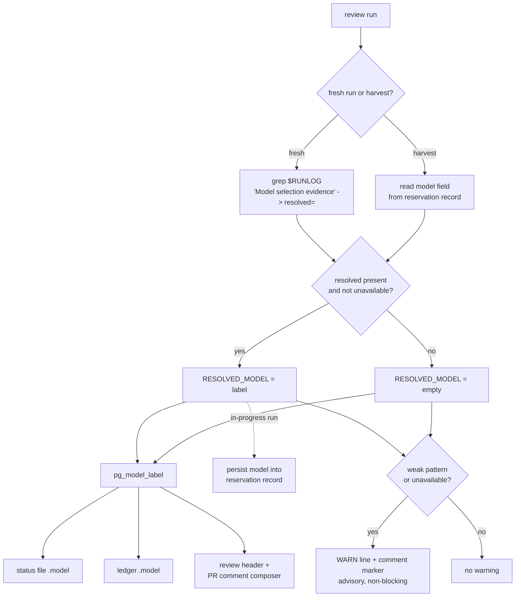

# De-version pro-gate model labels - Plan

## Goal Capsule

- **Objective:** Stop the pro-gate stack from asserting a stale model version ("GPT-5.5 Pro Extended"). The model that runs should follow the account automatically, and the only place a real version appears should be captured from the run itself, never hand-written. Every descriptive mention drops the version.
- **Product authority:** Will, operator and maintainer of pro-gate.
- **Feasibility (was a blocker, now confirmed):** Oracle emits a resolved-model line to stdout under both `select` and `current` strategies: `[browser] Model selection evidence: requested=<req>; resolved=<label>; status=<status>; strategy=<strategy>; verified=<yes|no>.` The line is emitted early, at model selection, before the review reasons, so it is present in `$RUNLOG` even on an in-progress run. Under `current`, `resolved=` carries the live DOM-read label and degrades to `resolved=(unavailable)` only when the label cannot be read (`@steipete/oracle@0.15.2`, `dist/src/browser/sessionRunner.js` formatter, called unconditionally). Layer 2 is buildable; no launch-blocking question remains.
- **Accepted behavior:** the self-updating selector trusts the account's selected model. If the ChatGPT UI is ever on a weak model, the gate runs weak. The soft downgrade warning (R6) turns that accepted risk into a visible one rather than eliminating it.
- **Landing:** single PR on this branch; repo conventions and the human merge the result. Stop before merge.

**Product Contract preservation:** Product Contract unchanged, except R4 was clarified during planning to include harvest reviews (user-confirmed).

---

## Product Contract

### Primary actor

The pro-gate operator and any human reading a pro-gate review (the PR-comment audit trail, the review header, the run ledger, the status file, the logs). They currently see a specific model version that may not be the one that answered.

### Problem

The literal "GPT-5.5 Pro Extended" is copy-pasted across the pro-gate stack: the review prompt, log and error messages, the agent and skill descriptions, README, install help, the daemon prompt, the systemd unit, and setup notes. None of it can know the true model, and it drifts the moment the model changes or `strategy=current` lets the ChatGPT UI's selected model win. The installed copies under `~/.claude` and `~/.pro-review-daemon` are plain copies of the repo files, which is why "most of the agents" repeat the same stale claim.

The string is not one thing. Three tokens hide behind the same text and need different treatment:

1. **Functional selector** (`ORACLE_MODEL` default and the `-m` flag in `bin/oracle-review.sh`): picks the model.
2. **Prompt role line** (the reviewer heredoc in `bin/oracle-review.sh`): tells the model to act as "GPT-5.5 Pro Extended."
3. **Descriptive prose** (docs, skill, agent, comments, log and error messages, the systemd unit): describes the model to humans.

A blind find-replace across all three would corrupt the selector and flatten the prompt role. The fix keeps them separate.

### Desired outcome

No descriptive prose names a model version. Runs follow the account's Pro model with no literal to bump. Where a specific model genuinely appears (review header, PR comment, status file, ledger), it is the model oracle actually resolved for that run, captured at runtime, or role-based fallback text when capture is unavailable. Reinstall propagates the change to the installed copies with no residual stale strings.

### Requirements

**Selector (self-updating)**

- R1. `PRO_GATE_MODEL_STRATEGY` defaults to `current`, so a review follows whatever Pro model the account has selected rather than switching to a pinned id.
- R2. `ORACLE_MODEL` is demoted to a fallback hint (the `-m` "requested" value), not the primary selector.
- R3. No model-version literal needs manual editing when OpenAI ships a new Pro model.

**Runtime truth**

- R4. Every review surface that shows a model (review header, PR-comment audit trail, status file, run ledger) names the model oracle actually resolved for that run, including harvest reviews (the separate later `--harvest` collection of an in-progress conversation).
- R5. When the resolved model cannot be determined, the surface shows role-based text, never a hardcoded version.
- R6. A soft warning fires when the resolved model is unreadable or matches a configurable weak-model pattern. It is advisory (a log line plus a marker the composer includes) and never blocks or fails the run.

**Prose de-versioning**

- R7. No descriptive prose in the pro-gate stack names a model version; role-based language replaces it.
- R8. The review prompt's role line is version-free.
- R9. The functional selector and the prompt role line are edited distinctly from descriptive prose (no blind find-replace).

**Propagation**

- R10. Reinstall propagates the fix to the installed copies (`~/.claude` skill and agent, `~/.pro-review-daemon` engine, lib, and daemon) with no residual stale strings.

### Scope Boundaries

In scope: the pro-gate repo canonical files and, by reinstall, their installed copies.

#### Deferred to Follow-Up Work

- API-based model selection (the Pro tier is web-UI-only; the oracle browser bridge stays).
- A hard downgrade guard that fails the run (declined; the soft warning is the chosen substitute).
- A recurrence lint (pre-commit or CI grep) and any sweep of `~/.claude` agents outside the pro-gate family (declined; scope is the pro-gate stack only). The grep-guard in the Verification Contract is a one-time acceptance check for this PR, not permanent enforcement.

### Outstanding Questions

- Default weak-model pattern for R6 (deferred, non-blocking). Lean: a denylist of recognizably cheap markers (for example `mini`, `nano`, `instant`), configurable via one env var. Explicitly not a Pro-tier allowlist, which would false-warn on a legitimate future top model whose name lacks "Pro" (for example "Sol Ultra").
- Exact role-based wording (deferred, non-blocking). The prompt role line and the human-facing prose can differ: the prompt wants "you are the final, highest-tier reviewer"; the docs want a descriptive noun phrase such as "OpenAI's frontier Pro reasoning model, web-UI-only, via the oracle bridge."

### Sources

- Oracle resolved-model evidence line and its `current`-strategy behavior: `@steipete/oracle@0.15.2`, `dist/src/browser/sessionRunner.js` (formatter, emitted early at model selection), `dist/src/browser/actions/modelSelection.js` (current-strategy DOM read).
- Feasibility evidence line documented in-repo: `docs/SETUP-NOTES.md`.
- Reservation record format and readers: `pg_reservation_write` / `pg_reservation_note_miss` in `lib/pro-gate-lib.sh` (tab-separated `pr\tout\tcreated\tmisses\tslot`).

---

## Planning Contract

### Key Technical Decisions

- KTD1. Default `PRO_GATE_MODEL_STRATEGY` to `current`. The existing "picker not found, retry with `current`" fallback in `bin/oracle-review.sh` becomes redundant for the default path but is retained for an explicit `select`. `-m "$MODEL"` is still passed and becomes the "requested" hint in oracle's evidence line.
- KTD2. Capture the resolved model from oracle's `Model selection evidence:` line in `$RUNLOG`, extracting the `resolved=` field and treating `(unavailable)` as empty. Because the line is emitted early, capture applies to both the fresh-success path and the fresh in-progress (exit-9) path. Store it in a script-scope `RESOLVED_MODEL` so `pg_finish` and the reservation writer can read it. This mirrors the existing `$RUNLOG` session-slug recovery pattern in the salvage branch.
- KTD3. Harvest recovery persists the model rather than re-deriving it. The `--harvest` collection runs in a separate later process with no `$RUNLOG`, so there is nothing to grep and no slug to pass to a post-hoc `oracle` call. Instead, the original in-progress run persists its captured `RESOLVED_MODEL` into the reservation record (a new trailing field), and the later `--harvest` process reads the model straight back from that record. No `oracle status`/`oracle session` call is added.
- KTD4. A single `pg_model_label` helper in `lib/pro-gate-lib.sh` centralizes rendering: it returns a captured model when present and not `(unavailable)`, else a role-based fallback string. Status, ledger, and the human-facing composers all render through this one source.
- KTD5. Downgrade warning is a configurable weak-model denylist plus an `(unavailable)` check, not a Pro-tier allowlist. Rationale: the failure mode is a cheap model, which carries recognizable markers; an allowlist would false-warn on a legitimate top model whose name lacks "Pro." The warning is a WARN log line plus a marker the composer includes, never a failure.
- KTD6. The human-facing header and PR comment are instruction-composed (the `oracle-reviewer` agent template and `skills/pro-gate/SKILL.md`), not code-rendered. Truthfulness there is achieved by pointing the composer at the status file's new `model` field and role-based language, rather than hardcoding a version.
- KTD7. Three-token discipline (R9): the functional `-m`/`ORACLE_MODEL` selector stays; the prompt role line loses only its version parenthetical; descriptive prose is rewritten to role-based language.
- KTD8. Propagate by fixing the canonical repo files only. `install.sh` (`put()` atomic copy) redeploys skill and agent to `~/.claude` and engine, lib, and daemon to `~/.pro-review-daemon`; there is no independent hand-maintained copy. R10 therefore needs no dedicated implementation unit: it is satisfied once U1-U6 land and `install.sh` runs, verified by the reinstall grep in the Verification Contract.

### Assumptions

- Appending a `model` field to the reservation record's tab-separated format does not break existing readers. Miss-tracking reads field 4 positionally and marker matching reads the filename, so a trailing sixth field is inert; U2 verifies this during implementation.
- De-versioning the prompt role line does not degrade review quality; removing a possibly-wrong self-identification is expected to be neutral or better.

---

## High-Level Technical Design

Model-label resolution is a small pipeline with a fresh-vs-harvest source branch and a fallback gate. The fresh in-progress path also persists the captured model so the later harvest process can read it back. The captured value flows into one helper, then into every surface.

Directional guidance for reviewers, not implementation specification.

---

## Implementation Units

R10 has no dedicated unit; it is satisfied automatically once U1-U6 land and `install.sh` redeploys (KTD8), verified by the reinstall grep in the Verification Contract.

### U1. Flip the selector default to self-updating

- **Goal:** Default operation follows the account's Pro model with no literal to bump.
- **Requirements:** R1, R2, R3.
- **Dependencies:** none.
- **Files:** `bin/oracle-review.sh`, `.env.example`, `tests/engine.test.sh`.
- **Approach:** Change the `PRO_GATE_MODEL_STRATEGY` default from `select` to `current` at its resolution points in `bin/oracle-review.sh` (the `pg_status launching` line and the `run_oracle` call). Keep `-m "$MODEL"` and the `ORACLE_MODEL` default as the requested hint. Update the retry log message that currently reads "ensure GPT-5.5 Pro Extended is your ChatGPT default" so it no longer names a version and reflects that `current` is now the primary path (this de-versions that specific line; U6 excludes it). In `.env.example`, document `current` as the default and describe `ORACLE_MODEL` as a fallback hint used under `select`.
- **Patterns to follow:** the existing `${PRO_GATE_MODEL_STRATEGY:-select}` resolution and the retry-to-`current` branch already in `run_oracle`.
- **Test scenarios (`tests/engine.test.sh`):**
  - Covers R1. With the fake oracle recording its argv, a default invocation passes `--browser-model-strategy current`.
  - Covers R2. With `PRO_GATE_MODEL_STRATEGY=select` set, the invocation passes `--browser-model-strategy select` and still passes `-m "$MODEL"` as the requested hint.
  - R3 has no discrete scenario: it is an outcome of R1/R2 (no version pin on the default path), verified by the Verification Contract grep-guard.
- **Verification:** default runs request `current`; `select` remains reachable via env; no version literal remains in the retry message.

### U2. Capture the resolved model and make it available on both paths

- **Goal:** Make the model oracle actually resolved available to every surface on both fresh and harvest paths, with a role-based fallback.
- **Requirements:** R4, R5.
- **Dependencies:** none.
- **Files:** `bin/oracle-review.sh`, `lib/pro-gate-lib.sh`, `tests/engine.test.sh`.
- **Approach:** Add a script-scope `RESOLVED_MODEL`. On any fresh run where `run_oracle` produced output (success and the in-progress/exit-9 path), set it from `$RUNLOG` by matching the `Model selection evidence:` line and extracting the `resolved=` field up to the next `;`; treat `(unavailable)` as empty. On the in-progress path, persist `RESOLVED_MODEL` into the reservation record by extending `pg_reservation_write` (and its no-jq positional format) with a trailing `model` field. On the `--harvest` path, read that field back from the reservation record into `RESOLVED_MODEL`; on any miss leave it empty. Add `pg_model_label` to `lib/pro-gate-lib.sh`: echo the captured model when non-empty and not `(unavailable)`, else a role-based fallback string.
- **Patterns to follow:** the `$RUNLOG` session-slug recovery grep in the salvage branch of `bin/oracle-review.sh`; the existing `pg_reservation_write` / reservation-record readers in `lib/pro-gate-lib.sh`.
- **Execution note:** the fake-oracle harness (`PRO_GATE_ORACLE_BIN`) emits a chosen evidence line, and the existing exit-9 and `--harvest` fixtures in `tests/engine.test.sh` exercise the reservation persist and read-back, so both paths are provable without a ChatGPT account. Add a failing capture test first.
- **Test scenarios (`tests/engine.test.sh`):**
  - Covers R4. Fresh run: fake oracle emits `... resolved=GPT-5.6 Pro; ...`; the captured value and `pg_model_label` equal `GPT-5.6 Pro`.
  - Covers R5. Fake oracle emits `resolved=(unavailable)` or no evidence line; `pg_model_label` returns the role-based fallback and contains no version literal.
  - Covers R4. In-progress fresh run persists the captured model into the reservation record; a subsequent `--harvest` reads it back and names that model.
  - Covers R5. `--harvest` against a reservation record with no `model` field falls back to role-based text.
  - Confirms the reservation-format assumption: an existing positional reader (miss-tracking, field 4) still parses correctly after the `model` field is appended.
- **Verification:** the resolved model is captured on the fresh paths, persisted for and read on the harvest path, and unavailable or missing degrades to role-based text with no version literal.

### U3. Thread the label into machine surfaces (status, ledger)

- **Goal:** The status file and run ledger carry the real model per run.
- **Requirements:** R4, R5.
- **Dependencies:** U2.
- **Files:** `bin/oracle-review.sh`, `tests/engine.test.sh`.
- **Approach:** Add a `model` field to the `pg_status` JSON writer (next to `marker`) and to the `pg_finish` ledger JSON writer (next to `out`), sourced from `pg_model_label`, including the no-jq `printf` fallbacks in both. `RESOLVED_MODEL` is set by U2 before `pg_finish` runs.
- **Patterns to follow:** the existing `jq -nc` object construction and no-jq fallbacks in `pg_status` and `pg_finish`.
- **Test scenarios (`tests/engine.test.sh`):**
  - Covers R4. After a fresh run with a known resolved model, the status file's `model` and the ledger row's `model` equal that model.
  - Covers R5. On a run with no resolved model, both carry the role-based fallback string, no version literal.
- **Verification:** status and ledger rows include a `model` field that matches the resolved model or the fallback.

### U4. Thread the label into human surfaces (review header, PR comment)

- **Goal:** The review header and PR-comment audit trail name the real model, or role-based text, never a stale literal, and surface the R6 warning marker.
- **Requirements:** R4, R5, R6.
- **Dependencies:** U2, U3, U5.
- **Files:** `agents/oracle-reviewer.md`, `skills/pro-gate/SKILL.md`, `daemon/daemon.sh`.
- **Approach:** Replace the two hardcoded review header templates in `agents/oracle-reviewer.md` with a role-based header that the agent fills from the status file's `model` field when present, falling back to role-based wording, and that renders the U5 warning marker when set. Update the `skills/pro-gate/SKILL.md` review-only and audit-trail instructions and the `daemon/daemon.sh` dispatch prompt (which currently reads "get the GPT-5.5 Pro Extended review ... the full Pro Extended review") so the composer names the model from the run's status `model` field (or role-based language) and includes the warning marker, rather than a version literal.
- **Patterns to follow:** the existing header envelopes (success and unavailable) in `agents/oracle-reviewer.md`; the existing `.status`-file consumption described in `skills/pro-gate/SKILL.md`.
- **Test scenarios:** `Test expectation: none -- instruction/template text consumed by a downstream Claude/codex composer, not executable code. The status model field and warning marker it reads are proven by U3 and U5; the removal of the version literal is proven by the Verification Contract grep-guard.`
- **Verification:** neither header template, the SKILL.md instructions, nor the daemon dispatch prompt names a version; all reference the status `model` field or role-based text and pass through the warning marker.

### U5. Soft downgrade warning

- **Goal:** Surface a visible, non-blocking warning when the resolved model is unreadable or looks weak.
- **Requirements:** R6.
- **Dependencies:** U2.
- **Files:** `bin/oracle-review.sh`, `lib/pro-gate-lib.sh`, `.env.example`, `tests/engine.test.sh`.
- **Approach:** After capture, if `RESOLVED_MODEL` is empty or `(unavailable)`, or matches a configurable weak-model pattern (one env var, default a denylist of cheap markers such as `mini|nano|instant`), emit a WARN log line and set a marker (in the status file, read by U4's composer) that the header/PR-comment includes. Never change the exit code. Document the env var in `.env.example`.
- **Patterns to follow:** the existing `echo "[oracle-review] WARNING: ..."` log style and the status-marker mechanism.
- **Test scenarios (`tests/engine.test.sh`):**
  - Covers R6. Fake oracle resolves `GPT-4o mini`; a WARN line is emitted and the marker is set.
  - Covers R6. Fake oracle resolves `GPT-5.6 Sol Ultra` (no "Pro" but not weak); no warning fires (guards against the allowlist false-positive).
  - Covers R6. `resolved=(unavailable)`; a warning fires. The run's exit code is unchanged in all three.
- **Verification:** weak or unreadable models warn without altering exit status; a strong non-"Pro" name does not warn.

### U6. De-version descriptive prose across the stack

- **Goal:** No descriptive prose or the prompt role line names a model version.
- **Requirements:** R7, R8, R9.
- **Dependencies:** none.
- **Files:** `README.md`, `skills/pro-gate/SKILL.md`, `agents/oracle-reviewer.md`, `docs/SETUP-NOTES.md`, `install.sh`, `daemon/login-view.sh`, `daemon/pro-review-daemon.service.tmpl`, `bin/oracle-review.sh`, `lib/pro-gate-lib.sh`, `.env.example`.
- **Approach:** Rewrite every descriptive occurrence to role-based language that names no version: prose in README, SKILL.md, the oracle-reviewer agent description and body, SETUP-NOTES intro and roadmap, install help, the login checklist, the systemd unit Description, and the comment, log, and error messages in `bin/oracle-review.sh` and `lib/pro-gate-lib.sh`. Remove only the version parenthetical from the prompt role line in the reviewer heredoc (R8), leaving the surrounding instruction intact. Preserve the technical `resolved=Pro Extended` example line in `docs/SETUP-NOTES.md` as evidence, but de-version its surrounding prose framing. Do not touch the functional `-m`/`ORACLE_MODEL` selector; do not re-edit the retry log message (U1 owns it) or the header templates and daemon dispatch prompt (U4 owns them).
- **Patterns to follow:** the role-based phrasing settled in KTD7 and the Outstanding Questions wording note.
- **Test scenarios:** `Test expectation: none -- documentation and comment edits; enforced by the propagation grep-guard in the Verification Contract.`
- **Verification:** the grep-guard (with its documented exclusions) returns nothing.

---

## Verification Contract

- `bash tests/engine.test.sh` passes, including the new cases in U1, U2, U3, U5. This is the primary proof; the harness stubs oracle via `PRO_GATE_ORACLE_BIN` and asserts on the status file, ledger, and reservation record.
- `node tests/cdp-salvage.test.mjs` still passes (regression guard for the salvage path U2 touches indirectly).
- Grep-guard (one-time acceptance check for this PR, not permanent enforcement): a repo-wide search finds no `GPT-5.5 Pro Extended`, `GPT-5.5 Pro`, or `Pro Extended` in descriptive prose, excluding `.claude/worktrees/`, the functional `ORACLE_MODEL` default, test fixtures, and the preserved `resolved=Pro Extended` evidence line in `docs/SETUP-NOTES.md`.
- `bash bin/pro-gate-doctor.sh` exits 0 on a configured host.
- `shellcheck` is clean on changed shell files when available.
- After `./install.sh`, grep `~/.claude/skills/pro-gate/SKILL.md`, `~/.claude/agents/oracle-reviewer.md`, and `~/.pro-review-daemon/` for stale version literals: none remain (R10).

---

## Definition of Done

**Global**

- R1 through R10 satisfied.
- `bash tests/engine.test.sh` and `node tests/cdp-salvage.test.mjs` pass; the grep-guard reports no stale prose literal; the doctor exits 0.
- Reinstall propagates cleanly to the installed copies with no residual stale strings.
- No dead or experimental code left from abandoned approaches; the diff is the fix only.

**Per unit**

- U1: default requests `current`; `select` still reachable; retry message de-versioned.
- U2: resolved model captured on fresh paths, persisted into the reservation on in-progress, read back on `--harvest`; unavailable or missing degrades to role-based text; the reservation-format change leaves existing readers intact.
- U3: status file and ledger rows carry a truthful `model` field.
- U4: header templates, SKILL.md instructions, and the daemon dispatch prompt render the status `model` field or role-based text and the warning marker, never a version.
- U5: weak or unreadable models warn without changing exit status; a strong non-"Pro" name does not warn.
- U6: no descriptive prose or prompt role line names a version; functional selector untouched.
