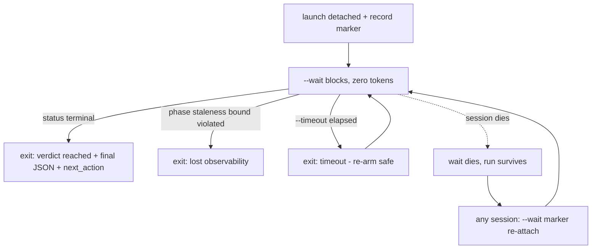
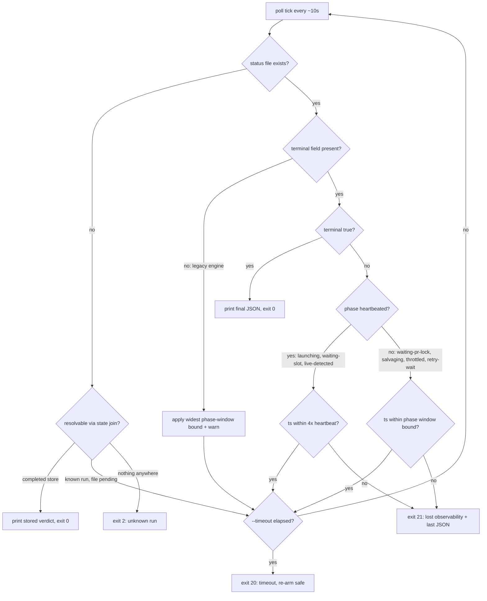

# Blocking --wait Verb and Honest-Ledger Prelude - Plan

## Goal Capsule

- **Objective:** Deliver stage 1 of the gate-run UX program in two sequential engine PRs: PR A (units U1–U2) instruments the ledger and round history so queue time, run time, and wall-clock-per-round are measurable; PR B (units U3–U5) adds the blocking `--wait` verb, the `terminal`/`next_action`/heartbeat status additions, and the caller-protocol rewrite.
- **Product authority:** This document's Product Contract (from ce-brainstorm, confirmed twice at scoping gates). Later program stages (Status v2 remainder, round-loop supervisor, fair-share admission) are not active scope.
- **Stop conditions:** Stop and surface rather than guess when a change would alter product behavior outside R1–R12, when a test reveals a live consumer of pre-lock epochs (R3), or when the daemon rewrite would require changing `daemon.sh` control flow beyond the prompt text (KTD-scoped as prompt-only).
- **Execution profile:** Two PRs, each gate-reviewed (`/pro-gate`) per repo convention; PR A lands before PR B. Dogfood: drive PR B's own gate wait with `--wait` manually.
- **Tail ownership:** Release notes ride each PR (VERSION-bump gate enforces); deployment via the existing auto-release chain.
- **Product Contract preservation:** restructured, no scope change — R5/R7/R10 mechanism clarifications (timeout exit-code split, probe mode, phase-aware staleness) confirmed at the 2026-08-17 scoping gate; all IDs unchanged.

---

## Product Contract

### Summary

Give the engine a blocking `--wait` verb so a calling agent launches a review, records the marker, runs `--wait` in the background, and ends its turn — the harness's background-completion notification is the wake. A prelude PR first splits the ledger's conflated duration into queue and run time and adds wall-clock to round history, so the program's effect is measurable against a baseline.

### Problem Frame

A calling agent has no way to wait on a review except polling `<out>.status` every minute or two for up to 47+ minutes p90. The protocol for doing so is hand-maintained in three places — `skills/pro-gate/SKILL.md` §3, `agents/oracle-reviewer.md`, and a `sleep 60` loop embedded in `daemon/daemon.sh`'s prompt string — and each caller re-derives it per session. In the prbot PR #1628 incident, one session invoked a hand-rolled background poller 65 times, re-armed it 9 times after 8 exit-code-3 crashes, and ended at roughly 100% context and ~$443 while waiting on a round-3 confirming pass.

Two observability gaps make the wait worse than it needs to be. The status file freezes at `launching` for the entire 10–90+ minute generation window (the phase is set once at `bin/oracle-review.sh:2255`, immediately before the blocking producer wait), so a healthy long think and a dead engine look identical. And the ledger's single `secs` field starts at preflight (`bin/oracle-review.sh:697`), before both up-to-40-minute lock waits (`waiting-pr-lock` at 1918, `waiting-slot` at 1975), so every duration percentile conflates queue-wait with generation and no before/after story about wait time can be told from existing data.

### Key Decisions

- KD1. **A blocking CLI verb, not a watcher script or notification bus.** (session-settled: user-approved — chosen over a standalone watcher script plus push notifications: a blocking command serves every caller shape, including the headless daemon that structurally cannot receive async notifications; the interactive wake comes from the harness's background-completion notification, observed working and recorded under Dependencies / Assumptions.) Governs R4.
- KD2. **Instrumentation lands before the behavior change.** (session-settled: user-approved — chosen over shipping `--wait` first: the before/after ruler for the whole UX program only exists if measurement fields predate the new behavior.) Governs R1, R2, R3.
- KD3. **Only `terminal`, `next_action`, and the heartbeat ride in PR B.** (session-settled: user-approved — chosen over shipping the full Status v2 schema at once: these fields are `--wait`'s loop condition, wake payload, and staleness definition; the rest is additive and trails as its own PR.) Governs R8, R9, R10.
- KD4. **Delete the poll ceremony; don't synchronize its three copies.** (session-settled: user-approved — chosen over a canonical-source-plus-generation scheme: `--wait` collapses §3 to one instruction, and manual recovery remains documented as the degradation path per `docs/solutions/conventions/ship-the-legible-core-let-the-gate-decline-fragile-automation.md`.) Governs R11, R12.
- KD5. **Marker-attach is in scope for `--wait`.** (session-settled: user-approved — surfaced as the scoping call-out and confirmed: attaching to a run the session didn't launch is what makes re-arming after session death free, at the cost of marker-resolution logic in PR B.) Governs R6.
- KD6. **Exit-code selection must account for the undocumented live code space.** Verification found `exit 10` is a real bootstrap-fatal path (`bin/oracle-review.sh:40` when the shared lib fails to source) absent from SKILL.md's documented contract, and exit 1 is internal-only. Governs R5.

### Requirements

**Instrumentation prelude (PR A)**

- R1. Ledger rows carry queue time and run time as separate appended fields, stamped at the existing phase transitions (preflight → lock waits → launch → outcome); the existing `secs` field is preserved unchanged for backward compatibility. Appending is verified safe: `bin/pro-gate-stats.sh` parses ledger rows by jq field name (`.secs` at lines 87–88 and 98), so only a rename or split of `secs` itself would break it. Harvest-invocation rows record their own short wall time; their field semantics are documented rather than reconstructed.
- R2. Round history rows gain wall-clock-per-round as a 7th positional TSV field, and both `--status` and the exit-12 refusal message state rounds used plus elapsed wall clock for the change. The 6-field `.hist` format (`lib/pro-gate-lib.sh:1274`) has one production reader (`pg_round_score`, fixed 6-variable `read` at `:1341`) and ~15 test fixtures; the reader extension and fixture updates land in the same PR as the writer.
- R3. The new timing fields are stamped at phase-transition time, never at marker mint or `RUN_START`, so queue time is never recorded as run time — and no budget or history window keys off a pre-lock epoch (the ~80-minute skew family documented at `lib/pro-gate-lib.sh:1129-1134` and `tests/engine.test.sh:1265-1268`).

**The --wait verb (PR B)**

- R4. `oracle-review.sh --wait <out-path|marker> [--timeout S]` blocks as a plain shell process — no LLM involvement — until the run's status reaches a terminal phase, then prints the final status JSON to stdout and exits. It is a pure watcher: it never drives `--harvest` or any other engine action, and it never touches `pg_finish`'s outcome bookkeeping (per KTD1, KTD6).
- R5. `--wait` exits with distinct codes for distinct situations: verdict-reached (one code regardless of the underlying engine outcome — the printed status JSON and `next_action` carry the disambiguation), usage error / unknown run (fail-fast, never blocks the full timeout on a run that never existed), timeout expiry (re-arm safe — a chunk boundary, not a failure), and lost observability (stale-beyond-bounds or unreadable state — escalate). Timeout and lost observability are separate codes so an unattended caller can re-arm on one and escalate on the other. New code values collide with nothing the engine currently returns: the documented set 0, 2–9, 11, 12 plus the undocumented bootstrap-fatal 10 (per KD6). Proposed values in KTD3; exact final values are the implementer's within that collision rule.
- R6. `--wait` accepts a bare marker and resolves it through the same state join `--status` already implements (reservations → active-run index → ledger → completed store, `bin/oracle-review.sh:190-448`, per KTD4), so a session that did not launch the run can wait on it; invoked on an already-terminal run it returns immediately with the verdict-reached exit. A marker with no engine state anywhere fails fast with the usage exit. Repeat waits are free and idempotent.
- R6a. When `--wait` knows the target marker, it verifies the polled status file's own `marker` field matches before trusting that file's phase or verdict; a mismatch is treated as "no status for this run yet" and falls back to the state join. `--out` paths are reused across rounds of the same PR (`skills/pro-gate/SKILL.md:204` launches every round at one fixed path, and `bin/oracle-review.sh:1009-1010` records that a shared `--out` can be reused by unrelated markers), so without this check a marker-attached wait could report a newer run's verdict as the target's. The bare out-path form has no marker to check and trusts the file as-is.
- R7. `--timeout` defaults to a value exceeding the worst-case envelope of both lock waits plus a long generation; on expiry `--wait` exits through the timeout code. `--timeout 0` is a probe: classify the run's current state once and exit immediately with the same code taxonomy.

**Status schema additions (ride PR B)**

- R8. The status JSON carries a literal `terminal` boolean — the field `--wait` tests — so future phase additions cannot silently break terminality inference. Terminal phases: `done`, `failed`, `deferred`, `oversized`, `round-capped`, `in-progress` (terminal for this invocation; collection follows).
- R9. The status JSON carries `next_action` — the command to run, the terminal flag, and a `wait_class` naming which situation the caller is in (act on a delivered verdict; collect a deferred review; enter recovery) — giving a woken caller one machine-actionable handoff instead of branching on the exit-code prose paragraph. The exact phase→`wait_class` mapping is the implementer's, anchored by: `done`/`failed` → verdict, `in-progress` → collect (with the harvest command), recovery states → recover.
- R10. Status freshness is phase-aware. Phases whose engine code already iterates re-write the status file with a fresh `ts` on a throttled tick — the 10-second watchdog loop (`bin/oracle-review.sh:2041-2178`) covers the frozen-`launching` generation window, and the 3-second slot-wait loop (`:1974-2026`) covers `waiting-slot`. Phases that block inside a single syscall or subprocess (`waiting-pr-lock` in one `flock -w`; `salvaging`/harvest inside one node call; throttle pauses in one `sleep`) are not heartbeated; `--wait` instead applies per-phase staleness bounds derived from the same env vars that bound those windows (`PRO_GATE_LOCK_WAIT`, salvage/harvest budgets, throttle cooldown). All writes preserve the existing atomic tmp+`mv -f` idiom (`bin/oracle-review.sh:692`). A missing status file is non-terminal (the launch race and transient sweeps), never an instant lost-observability verdict.

**Protocol rewrite (PR B)**

- R11. SKILL.md §3's documented caller protocol becomes: launch detached, record the marker, run `--wait` in the background, end the turn; the poll-loop instructions are removed. Manual recovery (`--status`, `--harvest`) stays documented as the degradation path, and the exit-code table gains the new `--wait` codes plus the previously undocumented bootstrap exit 10.
- R12. `agents/oracle-reviewer.md` is updated in the same PR (its own contract requires same-PR sync), and `daemon/daemon.sh`'s embedded `sleep 60` poll instruction is replaced by a chunked `--wait --timeout` loop that re-arms on the timeout code and escalates on lost observability — a prompt-text edit only (`daemon/daemon.sh:232-235`); the daemon's own control flow and its `engine_state_recoverable()` reader (`:25-32`) are untouched.

### Key Flows

- F1. Happy path
  - **Trigger:** A calling agent needs a gate verdict.
  - **Steps:** Launch the engine detached; record the marker; start `--wait` via the harness's background primitive; end the turn. The harness notifies when `--wait` exits; the agent reads the printed status JSON and acts on `next_action`. On an exit-9 run, `next_action` names the harvest command; the harvest is its own bounded invocation the caller runs (and may itself defer again — the caller re-arms `--wait <marker>` around each step).
  - **Covers:** R4, R8, R9, R11.
- F2. Caller dies mid-wait
  - **Trigger:** The session holding `--wait` compacts or exits.
  - **Steps:** Only the wait process dies; the run, reservation, marker, and status file survive. Any later session runs `--wait <marker>` and attaches; if the run finished meanwhile, it returns immediately.
  - **Covers:** R6.
- F3. Observability lost
  - **Trigger:** The status file's freshness violates its phase's staleness bound, or state becomes unreadable.
  - **Steps:** `--wait` exits through the lost-observability code with the last-known JSON. The caller escalates (check `--status`, engine logs, browser state) instead of re-arming a poller forever — the failure is named as "cannot observe," never "review failed." A plain timeout expiry is the separate re-arm-safe code (F4).
  - **Covers:** R5, R10.
- F4. Unattended chunked wait (daemon)
  - **Trigger:** The headless daemon's tool calls are capped (~30 min documented) while p90 waits run 47+ min.
  - **Steps:** The daemon's prompt loops `--wait --timeout <chunk>`; on the timeout code it re-arms; on verdict it proceeds; on lost observability it consults `engine_state_recoverable()` and escalates.
  - **Covers:** R5, R7, R12.

### Acceptance Examples

- AE1. **Covers R5, R10.** Given a healthy run in its 60th minute of generation with watchdog-tick heartbeats advancing `ts`, when `--wait` polls, then it keeps waiting; given `ts` is older than the heartbeat staleness bound while in a heartbeated phase, then `--wait` exits with the lost-observability code, not a failure code.
- AE2. **Covers R6.** Given a run that reached its verdict yesterday, when a fresh session runs `--wait <marker>`, then it exits immediately with the verdict-reached code and the final status JSON, spending nothing.
- AE3. **Covers R9.** Given a run that ends in exit 9 (deferred harvest), when `--wait` returns, then `next_action` carries the exact harvest command so the caller acts without parsing recovery prose.
- AE4. **Covers R1, R2.** Given PR A is deployed, when a run completes, then its ledger row carries the new queue and run time fields, its round-history row carries wall clock, and the existing `pro-gate-stats.sh` percentiles still compute from `secs` unchanged.
- AE5. **Covers R4, R8.** Given a live run whose status shows `terminal: false`, when the engine writes a terminal phase with `terminal: true`, then a blocked `--wait` exits within one poll interval and prints that final JSON.
- AE6. **Covers R5, R7.** Given `--wait --timeout 60` on a run that stays non-terminal and healthy, when 60 seconds elapse, then `--wait` exits through the timeout code (not lost-observability) and the run itself is unaffected.
- AE7. **Covers R7.** Given `--timeout 0`, when `--wait` runs against a healthy non-terminal run, then it exits immediately through the timeout code with the current status JSON printed — a zero-block probe.
- AE8. **Covers R10.** Given a run in `salvaging` (a non-heartbeated phase) whose status `ts` is 10 minutes old but within the salvage window bound, when `--wait` polls, then it keeps waiting rather than declaring lost observability.
- AE9. **Covers R10.** Given `--wait` armed before the engine's first status write, when the status file does not yet exist, then `--wait` keeps polling within its timeout instead of exiting.

### Success Criteria

- Background-poller invocations per gate wait drop from ~65 (PR #1628 transcript) to 1 — a single `--wait` — with zero hand-rolled poller scripts required by the documented protocol.
- Queue time and run time are independently reportable from the ledger for every post-PR-A run.
- No false lost-observability verdict on a healthy run across the test matrix's phase/staleness cases; during generation, status `ts` advances on the watchdog tick.
- The three prose copies of the poll ceremony are reduced to references to `--wait`.

### Scope Boundaries

- **Deferred for later (same program, separate PRs):** the rest of Status v2 (capacity `holders[]`, `recover_reason_code` enum, TTL countdown, rounds preview); the stage-2 round-loop supervisor; any ETA/`ready_by` field (buildable from PR A's data); fair-share slot admission; the fleet harvest sweep.
- **Deferred to Follow-Up Work:** threading the original generation duration through harvest-path ledger rows via the reservation record (PR A documents harvest-row semantics instead); normalizing `agents/oracle-reviewer.md`'s pre-existing duplicate step-3 numbering beyond the sections U5 rewrites.
- **Outside this work's identity:** push-delivery plumbing (cross-session SendMessage, webhooks) — cross-session delivery stays pull-based on the durable surfaces that already exist (completed store, PR comments, `--status`).

<!-- ce-section: work-relationships -->
### How This Work Fits Together

This plan owns stage 1 of the gate-run UX program mapped in `docs/ideation/2026-08-17-pro-gate-gate-run-ux-ideation.html`; the breakdown below is the current understanding, not a committed roadmap.

- Stage-2 round-loop supervisor — **Depends on** this plan's `--wait` primitive; planned separately.
- Status v2 remainder (PR C) — **Can proceed independently of** stage 2; additive to this plan's schema fields.
- ETA/`ready_by` and fair-share admission — **Depend on** PR A's queue/run split for evidence; **Still to decide** whether either is built at all.
- Fleet harvest sweep — **Can proceed independently of** everything here.

### Dependencies / Assumptions

- Verified against the live repo (fresh-context verifiers, 2026-08-17): no existing `--wait` or notify mechanism; the three protocol copies at `skills/pro-gate/SKILL.md:197-356`, `agents/oracle-reviewer.md:18-21,79-176`, `daemon/daemon.sh:232-235`; atomic status writes at `bin/oracle-review.sh:692` (`pg_status` defined at 652–693; schema: phase, attempt, detail, pr, out, ts, marker, model, model_warn, result); `RUN_START` at 697 preceding both lock waits; jq field-name ledger parsing in `bin/pro-gate-stats.sh:87-88,98`; `.hist` writer at `lib/pro-gate-lib.sh:1274` with sole reader at `:1341`; live exit code 10 at `bin/oracle-review.sh:40`; status writes occur once per phase entry, never per wait-loop iteration; the only in-repo programmatic status consumer is `daemon.sh`'s `engine_state_recoverable()` via `--status --json`.
- Assumption: the harness's background-completion notification reliably wakes the calling session when a background command exits. Evidence is one session's observation over short waits — not across a p90-length (47+ min) wait or a context-compaction event, and a notification that silently fails while both the wait and the session live is a distinct failure from F2's caller-death case. U4's verification includes a long-wait notification test; if it does not survive, the interactive protocol gains a coarse self-check fallback ("if no wake after N minutes, run `--status`"). The headless daemon does not depend on this at all (it chunks `--wait --timeout` calls).
- Risk: terminal status precedes the engine's own bookkeeping. `pg_status done` is written before `pg_finish` (`bin/oracle-review.sh:2592-2595`), whose rc=0 branch calls `pg_organize_chat finalize` (`:1045`) — in `remote-chrome` mode that can block on a 95s organizer-lock wait plus a `scan_s+50` helper timeout (`:935`, `:958-960`) before `pg_ledger_append` and `pg_active_clear` run (`:1111-1112`). A caller that acts the instant `--wait` reports terminal can therefore see the active-run index still reporting the change as live. Native-Chrome mode returns immediately (`:929`) and has no gap.
- Assumption: the ~30-minute tool-call cap documented in `skills/pro-gate/SKILL.md:207-209` applies to the daemon's headless agent, motivating F4's chunked waits; chunking is safe regardless of the cap's exact value.

### Outstanding Questions

- **Decide during U4:** how to close the terminal-status-precedes-bookkeeping gap named under Dependencies / Assumptions — either move `pg_ledger_append` and `pg_active_clear` ahead of `pg_organize_chat`'s browser work inside `pg_finish` (fixes it for every consumer, but reorders a load-bearing engine function), or have `--wait`'s terminal path re-check the active-run index before printing `next_action` (local to the new verb, leaves other consumers exposed). The plan does not pick; U4 cannot ship without one.
- **Deferred to implementation:** final exit-code values (KTD3 proposes 0/2/20/21 within R5's collision rule); heartbeat env-var names and the poll interval (KTD2 proposes `PRO_GATE_HEARTBEAT_SECS=30`, staleness 4×, poll every 10s); the loopless-phase slack term — give it the same explicit treatment as the heartbeat multiplier rather than an arbitrary constant (proposal: 1.5× each phase's own budget); the exact phase→`wait_class` mapping table beyond R9's anchors; `--timeout` default constant (KTD3 proposes 14400); whether a harvest invocation should publish its own `--timeout` so an external `--wait` can bound the harvest-collection phase exactly instead of assuming a default.
- **Resolve Before Planning:** none.

### Sources / Research

- `docs/ideation/2026-08-17-pro-gate-gate-run-ux-ideation.html` — the ranked ideation this plan's ideas 1 and 4 come from, including usage forensics (exit-7 burst, exit-9 at 19.5% of runs, the PR #1628 incident) and the adversarial verification of its bases.
- `docs/solutions/conventions/ship-the-legible-core-let-the-gate-decline-fragile-automation.md` — the design bar the blocking-verb and no-forked-ticker choices honor.
- External prior art: AWS Durable Execution's `waitForCondition` (suspended waits at no compute cost), the Aura postmortem's wake-not-poll production pattern with polling as named fallback, and Kubernetes-watch staleness reports motivating the pull-based safety net.
- Implementation template: the existing zero-token blocking loop `while node cdp-salvage.mjs --probe …; do sleep 60; done` at `bin/oracle-review.sh:2625`.

---

## Planning Contract

### Key Technical Decisions

- KTD1. **`--wait` joins the `--status` read-only family: direct exit, never `pg_finish`.** `pg_finish` (`bin/oracle-review.sh:998-1114`) is generation-outcome bookkeeping — ledger append, round refunds, active-index clearing — that a passive watcher must never trigger. `--wait` mirrors `--status`'s shape: own validation (in the existing post-parse validation block), own exits. Governs R4.
- KTD2. **Heartbeat where loops exist; phase-window staleness where they don't; no forked ticker.** Ticks ride the existing 10s watchdog loop and 3s slot-wait loop, throttled to `PRO_GATE_HEARTBEAT_SECS` (proposed 30). Loopless phases (`waiting-pr-lock` in one `flock -w`, salvage/harvest in one node subprocess — the dominant capture path — throttle in one `sleep`) get staleness bounds derived from their own window env vars. A forked background ticker was rejected: it could race a phase transition and re-write stale phase data, the exact fragile-automation shape `docs/solutions/conventions/ship-the-legible-core-let-the-gate-decline-fragile-automation.md` declines. Governs R10.
- KTD3. **Exit codes 0 (verdict), 2 (usage/unknown run), 20 (timeout, re-arm safe), 21 (lost observability, escalate); `--timeout` default 14400s.** Timeout is split from lost observability so F4's chunked unattended waits cannot misread a chunk boundary as a failure. 2 matches the engine's existing bad-usage convention; 20/21 clear the live space including undocumented 10 (KD6). Governs R5, R7.
- KTD4. **Marker resolution reuses `--status`'s state join via a shared helper.** The join at `bin/oracle-review.sh:190-448` (reservations → active-run index → ledger → completed store) is refactored into a helper both modes call — never duplicated. Completed-store hits return immediately. Governs R6.
- KTD5. **Legacy-engine detection by `terminal`-field absence.** A status JSON without `terminal` came from a pre-PR-B engine that will never heartbeat; `--wait` then applies the widest phase-window bound and warns, instead of false-alarming on a mixed-version deploy. No doctor/version dependency. Governs R10.
- KTD6. **`--wait` is a pure watcher; the exit-9 harvest two-step stays caller-owned.** `--harvest` can itself re-defer (`bin/oracle-review.sh:1369-1373`), so orchestration belongs to the caller, made explicit by `next_action` at each step — instantiates KD1 (session-settled: user-approved; cites R4, R9).
- KTD7. **The `.hist` wall-clock field is the 7th positional TSV field, migrated with its reader and fixtures in one PR.** `pg_round_score`'s `read` gains a 7th named variable (else bash glues the field onto `sp`); the ~15 six-field fixtures in `tests/engine.test.sh` (646-895, 1240-1313, 1562-1568) update in the same commit. New round-duration state reaches `--status` via the existing in-shell-call convention (comment at `bin/oracle-review.sh:361`). Governs R2.

### High-Level Technical Design

`--wait` classification loop (directional guidance, not implementation specification):

Phase staleness table (bounds sourced from the engine's own tunables):

| Phase group | Freshness source | Bound |
|---|---|---|
| `launching`, `live-detected` | watchdog-tick heartbeat | 4 × `PRO_GATE_HEARTBEAT_SECS` |
| `waiting-slot` | slot-loop heartbeat | 4 × `PRO_GATE_HEARTBEAT_SECS` |
| `waiting-pr-lock` | phase window | `PRO_GATE_LOCK_WAIT` + slack |
| `salvaging`, harvest collection | phase window | salvage/harvest budget + slack |
| `retry-wait`, throttle pause | phase window | cooldown budget + slack |
| any phase, legacy engine (no `terminal`) | phase window | widest of the above |

### Assumptions

- `run_in_background` shell processes on the interactive harness are not subject to the foreground tool-call cap (observed: background tasks run across turns); the daemon path does not depend on this (F4 chunks).
- Ledger and `.hist` schema changes are consumed only by the readers inventoried in Dependencies / Assumptions; the repo-wide grep found no other consumers.

### Sequencing

PR A = U1 + U2 (independent of each other; land together). PR B = U3 → U4 → U5 (strict dependency order). PR A merges and releases before PR B opens, so the baseline window starts immediately.

---

## Implementation Units

### U1. Ledger queue/run time split

- **Goal:** Every ledger row carries `queue_secs` and `run_secs`; `secs` unchanged; stats gains queue/run percentiles.
- **Requirements:** R1, R3. Covers AE4 (ledger half).
- **Dependencies:** none.
- **Files:** `bin/oracle-review.sh`, `bin/pro-gate-stats.sh`, `tests/engine.test.sh`.
- **Approach:**
  1. Capture a launch epoch when the run leaves the queue: after the slot wait completes (`bin/oracle-review.sh:~2026`) or at `launching` (`:2255`) — one site, before generation.
  2. In `pg_finish` (`:998-1114`), compute `queue_secs = launch_epoch - RUN_START` and `run_secs = now - launch_epoch`; append both fields by name to the ledger line next to `secs`. Runs that never reach launch (exit 7, preflight failures) record `queue_secs = now - RUN_START`, `run_secs = 0`.
  3. Harvest invocations: `queue_secs = 0`, `run_secs =` harvest wall time; document the semantic in a comment at the field build.
  4. `bin/pro-gate-stats.sh`: add `queue_p50/p95` and `run_p50/p95` alongside the existing `.secs` percentiles (`:87-88`), by field name, tolerating rows without the new fields (`// empty`).
- **Patterns to follow:** field-by-name jq access as in `pro-gate-stats.sh:87-88`; `pg_ledger_append`'s flock-guarded append (`lib/pro-gate-lib.sh:~937-963`).
- **Test scenarios:**
  1. A completed run's ledger row has `queue_secs + run_secs ≈ secs` (± 2s rounding) and all three fields present.
  2. An exit-7 (lock-timeout) row records its full wait in `queue_secs` and `run_secs = 0`.
  3. A harvest row records `queue_secs = 0` and a short `run_secs`.
  4. `pro-gate-stats.sh` on a mixed ledger (old rows without the fields + new rows) computes `.secs` percentiles unchanged and new percentiles from new rows only, without error.
  5. Covers AE4. Existing stats output fields are byte-compatible for old consumers.
- **Verification:** `bash tests/engine.test.sh` green including new cases; `jq empty` on a generated ledger row; shellcheck clean.

### U2. Round wall-clock in history, --status, and exit-12

- **Goal:** `.hist` rows carry per-round wall clock; `--status` and the round-cap refusal state rounds used plus elapsed time.
- **Requirements:** R2, R3. Covers AE4 (rounds half).
- **Dependencies:** none.
- **Files:** `lib/pro-gate-lib.sh`, `bin/oracle-review.sh`, `tests/engine.test.sh`.
- **Approach:**
  1. Extend the single `.hist` writer `pg_round_note_severity` (`lib/pro-gate-lib.sh:1274`) with a 7th tab field: seconds from the row's spend epoch to now. Both call sites (`bin/oracle-review.sh:1360` harvest, `:2585` fresh-run) flow through it unchanged.
  2. Extend `pg_round_score`'s `read` (`:1341`) with a 7th named variable; accumulate a total-elapsed global following the in-shell-call convention (`bin/oracle-review.sh:361` comment — no command substitution).
  3. `round_capped()` (`:1867-1905`): append "N rounds, ~X.Yh wall clock on this change" to the refusal note. `--status`'s round renderer surfaces the same totals.
  4. Update every 6-field fixture in `tests/engine.test.sh` (`646-895`, `1240-1313`, `1562-1568`) to 7 fields in the same commit.
  5. Add a test asserting round-budget windows key off the spend epoch, not marker mint (closes R3's audit; code change only if it fails).
- **Patterns to follow:** the existing `.hist` field discipline and `awk -F'\t'` fixture assertions.
- **Execution note:** extend fixtures in the same commit as the writer — a split commit leaves the suite red.
- **Test scenarios:**
  1. A completed round appends a 7-field row whose 7th field is plausible wall clock (> 0, < 24h).
  2. `pg_round_score` on mixed 6/7-field history (legacy rows) scores trajectories identically to before and treats missing durations as zero.
  3. Exit-12 refusal text contains rounds-used and elapsed-hours.
  4. Spend-epoch audit: history windows and budget checks reference `PG_ROUND_SPEND_EPOCH`-derived stamps, never pre-lock epochs.
- **Verification:** `bash tests/engine.test.sh` green; shellcheck clean.

### U3. Status schema: terminal, next_action, heartbeat ticks

- **Goal:** The status JSON self-describes terminality and next action, and its `ts` advances during loop-bearing phases.
- **Requirements:** R8, R9, R10. Covers AE5, AE8 (schema side).
- **Dependencies:** none (PR B opener).
- **Files:** `bin/oracle-review.sh`, `tests/engine.test.sh`.
- **Approach:**
  1. Extend `pg_status` (`:652-693`, both jq and printf-fallback branches) with `terminal` (phase in the R8 set) and `next_action {cmd, terminal, wait_class}` per the R9 anchors; keep the atomic tmp+`mv -f` write.
  2. Add a throttled heartbeat re-write (same phase, fresh `ts`) inside the watchdog loop (`:2041-2178`, bare tick) and the slot-wait loop (`:1974-2026`), gated by `PRO_GATE_HEARTBEAT_SECS` (default 30, defined inline per repo convention).
  3. No writes added to loopless phases (KTD2).
- **Patterns to follow:** `pg_status`'s dual jq/printf branches must stay in parity; env-var defaults inline with comment (`:1770-1771` shape).
- **Test scenarios:**
  1. Every phase write carries `terminal` matching the R8 set (parameterized across all 16 phases).
  2. `in-progress` yields `terminal: true` with `wait_class: collect` and a harvest command in `next_action.cmd`.
  3. During a simulated slot wait, `ts` advances at least once per heartbeat interval; the phase value never regresses.
  4. printf-fallback branch produces the same fields as the jq branch (jq removed from PATH in the test).
- **Verification:** `bash tests/engine.test.sh` green; `jq empty` on emitted status files; shellcheck clean.

### U4. The --wait verb

- **Goal:** `oracle-review.sh --wait <out|marker> [--timeout S]` blocks, classifies, and exits per the KTD3 taxonomy.
- **Requirements:** R4, R5, R6, R6a, R7, R10 (consumer side). Covers AE1, AE2, AE5, AE6, AE7, AE8, AE9.
- **Dependencies:** U3.
- **Files:** `bin/oracle-review.sh`, `tests/engine.test.sh`.
- **Approach:**
  1. Parse arm copying `--status`'s optional-positional shape (`:33-77`); validation in the existing post-parse block: `--wait` is exclusive with run/harvest/status modes.
  2. Extract `--status`'s state join (`:190-448`) into a shared resolver helper; `--wait` uses it for marker→surface resolution and completed-store fast return (KTD4).
  3. Loop body per the `:2625` template: sleep ~10s; read status; when a target marker is known, check the file's `marker` field first and treat a mismatch as ENOENT (R6a); classify per the HTD flowchart (ENOENT → keep polling; legacy no-`terminal` → widest bound + one stderr warning; phase-aware staleness per the HTD table; terminal → print JSON, exit 0; stale → exit 21 with last-known JSON; `--timeout` expiry → exit 20; unknown run → fail-fast exit 2).
  4. `--timeout 0` probe: one classification pass, exit immediately (terminal → 0; healthy non-terminal → 20; stale → 21).
  5. Direct-exit family: no `pg_finish`, no state mutation of any kind (KTD1).
- **Patterns to follow:** `--status`'s read-only discipline; shellcheck `--severity=error` clean with zero suppressions (repo has none).
- **Execution note:** most tests need no mock CDP — write status-file fixtures directly and invoke `--wait` against them; reserve `start_mock()` for one end-to-end launch-then-wait case.
- **Test scenarios:**
  1. Covers AE5: fixture flips `terminal` → `--wait` exits 0 within one poll interval, JSON on stdout.
  2. Covers AE2: marker resolving to a completed-store entry returns immediately, exit 0.
  3. Covers AE9: no status file + known run → keeps polling; file appears later → proceeds normally.
  4. Covers AE6/AE7: `--timeout 60` on healthy non-terminal → exit 20 after ~60s; `--timeout 0` → immediate exit 20 with JSON.
  5. Covers AE1: heartbeated-phase fixture with stale `ts` → exit 21; fresh `ts` → keeps waiting.
  6. Covers AE8: `salvaging` fixture with 10-minute-old `ts` within the salvage bound → keeps waiting; beyond the bound → exit 21.
  7. Legacy fixture without `terminal` → wide bound applied, one warning line, no false exit 21 within the window.
  8. Unknown marker (no state anywhere) → exit 2 immediately with a clear message.
  9. Usage: `--wait` combined with `--pr` → exit 2.
  10. Covers R6a: a status file at the resolved out-path carrying a different `marker` → `--wait` keeps polling via the state join instead of printing that run's terminal JSON.
  11. Terminal-exit ordering: after `--wait` reports verdict-reached, the engine's active-run index no longer reports the change as live (enforces whichever remedy U4 picks for the gap under Dependencies / Assumptions).
  12. Notification survival (manual, once): a background `--wait` spanning a p90-length wait and at least one context compaction still wakes the calling session; record the result and, on failure, add the `--status` self-check fallback to R11's protocol.
  10. End-to-end: launch against mock CDP, `--wait` in background, engine completes, `--wait` exits 0 with the final JSON.
- **Verification:** `bash tests/engine.test.sh` green including the new suite section (opened with the standard env-scrub block); shellcheck clean.

### U5. Protocol rewrite: SKILL §3, agent file, daemon prompt

- **Goal:** The documented caller protocol is "launch, record marker, `--wait` in background, end turn"; the daemon chunks `--wait`; the poll ceremony is deleted.
- **Requirements:** R11, R12. Covers AE3 (documentation of the harvest two-step).
- **Dependencies:** U4.
- **Files:** `skills/pro-gate/SKILL.md`, `agents/oracle-reviewer.md`, `daemon/daemon.sh`, `tests/daemon-reload.test.sh` (if prompt text is asserted there).
- **Approach:**
  1. Rewrite SKILL.md §3 (`:197-356`): launch → record marker → `--wait` via `run_in_background` → act on `next_action`; keep `--status`/`--harvest` as the documented degradation path; exit-code table gains 0/2/20/21 for `--wait` and documents bootstrap exit 10 (KD6).
  2. Sync `agents/oracle-reviewer.md` (`:18-21` contract note, `:79-176` protocol + exit-code sections) in the same PR; fix the duplicate step-3 numbering only where the rewrite already touches.
  3. Edit the daemon prompt (`daemon/daemon.sh:232-235`) to the F4 chunked loop: `--wait --timeout 1500`, re-arm on 20, proceed on 0, escalate on 21 via the existing recoverable check. No other daemon.sh changes; `engine_state_recoverable()` untouched.
- **Patterns to follow:** SKILL.md's existing exit-code table format; the ship-the-legible-core convention (manual path stays documented).
- **Test scenarios:** Test expectation: none — documentation and prompt-text unit; correctness is proven by U4's engine tests plus one grep-level assertion that the daemon prompt no longer contains the `sleep 60` poll instruction and does contain `--wait`.
- **Verification:** CI docs checks pass (`yq`/`jq` validation, actionlint, release-notes gate on the VERSION bump); `bash tests/daemon-reload.test.sh` green.

---

## Verification Contract

| Gate | Command | Applies to |
|---|---|---|
| Engine test suite (incl. new --wait/heartbeat/ledger cases) | `bash tests/engine.test.sh` | U1–U4 |
| Full test set | the 8 test files invoked by `.github/workflows/ci.yml` | all units |
| Shell lint (zero suppressions) | `shellcheck --severity=error` on all `*.sh` | U1–U5 |
| JSON/YAML validity | `jq empty` / `yq eval '.'` per CI | U1, U3, U4, U5 |
| Release-notes gate | CI `VERSION`-bump check | each PR |
| Terminal review gate | `/pro-gate` on each PR; PR B's wait driven by `--wait` itself (dogfood) | each PR |

Sequencing gate: PR A merged and released before PR B opens.

## Definition of Done

- Both PRs merged with green CI and a pro-gate review verdict; PR A released before PR B opened.
- The terminal-status-precedes-bookkeeping gap is closed by one of the two named remedies, with U4 test scenario 11 enforcing it.
- All U1–U5 verification gates pass; every AE1–AE9 scenario is enforced by a test or (AE3) by the rewritten docs.
- The SKILL.md §3 poll ceremony and the daemon's `sleep 60` instruction no longer exist; manual recovery remains documented.
- `pro-gate-stats.sh` runs correctly against a mixed old/new ledger; `pg_round_score` runs correctly against mixed 6/7-field history.
- No shellcheck suppressions introduced; no abandoned experimental code left in either diff.
- Release notes written for each release (Highlights convention).
