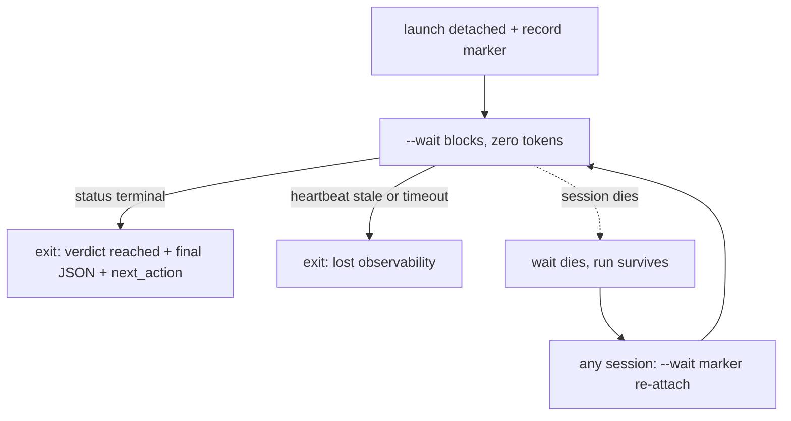

# Blocking --wait Verb and Honest-Ledger Prelude - Plan

## Goal Capsule

- **Objective:** Deliver stage 1 of the gate-run UX program: an instrumentation prelude (PR A) that separates queue time from generation time in the ledger, then a blocking `--wait` verb (PR B) that replaces the caller-side poll ceremony with a zero-token wait and a machine-actionable wake.
- **Product authority:** The ideation artifact `docs/ideation/2026-08-17-pro-gate-gate-run-ux-ideation.html` (ideas 1 and 4) plus the confirmed scoping synthesis. Later program stages (Status v2 remainder, round-loop supervisor, fair-share admission) are not active scope.
- **Open blockers:** None.

---

## Product Contract

### Summary

Give the engine a blocking `--wait` verb so a calling agent launches a review, records the marker, runs `--wait` in the background, and ends its turn — the harness's background-completion notification is the wake. A prelude PR first splits the ledger's conflated duration into queue and run time and adds wall-clock to round history, so the program's effect is measurable against a baseline.

### Problem Frame

A calling agent has no way to wait on a review except polling `<out>.status` every minute or two for up to 47+ minutes p90. The protocol for doing so is hand-maintained in three places — `skills/pro-gate/SKILL.md` §3, `agents/oracle-reviewer.md`, and a `sleep 60` loop embedded in `daemon/daemon.sh`'s prompt string — and each caller re-derives it per session. In the prbot PR #1628 incident, one session invoked a hand-rolled background poller 65 times, re-armed it 9 times after 8 exit-code-3 crashes, and ended at roughly 100% context and ~$443 while waiting on a round-3 confirming pass.

Two observability gaps make the wait worse than it needs to be. The status file freezes at `launching` for the entire 10–90+ minute generation window (the phase is set once at `bin/oracle-review.sh:2255`, immediately before the blocking producer wait), so a healthy long think and a dead engine look identical. And the ledger's single `secs` field starts at preflight (`bin/oracle-review.sh:697`), before both up-to-40-minute lock waits (`waiting-pr-lock` at 1918, `waiting-slot` at 1975), so every duration percentile conflates queue-wait with generation and no before/after story about wait time can be told from existing data.

### Key Decisions

- KD1. **A blocking CLI verb, not a watcher script or notification bus.** (session-settled: user-approved — chosen over a standalone watcher script plus push notifications: a blocking command serves every caller shape, including the headless daemon that structurally cannot receive async notifications; the interactive wake comes from the harness's background-completion notification, observed working and recorded under Dependencies / Assumptions.) Governs R4.
- KD2. **Instrumentation lands before the behavior change.** (session-settled: user-approved — chosen over shipping `--wait` first: the before/after ruler for the whole UX program only exists if measurement fields predate the new behavior.) Governs R1, R2, R3.
- KD3. **Only `terminal`, `next_action`, and the heartbeat ride in PR B.** (session-settled: user-approved — chosen over shipping the full Status v2 schema at once: these fields are `--wait`'s loop condition, wake payload, and staleness definition; the rest is additive and trails as its own PR.) Governs R8, R9, R10.
- KD4. **Delete the poll ceremony; don't synchronize its three copies.** (session-settled: user-approved — chosen over a canonical-source-plus-generation scheme: `--wait` collapses §3 to one instruction, and manual recovery remains documented as the degradation path per `docs/solutions/conventions/ship-the-legible-core-let-the-gate-decline-fragile-automation.md`.) Governs R11, R12.
- KD5. **Marker-attach is in scope for `--wait`.** (session-settled: user-approved — surfaced as the scoping call-out and confirmed: attaching to a run the session didn't launch is what makes re-arming after session death free, at the cost of marker-resolution logic in PR B.) Governs R6.
- KD6. **Exit-code selection must account for the undocumented live code space.** Verification found `exit 10` is a real bootstrap-fatal path (`bin/oracle-review.sh:40` when the shared lib fails to source) absent from SKILL.md's documented contract, and exit 1 is internal-only. Governs R5.

### Requirements

**Instrumentation prelude (PR A)**

- R1. Ledger rows carry queue time and run time as separate appended fields, stamped at the existing phase transitions (preflight → lock waits → launch → outcome); the existing `secs` field is preserved unchanged for backward compatibility. Appending is verified safe: `bin/pro-gate-stats.sh` parses ledger rows by jq field name (`.secs` at lines 87–88), so only a rename or split of `secs` itself would break it.
- R2. Round history rows gain wall-clock-per-round, and both `--status` and the exit-12 refusal message state rounds used plus elapsed wall clock for the change (today `rounds/<key>.hist` carries stamp, verdict, P0, P1, resolved, still-present — no time field).
- R3. The new timing fields are stamped at phase-transition time, never at marker mint or `RUN_START`, so queue time is never recorded as run time — and no budget or history window keys off a pre-lock epoch (the ~80-minute skew family documented at `lib/pro-gate-lib.sh:1129-1134` and `tests/engine.test.sh:1265-1268`).

**The --wait verb (PR B)**

- R4. `oracle-review.sh --wait <out-path|marker> [--timeout S]` blocks as a plain shell process — no LLM involvement — until the run's status reaches a terminal phase, then prints the final status JSON to stdout and exits.
- R5. `--wait` exits with distinct codes for "review reached a verdict" and "lost the ability to observe" (stale heartbeat, unreadable status, timeout), and lost observability is never reported as review failure. Verdict-reached is one exit code regardless of the underlying engine outcome (0, 9, 11, 12, …) — the printed status JSON and `next_action` carry the disambiguation. New code values collide with nothing the engine currently returns: the documented set 0, 2–9, 11, 12 plus the undocumented bootstrap-fatal 10 (per KD6); exit 1 is confirmed internal-only and available. Exact values are planning's choice.
- R6. `--wait` accepts a bare marker and resolves it to the run's status surface, so a session that did not launch the run can wait on it; invoked on an already-terminal run it returns immediately with the verdict-reached exit. Repeat waits are free and idempotent.
- R7. `--timeout`'s default exceeds the worst-case envelope of both lock waits plus a long generation; on expiry `--wait` exits through the lost-observability code.

**Status schema additions (ride PR B)**

- R8. The status JSON carries a literal `terminal` boolean — the field `--wait` tests — so future phase additions cannot silently break terminality inference.
- R9. The status JSON carries `next_action` — the command to run, the terminal flag, and a `wait_class` naming which situation the caller is in (act on a delivered verdict; collect a deferred review; enter recovery) — giving a woken caller one machine-actionable handoff instead of branching on the exit-code prose paragraph. Planning may refine the class taxonomy.
- R10. During every non-terminal phase the engine refreshes the status file on an interval with a current timestamp, preserving the existing atomic write (JSON to `.tmp`, then `mv -f`, `bin/oracle-review.sh:692`), so the frozen-`launching` gap closes. Staleness is defined as a multiple of the heartbeat interval — the heartbeat is engine-side and independent of Pro's thinking time, so the bound derives from the interval, not from generation length or the 600s watchdog fuses.

**Protocol rewrite (PR B)**

- R11. SKILL.md §3's documented caller protocol becomes: launch detached, record the marker, run `--wait` in the background, end the turn; the poll-loop instructions are removed. Manual recovery (`--status`, `--harvest`) stays documented as the degradation path.
- R12. `agents/oracle-reviewer.md` is updated in the same PR (its own contract requires same-PR sync), and `daemon/daemon.sh`'s embedded `sleep 60` poll loop is replaced by blocking on `--wait`.

### Key Flows

- F1. Happy path
  - **Trigger:** A calling agent needs a gate verdict.
  - **Steps:** Launch the engine detached; record the marker; start `--wait` via the harness's background primitive; end the turn. The harness notifies when `--wait` exits; the agent reads the printed status JSON and acts on `next_action`.
  - **Covers:** R4, R8, R9, R11.
- F2. Caller dies mid-wait
  - **Trigger:** The session holding `--wait` compacts or exits.
  - **Steps:** Only the wait process dies; the run, reservation, marker, and status file survive. Any later session runs `--wait <marker>` and attaches; if the run finished meanwhile, it returns immediately.
  - **Covers:** R6.
- F3. Observability lost
  - **Trigger:** The status heartbeat goes stale past the staleness bound, or `--timeout` expires.
  - **Steps:** `--wait` exits through the lost-observability code. The caller escalates (check `--status`, engine logs, browser state) instead of re-arming a poller forever — the failure is named as "cannot observe," never "review failed."
  - **Covers:** R5, R7, R10.

### Acceptance Examples

- AE1. **Covers R5, R10.** Given a healthy run in its 60th minute of generation with a fresh heartbeat, when `--wait` polls the status file, then it keeps waiting; given the heartbeat is older than the staleness bound, then `--wait` exits with the lost-observability code, not a failure code.
- AE2. **Covers R6.** Given a run that reached its verdict yesterday, when a fresh session runs `--wait <marker>`, then it exits immediately with the verdict-reached code and the final status JSON, spending nothing.
- AE3. **Covers R9.** Given a run that ends in exit 9 (deferred harvest), when `--wait` returns, then `next_action` carries the exact harvest command so the caller acts without parsing recovery prose.
- AE4. **Covers R1, R2.** Given PR A is deployed, when a run completes, then its ledger row carries the new queue and run time fields, its round-history row carries wall clock, and the existing `pro-gate-stats.sh` percentiles still compute from `secs` unchanged.
- AE5. **Covers R4, R8.** Given a live run whose status shows `terminal: false`, when the engine writes a terminal phase with `terminal: true`, then a blocked `--wait` exits within one poll interval and prints that final JSON.
- AE6. **Covers R7.** Given `--wait --timeout 60` on a run that stays non-terminal, when 60 seconds elapse, then `--wait` exits through the lost-observability code and the run itself is unaffected.

### Success Criteria

- Background-poller invocations per gate wait drop from ~65 (PR #1628 transcript) to 1 — a single `--wait` — with zero hand-rolled poller scripts required by the documented protocol.
- Queue time and run time are independently reportable from the ledger for every post-PR-A run.
- During healthy generation the status file is never staler than twice the heartbeat interval.
- The three prose copies of the poll ceremony are reduced to references to `--wait`.

### Scope Boundaries

- **Deferred for later (same program, separate PRs):** the rest of Status v2 (capacity `holders[]`, `recover_reason_code` enum, TTL countdown, rounds preview); the stage-2 round-loop supervisor; any ETA/`ready_by` field (buildable from PR A's data); fair-share slot admission; the fleet harvest sweep.
- **Outside this work's identity:** push-delivery plumbing (cross-session SendMessage, webhooks) — cross-session delivery stays pull-based on the durable surfaces that already exist (completed store, PR comments, `--status`).

<!-- ce-section: work-relationships -->
### How This Work Fits Together

This plan owns stage 1 of the gate-run UX program mapped in `docs/ideation/2026-08-17-pro-gate-gate-run-ux-ideation.html`; the breakdown below is the current understanding, not a committed roadmap.

- Stage-2 round-loop supervisor — **Depends on** this plan's `--wait` primitive; planned separately.
- Status v2 remainder (PR C) — **Can proceed independently of** stage 2; additive to this plan's schema fields.
- ETA/`ready_by` and fair-share admission — **Depend on** PR A's queue/run split for evidence; **Still to decide** whether either is built at all.
- Fleet harvest sweep — **Can proceed independently of** everything here.

### Dependencies / Assumptions

- Verified against the live repo (fresh-context verifier, 2026-08-17): no existing `--wait` or notify mechanism; the three protocol copies at `skills/pro-gate/SKILL.md:197-263`, `agents/oracle-reviewer.md:18-21,79-100`, `daemon/daemon.sh:234`; atomic status writes at `bin/oracle-review.sh:692` (`pg_status` defined at 667); `RUN_START` at 697 preceding both lock waits; jq field-name ledger parsing in `bin/pro-gate-stats.sh:87-88`; round-history shape at `lib/pro-gate-lib.sh:1274`; live exit code 10 at `bin/oracle-review.sh:40`.
- Assumption: the harness's background-completion notification reliably wakes the calling session when a background command exits (observed working throughout this session); the headless daemon does not rely on it (it blocks synchronously on `--wait`).

### Outstanding Questions

- **Deferred to Planning:** exact exit-code values for verdict-reached and lost-observability (per R5's collision rule); heartbeat interval and staleness multiplier; `--timeout` default value; marker-resolution order (reservations → active → completed store); whether R3 requires code change or only a documenting test, given v0.31 already stamps the spend epoch at `pg_round_record` time.
- **Resolve Before Planning:** none.

### Sources / Research

- `docs/ideation/2026-08-17-pro-gate-gate-run-ux-ideation.html` — the ranked ideation this plan's ideas 1 and 4 come from, including usage forensics (exit-7 burst, exit-9 at 19.5% of runs, the PR #1628 incident) and the adversarial verification of its bases.
- `docs/solutions/conventions/ship-the-legible-core-let-the-gate-decline-fragile-automation.md` — the design bar the blocking-verb choice honors.
- External prior art: AWS Durable Execution's `waitForCondition` (suspended waits at no compute cost), the Aura postmortem's wake-not-poll production pattern with polling as named fallback, and Kubernetes-watch staleness reports motivating the pull-based safety net.
