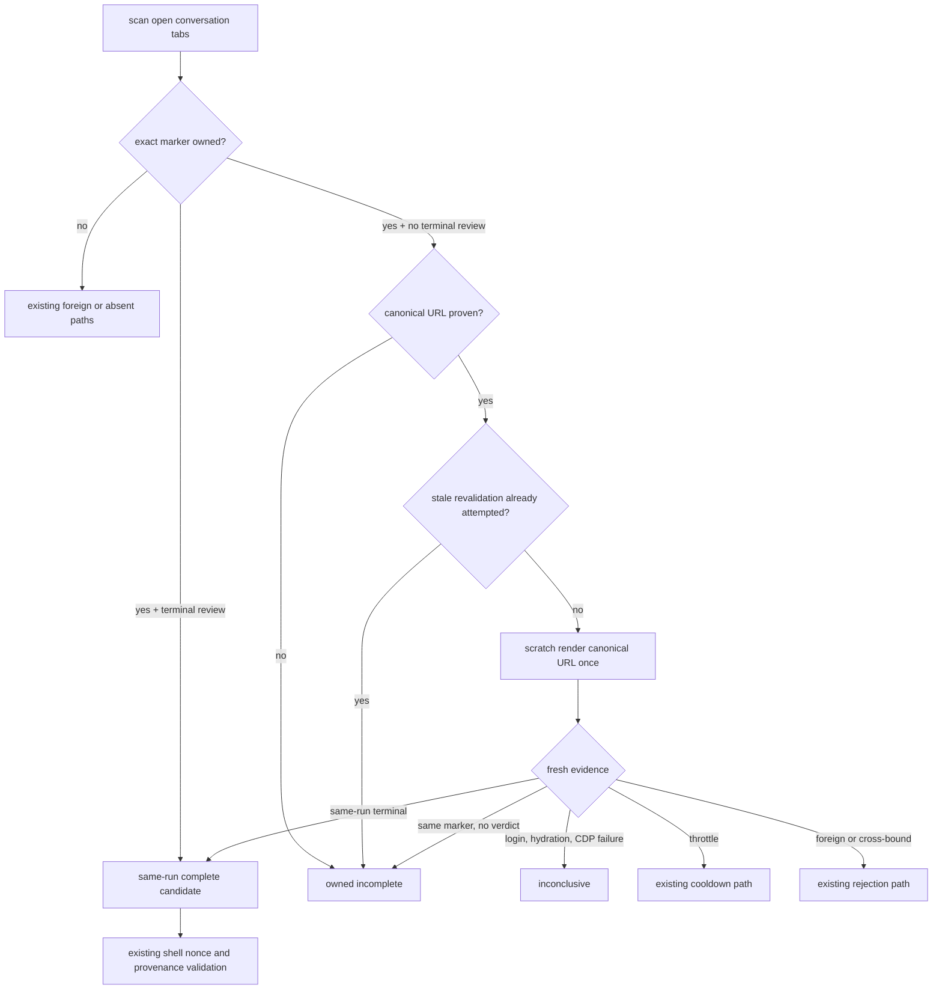
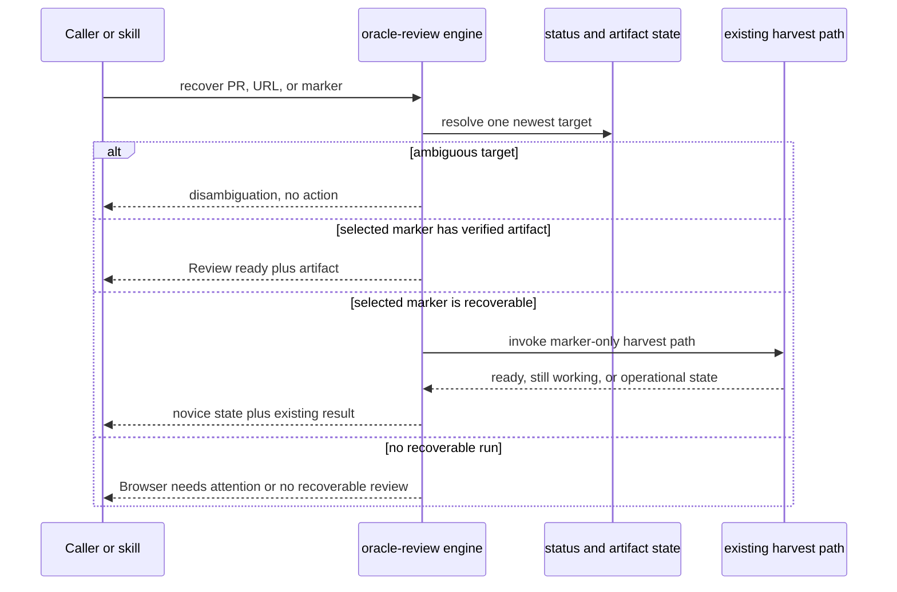

# Readable Stale-Tab Recovery - Plan

## Goal Capsule

- **Objective:** Recover completed ChatGPT Pro reviews automatically when an open marker-owned browser tab is readable but stale, without spending another review slot or asking users to understand browser internals.
- **Means:** Revalidate the proven canonical conversation URL once in a disposable same-profile scratch tab, classify that fresh evidence through the existing safety pipeline, and expose the flow through a recovery-only engine mode used by `/pro-gate recover` (KTD1, KTD3).
- **Product authority:** Issue #90 and this Product Contract. Existing nonce, provenance, cross-bind, throttle, reservation, lock, and durable-artifact contracts outrank convenience behavior.
- **Execution profile:** Test-first engine correction, recovery-only CLI integration, then caller documentation and a v0.35.0 release. Follow-up browser lifecycle and account-profile work are excluded.
- **Stop conditions:** Stop rather than guess if implementation would require weakening terminal-answer ownership, releasing an inconclusive reservation, submitting fresh work from recovery mode, or mutating the source tab.
- **Tail ownership:** The engine owns evidence collection and durable recovery. The skill and relay only route callers through that engine behavior.

---

## Product Contract

### Summary

Repair stale-readable-tab recovery in the shared CDP helper and add one novice-safe recovery action. The same correction must govern salvage, harvest, and probe, while all ambiguous states remain fail-closed and all existing expert recovery surfaces remain compatible.

### Problem Frame

pro-gate v0.34.0 can retain a completed review as `in-progress` for hours. The source ChatGPT tab remains readable and contains the run marker in the submitted prompt, but its renderer is stale and lacks the completed assistant answer. `cdp-salvage` treats that marker-bearing DOM as current liveness, sets `stillGeneratingUrl`, and suppresses its remembered-URL scratch render because the source tab still exists.

The failure was reproduced on pushbot PR #1758. Repeated harvests, including a full 20-minute harvest, returned exit 9 while the server conversation already carried the exact nonce-bearing verdict. A fresh navigation to the remembered URL in the same Chrome profile immediately exposed the answer. Refreshing the source tab made the unchanged harvest command succeed. Three additional old exit-9 tabs had the same state and were recovered the same way.

Manual refresh is not an acceptable product fix. It does not repair unattended harvest or probe, requires users to discover Xvfb/noVNC/CDP, and leaves the engine confidently reporting the wrong state.

### Key Decisions

- KD1. **Correct the engine before simplifying the skill.** (session-settled: user-approved — chosen over a skill-only manual-refresh workaround: unattended salvage and probe must become correct without human browser intervention.) Governs R1–R6.
- KD2. **Ship issue #90 without browser/account expansion.** (session-settled: user-approved — chosen over bundling noVNC lifecycle, named profiles, and account rotation: those concerns do not repair stale server-state detection and would delay the correctness release.) Governs R11, R12.
- KD3. **Recovery is harvest-only.** A recovery invocation may return an existing artifact or collect one known run; it can never submit a new review. Governs R7–R10.

### Requirements

**Canonical stale-tab evidence**

- R1. A readable marker-owned source tab with no valid terminal verdict and a proven canonical conversation URL must receive at most one bounded same-profile scratch revalidation before the invocation reports it as generating; the scratch target must still equal the requested canonical URL when evidence is read, or the result is inconclusive.
- R2. Stale revalidation must never reload, navigate, close, rename, or archive the source tab; it may close only the scratch target it created.
- R3. Salvage, harvest, and probe must classify the same refreshed evidence, while preserving each caller's existing public exit contract.
- R4. Harvest candidate bytes may proceed only through the existing nonce/provenance acceptance path; probe may report complete only when the terminal verdict is positionally after this run's latest exact prompt marker and echoes this run marker. Foreign, cross-bound, throttle, login, hydration, URL-drift, target-disappearance, and CDP failure outcomes retain their existing semantics.
- R5. A same-marker scratch result without a terminal verdict remains in progress; an inconclusive scratch result is not a confirmed miss, cannot update memo/blacklist state, and cannot release a reservation.
- R6. Stale revalidation must reuse the existing deadline, render cadence, and throttle controls and must not add an unbounded poller or background self-heal.

**Recovery-only public action**

- R7. `/pro-gate recover <PR|URL|marker>` must route to an engine `--recover` mode that is structurally separated from repository fetch, diff assembly, round charging, slot acquisition, and fresh Oracle submission.
- R8. Recovery must select one run deterministically: an exact marker wins; a repo-qualified URL or repository context resolves the newest run for that change; an ambiguous bare PR number or multiple unresolved candidates produces a non-mutating disambiguation response.
- R9. For the selected run, recovery returns a verified completed artifact through a preflight-free path that performs only requested output publication; otherwise it invokes only the existing marker-addressable harvest path and inherits its marker lock, cooldown, provenance, and idempotency behavior.
- R10. Plain recovery output must use novice-readable states—`Review ready`, `Checking for completed review`, `Still working`, or `Browser needs attention`—while the existing `--status --json` surface remains the detailed machine/expert diagnostic contract.

**Compatibility and release**

- R11. Existing `--status`, `--harvest`, direct review modes, environment variables, artifact paths, exit codes, reservation formats, and caller contracts remain supported.
- R12. The skill, oracle-reviewer relay, README/runtime help, release notes, `VERSION`, and plugin version must describe the shipped behavior in the same release.

### Actors

- A1. **Novice caller:** knows the PR but not the marker, browser backend, reservation state, or recovery command sequence.
- A2. **Expert caller or automation:** uses markers, `--status --json`, direct `--harvest`, and existing exit codes.
- A3. **Recovery engine:** resolves run state, collects browser evidence, validates ownership, and persists the artifact.
- A4. **ChatGPT browser session:** may expose divergent source-tab and server-rendered state.

### Key Flows

- F1. **Automatic stale-source recovery**
  - **Trigger:** Salvage or harvest sees a readable marker-owned source with no terminal verdict.
  - **Steps:** Preserve source liveness; scratch-render the proven canonical URL once; classify the fresh result; close the scratch; route accepted bytes through existing shell-side validation and persistence.
  - **Outcome:** A completed review returns without a new slot, or the invocation retains its prior in-progress/inconclusive state.
  - **Covers:** R1–R6.
- F2. **Probe completion classification**
  - **Trigger:** Reservation reconciliation or watchdog probe sees the stale readable source.
  - **Steps:** Defer probe's current early finalization long enough for the single canonical revalidation; emit `probe-state: complete` or `probe-state: generating`; preserve exit 0 as proof the conversation exists.
  - **Outcome:** Completed work releases capacity through existing lifecycle logic without enabling a duplicate review.
  - **Covers:** R1, R3–R6.
- F3. **Novice recovery**
  - **Trigger:** A caller invokes `/pro-gate recover` with a PR, URL, or marker.
  - **Steps:** Resolve exactly one target; return its verified artifact if present; otherwise run only harvest; render one plain-language state.
  - **Outcome:** The caller gets the review or a safe next state without learning markers or risking a new spend.
  - **Covers:** R7–R10.
- F4. **Concurrent recovery**
  - **Trigger:** Two callers recover the same marker.
  - **Steps:** Both may resolve state; the existing marker harvest lock serializes collection; later calls use the completed-artifact fast path.
  - **Outcome:** One durable artifact, one reservation retirement, no fresh submission.
  - **Covers:** R9, R11.

### Acceptance Examples

- AE1. **Covers F1 / R1–R4.** Given an open source tab with this run's prompt marker and no assistant verdict, and a scratch render of the same remembered URL with a same-run nonce verdict, salvage returns the review, closes only the scratch, and leaves the source untouched.
- AE2. **Covers F2 / R3.** Given the same divergent source and server state under `--probe`, probe exits through its existing live-conversation code and emits `probe-state: complete` rather than `generating`.
- AE3. **Covers R4, R5.** Given a scratch page with another run's terminal marker, a login wall, an incomplete shell, or a CDP error, the engine accepts no review and releases no reservation.
- AE4. **Covers R5, R6.** Given a scratch render that still has this marker but no verdict, the invocation remains in progress and performs no second forced stale revalidation.
- AE5. **Covers F3 / R7–R10.** Given an exact marker with a completed artifact and no browser, recover returns `Review ready` and the artifact without touching CDP.
- AE6. **Covers F3 / R8.** Given bare PR number `42` with matches in two repositories, recover lists disambiguation and performs no harvest.
- AE7. **Covers F3 / R8, R9.** Given one repo-scoped change with an older completed round and a newer in-progress round, recover targets the newer run; it does not return the older artifact as if it were current.
- AE8. **Covers F4 / R9.** Given concurrent recover calls for one marker, one collects while the other receives the established busy/idempotent path; neither can launch Oracle.

### Success Criteria

- The four production stale tabs from the 2026-08-18 incident are representable by deterministic tests that fail on v0.34.0 and pass after the fix.
- A completed server review behind a readable stale source is recovered within one scratch-render budget and spends no additional Pro slot.
- Recovery mode has no control-flow path to fresh submission or round charging.
- Existing salvage, harvest, probe, cross-bind, throttle, and reservation tests remain green.
- A novice can recover from a PR number or URL through one supported skill action without opening noVNC or reading raw status JSON.

### Scope Boundaries

- **Deferred to Follow-Up Work:** owned noVNC/login-view start-status-stop lifecycle; richer doctor diagnostics; named browser-profile registry; profile-scoped cooldown/ramp state; automatic account selection or rotation.
- **Outside this work's identity:** connector setup; browser login/2FA automation; CAPTCHA handling; Oracle dependency upgrade; changes to review/fix/merge policy; backend ChatGPT APIs.

### Dependencies / Assumptions

- The current `freshRenderText` scratch primitive remains the single server-state revalidation mechanism.
- The existing completed store, status join, marker harvest lock, reservation lifecycle, and shell-side nonce/provenance validation remain authoritative.
- `oracle-review.sh --recover <query> [--repo <dir>] [--out <file>] [--timeout <dur>]` is the installed engine surface. `/pro-gate recover <query>` is the novice skill syntax. No new executable is introduced.
- For a selected marker, omitted `--out` may use the existing resolved output/default publication behavior; the marker-addressed completed artifact remains authoritative.
- Detailed automation continues to use `oracle-review.sh --status <query> --json`; this release does not add a second JSON schema or a new verbose mode to recovery.

### Sources / Research

- GitHub issue #90 — verified incident, must-ship scope, and acceptance contract.
- `bin/cdp-salvage.mjs` — current live-tab scan, remembered-URL rendering, cross-bind logic, and scratch-render limits.
- `bin/oracle-review.sh` and `lib/pro-gate-lib.sh` — artifact-first harvest, state join, marker locks, reservation lifecycle, and probe-state consumption.
- `tests/cdp-salvage.test.mjs` and `tests/engine.test.sh` — existing tabless/dead-tab, hydration, cross-bind, lock, and artifact fixtures.
- `docs/solutions/conventions/ship-the-legible-core-let-the-gate-decline-fragile-automation.md` — keep recovery bounded and legible; reject a larger self-healing subsystem.
- Merged PRs #44, #54, and #68 — remembered URL, positive run binding/idempotent artifacts, and cross-bind hardening that this change must preserve.

---

## Planning Contract

### Key Technical Decisions

- KTD1. **Use one disposable canonical scratch render, never a source-tab refresh.** (session-settled: user-approved — chosen over documenting manual refresh: unattended recovery must observe current server state without mutating the user's source tab.) The stale attempt is once per invocation and consumes the existing remembered-URL render cadence and deadline. Governs R1, R2, R6.
- KTD2. **Classify evidence before mapping caller behavior.** Open-tab reads and scratch reads feed one non-exiting result seam: terminal review candidate, owned incomplete, inconclusive, throttle, or foreign/cross-bound. Salvage maps candidate bytes to its current output for shell validation. Probe reports complete only for a terminal verdict after the latest exact prompt marker that echoes this run marker; otherwise proven ownership remains generating. Governs R3–R5.
- KTD3. **Add `--recover` to the existing engine; add no wrapper executable.** The parser enters a dedicated recovery branch before browser preflight, self-heal, repository/diff work, locks, round governance, status writes, or fresh dispatch. `/pro-gate recover` is skill syntax over that branch. Governs R7, R9, R11.
- KTD4. **Resolve newest-run intent before artifact-first return.** Exact markers select themselves. Other queries use one extracted read-only candidate enumerator shared with status, require repository identity for every candidate, normalize ordering to charged-spend epoch with marker epoch as the legacy fallback, and fail closed on missing, conflicting, or tied evidence. Artifact-first applies only after one marker is selected. Governs R8, R9.
- KTD5. **Keep authority in the shell engine.** CDP may supply fresh candidate bytes, but `oracle-review.sh` retains nonce/provenance acceptance, publication, reservation retirement, and organizer authority. Governs R4, R9, R11.
- KTD6. **Reuse existing diagnostics instead of creating a recovery JSON protocol.** Plain recovery states serve novices; `--status --json`, direct `--harvest`, logs, and existing exit codes serve automation and experts. Governs R10, R11.
- KTD7. **Ship as v0.35.0.** This user-visible recovery action and engine behavior change land with synchronized runtime/plugin versions and release notes. Governs R12.

### High-Level Technical Design

Evidence classification and stale revalidation:

Recovery-only command sequence:

Recovery candidate resolver:

| Query/candidate source | Repository proof | Ordering evidence | Decision |
|---|---|---|---|
| Exact marker | Marker syntax and its repo-scoped round key | Not needed | Select that marker. |
| Repo-qualified PR URL or current-repo PR number | Exact slug/round-key match | Charged-spend epoch; marker epoch only for legacy state | Select the unique newest marker. |
| Active or reservation state | Repo-scoped change key in the record | Reservation spend field when present; marker epoch fallback | Merge by marker before ordering. |
| Ledger or completed store | Repo-scoped round key and marker-addressed artifact identity | Joined charged-spend evidence when available; marker epoch fallback | Candidate only; never outranks a newer live run by completion timestamp. |
| Bare PR spanning repositories, tied epochs, missing repo proof, or conflicting evidence | Insufficient | Insufficient | Return disambiguation and perform no action. |

Artifact lookup occurs only after this table yields one selected marker. A selected artifact is verified and published without browser preflight, organizer work, harvest locking, reservation mutation, ledger/round accounting, or fresh-dispatch status writes.

### System-Wide Impact

- **Spend safety:** Recovery remains incapable of creating a fresh Pro turn. Probe exit semantics remain live-conversation semantics, so watchdogs still suppress duplicate submission.
- **Browser traffic:** One additional canonical page load may occur for a stale readable source. Existing deadline, throttle, and URL cadence bound it.
- **State lifecycle:** Completed artifacts and reservations keep their formats. Probe completion requires an exact marker-owned terminal verdict after the current prompt, so earlier capacity release is tied to positive same-run evidence rather than extraction alone.
- **Target identity:** Scratch URL drift and recovery-candidate repository ambiguity are inconclusive. Neither may update memory, release capacity, or choose an artifact.
- **Agent parity:** Novice and expert callers use the same engine state and artifacts. The skill adds orchestration, not a parallel recovery implementation.
- **Compatibility:** No existing command, environment variable, status JSON field, or exit code is removed or narrowed.

### Risks & Mitigations

- **Probe latency could delay watchdog decisions.** Limit stale revalidation to one attempt inside the probe's existing outer deadline; preserve exit 0 once ownership is proven.
- **Fresh scratch text could belong to another run.** Route it through the existing terminal-marker, cross-bind, blacklist, nonce, and provenance checks.
- **Repeated recovery calls could load the page repeatedly.** Reuse existing render cadence and throttle controls; do not add an independent loop or ticker.
- **Recovery could return an old round.** Resolve newest-run intent before artifact lookup and require disambiguation for unresolved ties.
- **Parser fallthrough could spend a slot.** Place `--recover` in an exclusive early mode and enforce with integration tests whose Oracle binary fails if invoked.

### Sequencing

U1 establishes the failing CDP cases and engine classifier. U2 proves shell lifecycle integration. U3 adds the recovery-only public action after the engine is trustworthy. U4 synchronizes callers and public documentation. U5 packages and verifies the release.

---

## Implementation Units

### U1. Canonical stale-source revalidation

- **Goal:** Recover a completed server review behind a readable stale source and classify probe from the same fresh evidence.
- **Requirements:** R1–R6. Covers AE1–AE4.
- **Dependencies:** none.
- **Files:** `bin/cdp-salvage.mjs`, `tests/cdp-salvage.test.mjs`.
- **Approach:**
  1. Add the readable-stale fixture first by giving the listed source prompt/progress text and the exact canonical scratch target completed terminal text.
  2. Replace probe's early exit and the duplicated open/dead/seeded outcome branches with one non-exiting evidence-classification seam; caller-specific output happens only after the bounded candidate pass.
  3. Reuse `freshRenderText`, `nextRenderAt`, seeded render budget, throttle detection, `foreignAnswerMarker`, memo claim-and-verify, and scratch cleanup.
  4. Verify the scratch target still has the requested canonical URL before using its text; URL drift or target disappearance is inconclusive and mutates no memo, blacklist, or reservation state.
  5. Map the final internal class back to current salvage/probe outputs; keep probe rc 0 for a proven conversation and require exact terminal-marker ownership before `probe-state: complete`.
- **Execution note:** Begin with failing normal-salvage and probe regressions that reproduce the production divergence; do not modify the source-tab fixture to simulate a refresh.
- **Patterns to follow:** Existing tabless remembered-URL and hydration tests; existing per-candidate cross-bind rejection; `freshRenderText` cleanup in `finally`.
- **Test scenarios:**
  1. Covers AE1. Readable stale source plus same-run completed scratch returns exact review bytes; one scratch opens/closes; source target remains open and unnavigated.
  2. Covers AE2. The same fixture under probe emits `probe-state: complete`, returns rc 0, and emits no review body.
  3. Covers AE4. Same-marker incomplete scratch remains generating and consumes no second stale attempt.
  4. Login shell, pre-hydration shell, null text, CDP failure, target disappearance, and canonical-URL drift remain inconclusive, close only the scratch, and mutate no memo/blacklist/reservation state.
  5. A terminal verdict before the latest exact prompt marker or without this run's marker cannot produce `probe-state: complete`.
  6. Throttle scratch takes the existing throttle exit and does not continue rendering.
  7. Foreign/cross-bound terminal scratch is rejected with current memo/blacklist behavior.
  8. Existing dead-tab, tabless memo, hydration, and latest-scan tests remain unchanged and green.
- **Verification:** Focused CDP suite proves exact target count, source immutability, scratch cleanup, output bytes, and result classification.

### U2. Harvest and reservation lifecycle integration

- **Goal:** Prove the repaired CDP evidence produces one durable artifact and the correct capacity transition through existing shell authority.
- **Requirements:** R3–R6, R9, R11. Covers AE1–AE4, AE8.
- **Dependencies:** U1.
- **Files:** `bin/oracle-review.sh`, `lib/pro-gate-lib.sh` only if current probe-state consumption needs adjustment, `tests/mock-cdp.mjs`, `tests/engine.test.sh`.
- **Approach:**
  1. Extend `tests/mock-cdp.mjs` so one listed source and its scratch target can expose divergent DOM states and record scratch opens/closes.
  2. Exercise direct `--harvest` through the existing marker lock, shell nonce/provenance validation, durable publication, and reservation retirement.
  3. Verify repaired probe completion flows through current `pg_reservation_reconcile` capacity release without changing reservation formats or miss rules.
  4. Avoid shell changes when U1's existing outputs already satisfy lifecycle consumers.
- **Execution note:** Treat shell changes as evidence-driven; first prove whether the corrected CDP output is sufficient.
- **Patterns to follow:** Completed-artifact fast path; marker harvest lock; reservation claimed-marker exemption; immutable marker-addressed artifact store.
- **Test scenarios:**
  1. Stale readable source harvest exits 0, publishes the exact nonce-valid review, and records a durable completed artifact.
  2. Reservation remains through incomplete/inconclusive scratch and retires exactly once after durable success.
  3. Repaired probe reports complete and releases only capacity state already designed to release on completion.
  4. Two concurrent harvests serialize; the second returns the artifact or existing busy outcome without Oracle submission.
  5. Throttle, cross-bound, and browser-unreachable outcomes preserve current exit/status/reservation semantics.
- **Verification:** Engine suite proves no fresh Oracle invocation, exactly-once persistence, lock behavior, and unchanged reservation/miss formats.

### U3. Recovery-only engine mode and skill action

- **Goal:** Give novice and automated callers one deterministic no-spend recovery action.
- **Requirements:** R7–R11. Covers AE5–AE8.
- **Dependencies:** U2.
- **Files:** `bin/oracle-review.sh`, `tests/engine.test.sh`.
- **Approach:**
  1. Add exclusive `--recover <query>` parsing before any browser preflight, self-heal, repository/diff work, locks, round governance, status side effects, or fresh-dispatch validation; accept existing `--repo`, `--out`, and `--timeout` modifiers.
  2. Extract one machine-oriented read-only candidate enumerator/selector from the inline status join; status and recover call that seam rather than parsing status output or duplicating reservation/active/ledger/completed scans.
  3. Apply KTD4's repository proof, charged-spend ordering, legacy fallback, and tie rules to select one marker before artifact lookup.
  4. For a selected verified artifact, publish the caller-requested output alias and print/return the result without `pg_finish`, organizer/CDP, browser preflight, harvest locking, reservation mutation, ledger/round accounting, or fresh-dispatch setup.
  5. Only artifact absence may enter the established marker harvest branch.
  6. Map existing terminal outcomes to the four R10 plain states. Direct callers retain existing detailed output, exit codes, and `--status --json` diagnostics.
- **Execution note:** Write parser and control-flow isolation tests before adding recovery behavior; use a failing fake Oracle binary to prove no input reaches fresh dispatch.
- **Patterns to follow:** `--status` query parsing and state join; `--harvest` completed fast path; exclusive mode validation near current `STATUS_REQUESTED` handling.
- **Test scenarios:**
  1. Covers AE5. Exact marker with artifact succeeds while CDP and Oracle are unavailable; it makes zero mock-CDP requests and creates no active record, reservation, round record, ledger row, organizer call, or fresh-dispatch status.
  2. Repo-qualified PR with one newest recoverable marker invokes harvest and publishes the result; only this artifact-absent path may acquire the marker harvest lock.
  3. Covers AE7. A newer in-progress round wins over an older completed artifact using charged-spend ordering, not completion time.
  4. Covers AE6. Bare PR with cross-repo ambiguity lists candidates and takes no lock, CDP, or state action.
  5. Missing repo proof, conflicting order evidence, tied normalized epochs, or multiple unresolved same-priority markers require an exact marker.
  6. Incomplete harvest prints `Still working`; CDP/login/operational failure prints `Browser needs attention`; completed result prints `Review ready`.
  7. Covers AE8. Concurrent recover calls inherit the harvest lock and idempotent artifact behavior.
  8. Every recovery input leaves the fake Oracle fresh-dispatch sentinel untouched and records no round spend.
- **Verification:** Engine tests prove deterministic selection, artifact-first behavior for the selected marker, plain-state mapping, and structural no-submit isolation.

### U4. Caller and operator contract update

- **Goal:** Make the supported recovery path discoverable without teaching users manual browser repair.
- **Requirements:** R7, R10–R12.
- **Dependencies:** U3.
- **Files:** `skills/pro-gate/SKILL.md`, `agents/oracle-reviewer.md`, `README.md`, `bin/oracle-review.sh` usage/help text, relevant docs assertions in `tests/distribution.test.sh` or `tests/engine.test.sh`.
- **Approach:**
  1. Add `/pro-gate recover <PR|URL|marker>` routing to the skill and the equivalent engine command to runtime help/README.
  2. Replace stale guidance that treats a readable/open tab as current server truth; state that recovery safely revalidates the canonical conversation.
  3. Preserve direct `--status --json` and `--harvest` as expert surfaces and preserve every warning against fresh reruns, reservation deletion, and nonce disabling.
  4. Synchronize the oracle-reviewer relay in the same change as required by its contract.
- **Patterns to follow:** Existing engine-command README section; skill's detached-vs-dead recovery section; relay's same-PR synchronization note.
- **Test scenarios:**
  1. Skill recovery examples invoke `--recover`, never fresh `--pr` dispatch or manual browser reload.
  2. Relay and README name the same accepted queries and no-spend guarantee.
  3. Existing compatibility commands and exit tables remain documented.
  4. Distribution assertions prove both skill and relay use the same recover grammar, four plain states, and no-fresh-run guarantee, and route through `oracle-review.sh --recover` rather than `--pr` or manual refresh.
  5. Distribution/runtime install assertions still find the updated engine surface and preserve the direct `--status --json` and `--harvest` expert routes.
- **Verification:** Documentation search finds no primary manual-refresh workaround and no conflicting recovery command; distribution and engine tests remain green.

### U5. Package, release, and full verification

- **Goal:** Ship the synchronized runtime/plugin change as v0.35.0 with complete release evidence.
- **Requirements:** R11, R12.
- **Dependencies:** U1–U4.
- **Files:** `VERSION`, `.claude-plugin/plugin.json`, `docs/release-notes/v0.35.0.md`, any generated release metadata required by existing tests.
- **Approach:**
  1. Write customer-facing release notes explaining automatic recovery and the new recovery action without exposing CDP implementation jargon.
  2. Bump runtime and plugin versions together only after focused tests pass.
  3. Run the full CI-equivalent suite, shell lint, release-note validation, simplification review, and code review.
  4. Dogfood `/pro-gate` only after no unrelated review holds the active account; never restart or switch the browser to test this change.
- **Patterns to follow:** `docs/release-notes/v0.34.0.md`; lockstep version checks; release train triggered by `VERSION` bump.
- **Test scenarios:** Test expectation: none—packaging unit; behavior is proven by U1–U4 and release integrity by existing distribution/release suites.
- **Verification:** Version files match, release notes validate, all CI commands pass, and no abandoned experimental path remains in the diff.

---

## Verification Contract

| Gate | Command | Applies to | Done signal |
|---|---|---|---|
| Focused CDP regressions | `node --test tests/cdp-salvage.test.mjs` | U1 | Stale readable source, probe, incomplete, throttle, and cross-bind cases pass with source immutability assertions. |
| Engine lifecycle and recover mode | `bash tests/engine.test.sh` | U2, U3, U4 | Harvest persistence, reservation lifecycle, ambiguity, concurrency, and no-submit tests pass. |
| Distribution compatibility | `bash tests/distribution.test.sh` | U4, U5 | Installed runtime/help and compatibility surfaces remain valid. |
| Full repository suite | CI sequence from `.github/workflows/ci.yml` | U1–U5 | All eight test programs pass. |
| Shell lint | `find . -path './.git' -prune -o -name '*.sh' -print0 | xargs -0 shellcheck --severity=error` | U2–U5 | No errors and no new suppressions. |
| Release notes | `./scripts/check-release-notes.sh docs/release-notes/v0.35.0.md` | U5 | Customer copy passes release validation. |
| Simplification review | `/simplify` | U1–U5 | No duplicated classifier, resolver, or recovery path remains. |
| Code review | `/ce-code-review` followed by same-session `/verify-review` for surviving findings | U1–U5 | Confirmed findings resolved or explicitly escalated. |
| Terminal gate | `/pro-gate 91` after the account is idle | U1–U5 | Final reviewed head has no unresolved P0/P1, or remaining findings are disclosed per gate policy. |

Full CI sequence:

1. `bash tests/engine.test.sh`
2. `bash tests/daemon-reload.test.sh`
3. `bash tests/autoupdate.test.sh`
4. `bash tests/browser-launch.test.sh`
5. `node --test tests/cdp-salvage.test.mjs`
6. `bash tests/distribution.test.sh`
7. `bash tests/release-train.test.sh`
8. `bash tests/release-assets.test.sh`

---

## Definition of Done

- U1–U5 satisfy their cited requirements and acceptance examples.
- A readable stale source can no longer suppress canonical server-state revalidation in salvage, harvest, or probe.
- Source tabs are never mutated by stale revalidation; scratch targets always close.
- Same-run completion, incomplete, inconclusive, throttle, and foreign/cross-bound states preserve the defined safety boundaries.
- `--recover` and `/pro-gate recover` are deterministic, artifact-first for the selected newest marker, concurrency-safe, and incapable of fresh submission.
- Existing expert commands, JSON status, exit codes, environment variables, artifacts, reservations, locks, and caller compatibility remain intact.
- Skill, relay, README, runtime help, release notes, runtime version, and plugin version agree on the shipped contract.
- Focused tests, full CI-equivalent tests, shell lint, release validation, simplification review, code review, and the terminal gate complete successfully.
- The draft PR references issue #90 and carries a concise incident-to-fix audit trail.
- No browser lifecycle, named-profile, account-pool, connector, Oracle-upgrade, dead-end, or experimental code remains in the diff.
