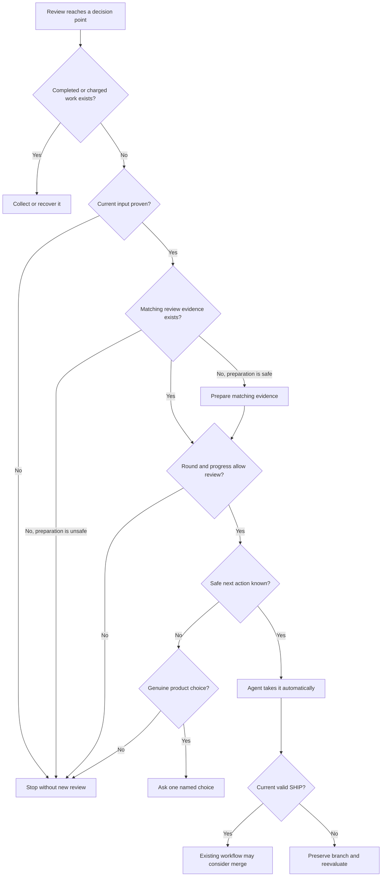

# Pro-gate One Clear Next Step - Plan

## Goal Capsule

- **Objective:** Coding agents take a safe, earned next step without routine permission prompts, never repeat the same review without progress, and merge only after a current valid `SHIP`.
- **Means:** At each review decision point, pro-gate returns one clear next action that every supported harness follows.
- **Product authority:** Pro-gate decides review continuation, recovery, collection, stopping, and merge eligibility; coding agents keep code-edit authority, and the surrounding workflow keeps merge authority.
- **Open blockers:** None for product scope. Planning will adapt the located Pi `/oracle` bridge rather than inventing a new Pi runtime.

---

## Product Contract

### Summary

Pro-gate will give one clear next action whenever a review reaches a decision point.
Claude Code, Codex, and supported Pi adapters will follow that answer instead of separately interpreting verdict prose, exit codes, polling state, recovery state, or remaining rounds.

### Problem Frame

In the PR #1983 incident, ChatGPT's connector could not inspect the pull request, but the coding agent had already prepared a 31 KB scoped bundle for the unchanged head and another review was still allowed.
The agent stopped to ask whether it should run that review even though the safe next step was already known.

The same duplication appears across current caller surfaces: the skill, relay, and daemon each translate engine state into their own recovery, retry, and stopping behavior.
That creates unnecessary questions, inconsistent behavior across harnesses, and opportunities to repeat or abandon work incorrectly.

### Key Decisions

- **Pro-gate returns one clear next action.** (session-settled: user-directed — chosen over better prompt instructions: prose alone cannot prevent caller drift.) Governs R1-R5, R16.
- **Pro-gate remains review-only.** (session-settled: user-approved — chosen over a full workflow supervisor: owning fixes and merges would add authority and failure states.) Governs R14.
- **Only decision points receive an action.** (session-settled: user-directed — chosen over every phase transition: queued, running, and waiting states do not require policy.) Governs R4.
- **Supported harnesses share one behavior.** (session-settled: user-approved — chosen over harness-specific rules: Claude Code, Codex, and Pi must not make different review decisions from the same facts.) Governs R2, R3, R15.
- **Existing safety and spend controls remain authoritative.** (session-settled: user-directed — chosen over deleting safety machinery: the simplification target is duplicated caller policy, not provenance, recovery, or round limits.) Governs R6-R13, R16.

### Terms

- **Current input:** The repository, pull request, and exact current head that pro-gate can prove a review applies to.
- **Matching review evidence:** A prepared scoped bundle or reviewed diff that applies to the current input.
- **Current valid `SHIP`:** An accepted `SHIP` result with valid attempt provenance that applies to the current input.
- **Decision point:** A review state that requires continuation, recovery, collection, stopping, merge eligibility, or a genuine product choice.
- **Review progress:** Either the code input changed to address review findings or the review evidence changed to resolve an earlier inability to inspect the current input; identical code input plus identical review evidence is not progress.
- **Genuine product choice:** A review identifies two or more legitimate user-facing outcomes, current repository policy does not select one, and durable state cannot make either outcome safer or required.
- **Next actions:** Collect an existing result; recover an existing review; fix review findings; prepare matching review evidence; run a granted review; stop without another review; allow the existing merge workflow to consider merge; or ask one named product choice.

### Actors

- A1. **Pro-gate runtime:** Reads durable review state and returns one next action.
- A2. **Coding agent:** Follows the returned action when it has the required capability and retains all code-edit decisions.
- A3. **Harness adapter:** Carries the runtime answer between pro-gate and Claude Code, Codex, or a supported Pi environment without adding review policy.
- A4. **Operator:** Answers only a named product choice that pro-gate cannot resolve safely.
- A5. **Surrounding merge workflow:** Applies existing repository checks and merge authority after a current valid `SHIP`.

### Requirements

**One answer across harnesses**

- R1. At every decision point, pro-gate returns exactly one action from the defined next-action list.
- R2. The same durable facts produce the same next action for every supported harness.
- R3. A harness adapter presents or carries out pro-gate's answer without replacing it with adapter-specific review policy.
- R4. Queued, running, waiting, and observation states remain progress information and never become routine permission prompts.
- R5. When pro-gate returns a safe action the coding agent can perform, the agent takes it without asking routine permission.

**Current input and existing work**

- R6. Automatic review continuation requires proof of the current repository, pull request, and exact head for the selected review mode.
- R7. Pro-gate uses prepared review evidence automatically only when that evidence matches the proven current input.
- R8. Before permitting new review spend, pro-gate resolves competing actions in this order:
  1. Collect a current completed canonical result whose provenance is valid.
  2. Recover current active or unknown-fate charged work, including a rejected capture when canonical recovery state exists.
  3. Stop without new spend when attempt provenance is invalid and no canonical recovery state exists, or when current input cannot be proved.
  4. Prepare matching review evidence when current input is proven, matching evidence is absent, and preparation does not change the reviewed code.
  5. Stop without new spend when matching evidence cannot be prepared safely.
  6. Stop without new spend when the round governor or review-progress rule denies continuation.
  7. Permit the remaining safe matching continuation.
- R9. Pro-gate accepts a review result only when existing provenance checks establish that it belongs to the attempt being evaluated.
- R10. Collection and recovery use canonical marker-addressed artifacts rather than shared output paths.

**Finite continuation and merge safety**

- R11. The existing round governor remains the maximum permission for another expensive review; this feature may deny a granted round but never exceed it.
- R12. Another expensive review requires review progress, so identical code input plus identical review evidence cannot run again.
- R13. Pro-gate asks an operator only for a genuine product choice, names the available outcomes and their consequences, and otherwise stops without new review spend when no safe action is justified.
- R14. Only a current valid `SHIP` may make a pull request eligible for the surrounding workflow's existing merge process; pro-gate never edits or merges.
- R15. An adapter uses the shared next action only when its distributed runtime and caller contract are compatible; the tracked Pi `/oracle` bridge must consume the same answer and pass the same behavior checks before Pi support is claimed.
- R16. If no defined next action is justified by current input and durable state, pro-gate returns stop-without-new-review and records the blocking reason instead of letting an adapter invent a fallback.

The diagram summarizes R1-R16; the requirements remain authoritative.

### Key Flows

- F1. **Prepared same-head review**
  - **Trigger:** Connector review cannot inspect the current pull request, but matching scoped evidence is available.
  - **Actors:** A1, A2, A3.
  - **Steps:** Pro-gate confirms current input, checks durable same-input work, checks round capacity and review progress, and returns the prepared review as the next action; the coding agent runs it without asking.
  - **Outcome:** The PR #1983 path continues safely instead of stopping for routine permission.
  - **Covers:** R1-R8, R11, R12, R16.

- F2. **Changed or unproven input**
  - **Trigger:** The pull request head changed, review evidence belongs to another head, or current input cannot be proven.
  - **Actors:** A1, A2, A3.
  - **Steps:** Pro-gate may collect known marker-addressed work, but it returns stop-without-new-review for any continuation whose current applicability is unproven.
  - **Outcome:** Old or ambiguous evidence cannot authorize a new review or merge.
  - **Covers:** R1-R3, R6-R10, R14, R16.

- F3. **Recover existing work**
  - **Trigger:** Durable state shows active or unknown-fate charged same-input work.
  - **Actors:** A1, A2, A3.
  - **Steps:** Pro-gate returns recover-existing-review; the coding agent follows that path instead of launching another review.
  - **Outcome:** Caller death, timeout, or lost observation does not cause duplicate spend.
  - **Covers:** R1-R3, R8-R10, R16.

- F4. **Collect completed work**
  - **Trigger:** Durable state shows a completed but uncollected canonical result.
  - **Actors:** A1, A2, A3.
  - **Steps:** Pro-gate returns collect-existing-result and evaluates its provenance and current applicability before any continuation.
  - **Outcome:** Completed work is consumed before a new review is considered.
  - **Covers:** R1-R3, R8-R10, R14, R16.

- F5. **End a non-progressing loop**
  - **Trigger:** The round governor denies another review or neither the code input nor review evidence has progressed.
  - **Actors:** A1, A2, A3.
  - **Steps:** Pro-gate returns stop-without-new-review and does not offer another review merely because a caller asks.
  - **Outcome:** Identical code and identical evidence cannot cycle through repeated expensive reviews.
  - **Covers:** R1-R3, R8, R11, R12, R16.

- F6. **Hand off a current valid SHIP**
  - **Trigger:** A provenance-valid `SHIP` applies to the current input.
  - **Actors:** A1, A3, A5.
  - **Steps:** Pro-gate returns allow-existing-merge-workflow; that workflow performs its normal repository checks and retains the merge decision.
  - **Outcome:** Review completion does not expand pro-gate's authority.
  - **Covers:** R2, R3, R8-R10, R14-R16.

- F7. **Ask a genuine product choice**
  - **Trigger:** A review identifies legitimate user-facing outcomes that repository policy and durable state cannot choose between.
  - **Actors:** A1, A3, A4.
  - **Steps:** Pro-gate returns one compact question naming the outcomes and their consequences; the adapter presents that question without adding another permission layer.
  - **Outcome:** Human attention is reserved for product judgment, not routine mechanics.
  - **Covers:** R1-R5, R13, R16.

### Acceptance Examples

- AE1. **PR #1983 continuation**
  - **Covers:** R1-R8, R11, R12, R16.
  - **Given:** The exact PR head is unchanged, review evidence changes from an unusable connector view to a matching 31 KB scoped bundle, no same-input work needs recovery, and another round is granted.
  - **When:** The connector cannot inspect the pull request.
  - **Then:** The coding agent runs the scoped-bundle review without asking whether to continue.

- AE2. **Progress is not a question**
  - **Covers:** R4.
  - **Given:** A review is queued, running, waiting, or being observed.
  - **When:** An adapter reports its state.
  - **Then:** The adapter reports progress and does not ask for permission, launch a duplicate review, or change ownership of charged work.

- AE3. **Cross-harness consistency**
  - **Covers:** R2, R3, R15.
  - **Given:** Claude Code and Codex receive the same compatible runtime answer from the same durable state.
  - **When:** Each adapter handles the answer.
  - **Then:** Both produce the same review action even if their presentation differs.

- AE4. **Changed or unknown input fails closed**
  - **Covers:** R6-R8, R14, R16.
  - **Given:** The repository, pull request, exact head, or evidence binding is missing, ambiguous, or different from the reviewed input.
  - **When:** A caller requests automatic continuation.
  - **Then:** Pro-gate may collect known marker-addressed work but returns stop-without-new-review for the unproven continuation and supplies no merge eligibility.

- AE5. **Active or reserved work is recovered**
  - **Covers:** R8, R16.
  - **Given:** Durable state shows an active same-input attempt or reservation.
  - **When:** A caller requests another review.
  - **Then:** Pro-gate returns recover-existing-review and does not permit a new launch.

- AE6. **Completed work is collected**
  - **Covers:** R8-R10, R16.
  - **Given:** Durable state shows a completed but uncollected same-input result.
  - **When:** A caller requests another review.
  - **Then:** Pro-gate returns collect-existing-result through the canonical artifact and does not permit a new launch.

- AE7. **Unknown-fate work is recovered**
  - **Covers:** R8, R10, R16.
  - **Given:** Same-input work may have been charged but its outcome is unknown.
  - **When:** A caller requests continuation.
  - **Then:** Pro-gate returns recover-existing-review and does not refund, accept a result, or launch again merely because observation was lost.

- AE8. **Invalid result provenance is never accepted**
  - **Covers:** R8-R10, R16.
  - **Given:** A captured result lacks valid attempt provenance.
  - **When:** Pro-gate evaluates the result.
  - **Then:** Pro-gate rejects it, returns recovery when canonical recoverable state exists, and otherwise returns stop-without-new-review.

- AE9. **Round denial ends review spend**
  - **Covers:** R8, R11, R16.
  - **Given:** The existing round governor denies another review.
  - **When:** A caller asks to continue.
  - **Then:** Pro-gate returns stop-without-new-review rather than another review opportunity.

- AE10. **Identical evidence cannot loop**
  - **Covers:** R8, R11, R12, R16.
  - **Given:** Neither the code input nor the review evidence has changed since the applicable prior review.
  - **When:** A caller requests re-review even though numeric round capacity remains.
  - **Then:** Pro-gate returns stop-without-new-review; changing from an unusable connector view to matching scoped evidence counts as progress, but resubmitting the same scoped evidence does not.

- AE11. **FIX-FIRST requires code progress before re-review**
  - **Covers:** R1, R5, R11, R12, R16.
  - **Given:** A current review returns `FIX-FIRST` with actionable findings.
  - **When:** The coding agent handles the result.
  - **Then:** Pro-gate returns fix-review-findings; another review is considered only after the code input changes and the round governor grants it.

- AE12. **Only a current SHIP reaches merge checks**
  - **Covers:** R8-R10, R14, R16.
  - **Given:** A `SHIP` has valid provenance and applies to the exact current head.
  - **When:** The surrounding workflow considers merge.
  - **Then:** It may apply its existing merge rules; an old, unreadable, or provenance-invalid `SHIP` supplies no merge eligibility.

- AE13. **Human judgment stays narrow**
  - **Covers:** R5, R13, R16.
  - **Given:** A review names two legitimate user-facing product outcomes and current repository policy does not select one.
  - **When:** Pro-gate cannot resolve the choice from current input and durable state.
  - **Then:** It asks one question naming both outcomes and their consequences; waiting, recovery, collection, evidence preparation, and earned review never reach this action.

- AE14. **Compatibility fails closed**
  - **Covers:** R3, R15, R16.
  - **Given:** A distributed adapter and runtime fail the existing compatibility check.
  - **When:** The adapter requests the shared answer.
  - **Then:** It follows the existing update path and does not interpret incompatible output.

- AE15. **Pi uses the existing bridge without a routine confirmation**
  - **Covers:** R2-R5, R15.
  - **Given:** The tracked Pi `/oracle` bridge invokes the Oracle CLI and injects its completed answer into the next Pi turn.
  - **When:** Pi receives a pro-gate decision-point answer through that bridge.
  - **Then:** The bridge follows the same next action as Claude Code and Codex, and it does not add its current interactive confirmation for a safe action already selected by pro-gate.

- AE16. **No implicit fallback**
  - **Covers:** R1, R3, R13, R16.
  - **Given:** Current input and durable state justify none of the defined next actions.
  - **When:** An adapter requests an answer.
  - **Then:** Pro-gate returns stop-without-new-review with the blocking reason, and the adapter does not invent another action or ask a generic permission question.

- AE17. **Missing review evidence is prepared, not debated**
  - **Covers:** R1, R5-R8, R11, R12, R16.
  - **Given:** The connector cannot inspect a proven current input, no matching scoped evidence exists yet, and the evidence can be prepared without changing the reviewed code.
  - **When:** The coding agent requests the next action.
  - **Then:** Pro-gate returns prepare-matching-review-evidence; after the agent prepares it, pro-gate may return run-granted-review if the evidence matches and the round governor allows it, without asking routine permission.

### Success Criteria

- **PR #1983 path:** Matching changed review evidence reaches the granted scoped-bundle review without a routine prompt and reaches merge checks only after a later current valid `SHIP`. Covers R5-R8, R11, R12, R14.
- **Cross-harness behavior:** The same durable facts produce the same next action in every supported adapter. Covers R2, R3, R15.
- **No duplicate spend:** A killed caller recovers or collects existing work without consuming another review round. Covers R8-R10.
- **Finite review loops:** Stale input, mismatched evidence, invalid provenance, unresolved charged work, round denial, and identical code plus evidence cannot authorize another review or merge. Covers R6-R12, R14, R16.
- **One policy owner:** Caller-facing surfaces no longer make independent recovery, re-review, stopping, or merge-eligibility decisions. Covers R1-R3.
- **Human attention only for judgment:** Every remaining prompt names a genuine product choice and its consequences. Covers R5, R13, R16.

### Scope Boundaries

- pro-gate does not become a general workflow controller or autonomous code-fixing supervisor.
- pro-gate does not merge, bypass branch protections, alter repository permissions, or replace the surrounding workflow's merge checks; R14 remains the authority.
- The feature does not add a per-finding ledger, a second approval-token lifecycle, or a universal adapter runtime.
- Progress display, waiting behavior, and wake notifications remain outside this feature per R4.
- Scoped-bundle construction and code editing remain coding-agent responsibilities per A2 and R5.
- The feature does not add dynamic HOV marketplace cards.

### Dependencies / Assumptions

- Existing durable state continues to distinguish active, recoverable, completed, capped, failed, and deferred work.
- Existing provenance, reservation, canonical artifact, charge-ordering, recovery, and finite round behavior remain available and unchanged in effect.
- The surrounding workflow continues to own code edits, repository checks, and merge execution.
- Current plugin/runtime compatibility checks remain the release boundary for Claude distribution.
- The tracked Pi `/oracle` bridge lives outside these two repositories in the local dotfiles tree; planning must include that adapter surface while keeping pro-gate runtime behavior repository-owned.
- The adjacent blocking-wait plan may share status concepts, but progress observation remains outside this Product Contract.

### Outstanding Questions

**Resolve Before Planning**

- None.

**Deferred to Planning**

- How each review input mode proves the current repository, pull request, head, and matching evidence while satisfying R6-R8.
- How the defined next actions are represented and remain backward-compatible across runtime and adapter versions while satisfying R1-R3 and R15.
- How conformance examples are exercised for Claude Code, direct Codex use, and the tracked Pi `/oracle` bridge.
- How this work is sequenced with `docs/plans/2026-08-17-0224-feat-blocking-wait-verb-plan.md` without duplicating status semantics.

### Sources / Research

- `docs/ideation/2026-08-26-pro-gate-simplification-ideation.html`
- `docs/plans/2026-08-17-0224-feat-blocking-wait-verb-plan.md`
- `README.md`
- `bin/oracle-review.sh`
- `lib/pro-gate-lib.sh`
- `skills/pro-gate/SKILL.md`
- `agents/oracle-reviewer.md`
- `daemon/daemon.sh`
- `scripts/package-runtime.sh`
- `install.sh`
- `.claude-plugin/plugin.json`
- [HOV marketplace pro-gate card](https://github.com/StartupBros-com/hov-marketplace/blob/main/.claude-plugin/marketplace.json)
- [HOV marketplace validation](https://github.com/StartupBros-com/hov-marketplace/blob/main/scripts/validate-marketplace.sh)
