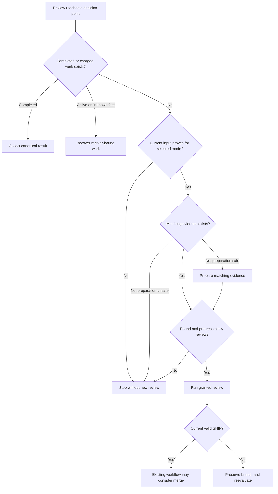
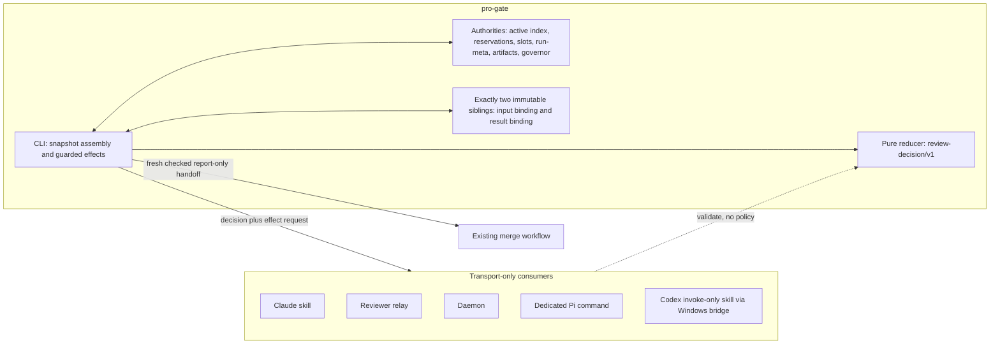
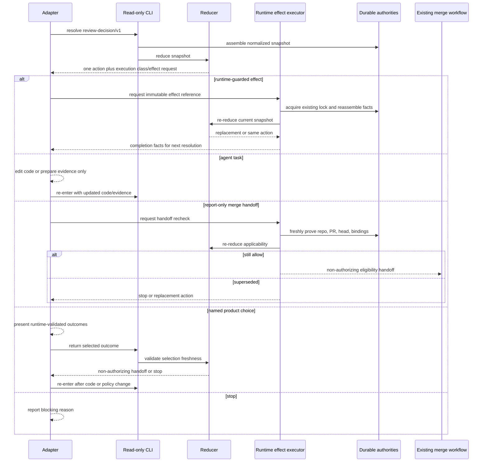
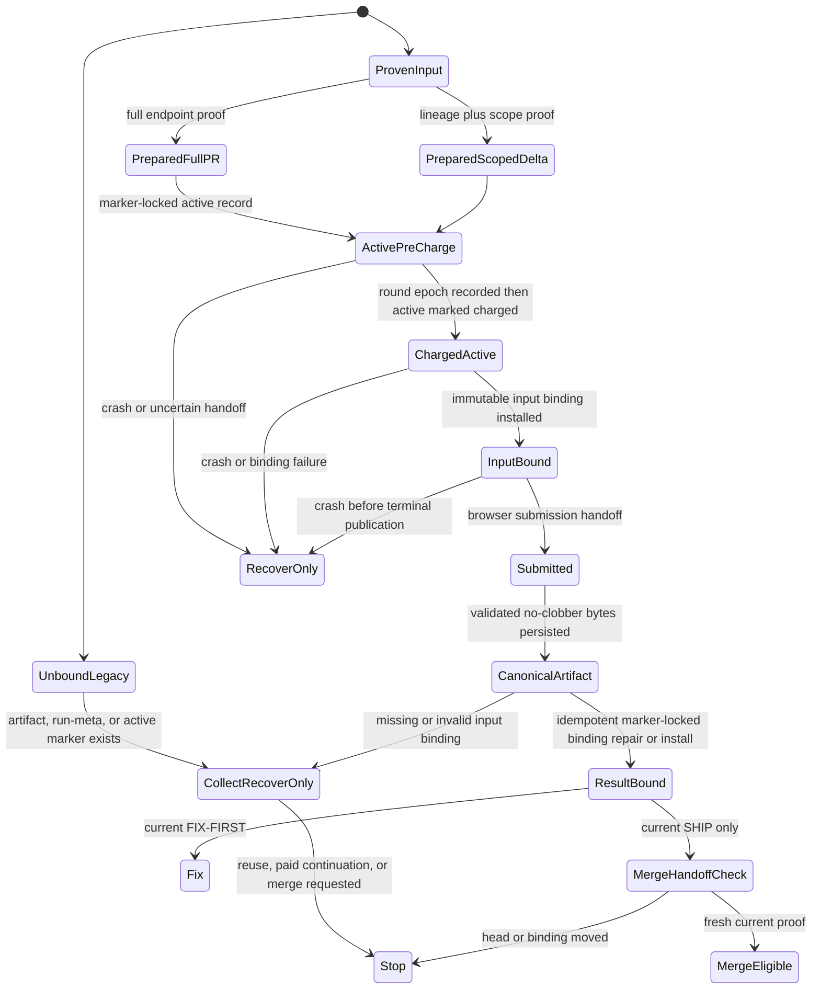

# Pro-gate One Clear Next Step - Plan

## Goal Capsule

- **Objective:** Coding agents take a safe, earned next step without routine permission prompts, never repeat the same review without progress, and make a pull request eligible for the surrounding merge workflow only after a current valid `SHIP`.
- **Means:** Implement KTD1-KTD7 through a runtime-owned typed decision, immutable input/result bindings, fresh input proof, effect-time rechecks, transport-only consumers, release-compatible distribution, and dedicated Pi and Codex Desktop adapter prerequisites.
- **Product authority:** Pro-gate decides review continuation, recovery, collection, stopping, and merge eligibility. Coding agents retain code-edit authority, and the surrounding workflow retains merge authority.
- **Open blockers:** None. Pi and Codex Desktop support remain delivery prerequisites and are not claimed until their respective conformance gates pass.
- **Stop conditions:** Stop without new review when current input, evidence, provenance, compatibility, or a safe preparation path cannot be proved; when code-plus-evidence identity has not progressed; or when the existing governor denies continuation. Do not proceed past a failed effect-time recheck.
- **Execution profile:** Runtime-first, read-only resolution plus guarded effect rechecks; one releaseable pro-gate change followed by distribution-complete external-adapter work in dotfiles.
- **Tail ownership:** Pro-gate owns runtime, in-repo consumers, packaging, release assets, and marketplace handoff. Dotfiles owns the Pi command and Codex Desktop bridge conformance. The surrounding workflow retains code-edit and merge execution ownership.

---

## Product Contract

### Summary

Pro-gate will give one clear next action whenever a review reaches a decision point. Claude Code, Codex, and supported Pi adapters will follow that answer instead of separately interpreting verdict prose, exit codes, polling state, recovery state, or remaining rounds.

### Problem Frame

In the PR #1983 incident, ChatGPT's connector could not inspect the pull request, but the coding agent had already prepared a 31 KB scoped bundle for the unchanged head and another review was still allowed. The agent stopped to ask whether it should run that review even though the safe next step was already known.

The same duplication appears across current caller surfaces: the skill, relay, and daemon each translate engine state into their own recovery, retry, and stopping behavior. That creates unnecessary questions, inconsistent behavior across harnesses, and opportunities to repeat or abandon work incorrectly.

### Key Decisions

- **Pro-gate returns one clear next action.** (session-settled: user-directed — chosen over better prompt instructions: prose alone cannot prevent caller drift.) Governs R1-R5, R16.
- **Pro-gate remains review-only.** (session-settled: user-approved — chosen over a full workflow supervisor: owning fixes and merges would add authority and failure states.) Governs R14.
- **Only decision points receive an action.** (session-settled: user-directed — chosen over every phase transition: queued, running, and waiting states do not require policy.) Governs R4.
- **Supported harnesses share one behavior.** (session-settled: user-approved — chosen over harness-specific rules: Claude Code, Codex, and Pi must not make different review decisions from the same facts.) Governs R2, R3, R15.
- **Existing safety and spend controls remain authoritative.** (session-settled: user-directed — chosen over deleting safety machinery: the simplification target is duplicated caller policy, not provenance, recovery, or round limits.) Governs R6-R13, R16.

### Terms

- **Current input:** The repository, pull request, and exact current head that pro-gate can prove a review applies to.
- **Matching review evidence:** A prepared scoped bundle or reviewed diff that applies to the current input.
- **Current valid `SHIP`:** An accepted `SHIP` result with valid attempt provenance that applies to the current input.
- **Decision point:** A review state that requires continuation, recovery, collection, stopping, merge eligibility, or a genuine product choice.
- **Review progress:** Either the code input changed to address review findings or the review evidence changed to resolve an earlier inability to inspect the current input; identical code input plus identical review evidence is not progress.
- **Genuine product choice:** A review identifies two or more legitimate user-facing outcomes, current repository policy does not select one, and durable state cannot make either outcome safer or required.
- **Next actions:** The closed list is collect an existing result, recover an existing review, fix review findings, prepare matching review evidence, run a granted review, stop without another review, allow the existing merge workflow to consider merge, or ask one named product choice.

### Actors

- A1. **Pro-gate runtime:** Reads durable review state and returns one next action.
- A2. **Coding agent:** Follows the returned action when it has the required capability and retains all code-edit decisions.
- A3. **Harness adapter:** Carries the runtime answer between pro-gate and Claude Code, Codex, or a supported Pi environment without adding review policy.
- A4. **Operator:** Answers only a named product choice that pro-gate cannot resolve safely.
- A5. **Surrounding merge workflow:** Applies existing repository checks and merge authority after a current valid `SHIP`.

### Requirements

**One answer across harnesses**

- R1. At every decision point, pro-gate returns exactly one action from the defined next-action list.
- R2. The same durable facts produce the same next action for every supported harness.
- R3. A harness adapter presents or carries out pro-gate's answer without replacing it with adapter-specific review policy.
- R4. Queued, running, waiting, and observation states remain progress information and never become routine permission prompts.
- R5. When pro-gate returns a safe action the coding agent can perform, the agent takes it without asking routine permission.

**Current input and existing work**

- R6. Automatic review continuation requires proof of the current repository, pull request, and exact head for the selected review mode.
- R7. Pro-gate uses prepared review evidence automatically only when that evidence matches the proven current input.
- R8. Before permitting new review spend, pro-gate resolves competing actions in this order:
  1. Collect a current completed canonical result whose provenance is valid.
  2. Recover current active or unknown-fate charged work, including a rejected capture when canonical recovery state exists.
  3. Stop without new spend when attempt provenance is invalid and no canonical recovery state exists, or when current input cannot be proved.
  4. Prepare matching review evidence when current input is proven, matching evidence is absent, and preparation does not change the reviewed code.
  5. Stop without new spend when matching evidence cannot be prepared safely.
  6. Stop without new spend when the round governor or review-progress rule denies continuation.
  7. Permit the remaining safe matching continuation.
- R9. Pro-gate accepts a review result only when existing provenance checks establish that it belongs to the attempt being evaluated.
- R10. Collection and recovery use canonical marker-addressed artifacts rather than shared output paths.

**Finite continuation and merge safety**

- R11. The existing round governor remains the maximum permission for another expensive review; this feature may deny a granted round but never exceed it.
- R12. Another expensive review requires review progress, so identical code input plus identical review evidence cannot run again.
- R13. Pro-gate asks an operator only for a genuine product choice, names the available outcomes and their consequences, and otherwise stops without new review spend when no safe action is justified.
- R14. Only a current valid `SHIP` may make a pull request eligible for the surrounding workflow's existing merge process; pro-gate never edits or merges.
- R15. An adapter uses the shared next action only when its distributed runtime and caller contract are compatible. Pi support requires a dedicated pro-gate command in the tracked Pi extension that consumes the same answer and passes the same behavior checks. Codex support requires the repository skill to ship invoke-only Codex metadata and the existing Windows bridge to mount that repository source; support is not claimed until conformance passes. The generic `/oracle` command and its confirmation remain unchanged.
- R16. If no defined next action is justified by current input and durable state, pro-gate returns stop-without-new-review and records the blocking reason instead of letting an adapter invent a fallback.

The diagram summarizes R1-R16; the requirements remain authoritative.

### Key Flows

- F1. **Prepared same-head review** — Trigger: connector review cannot inspect the current pull request but matching scoped evidence is available. A1 confirms current input, resolves existing work, checks capacity and progress, and returns the prepared review; A2 runs it without asking. **Outcome:** PR #1983 continues safely. **Covers:** R1-R8, R11, R12, R16.
- F2. **Changed or unproven input** — Trigger: head changed, evidence belongs to another head, or current input cannot be proved. A1 may collect known marker-addressed work but stops unproven continuation. **Outcome:** old or ambiguous evidence cannot authorize review or merge. **Covers:** R1-R3, R6-R10, R14, R16.
- F3. **Recover existing work** — Trigger: durable state shows active or unknown-fate charged same-input work. A1 returns recover-existing-review instead of a new launch. **Outcome:** caller loss does not duplicate spend. **Covers:** R1-R3, R8-R10, R16.
- F4. **Collect completed work** — Trigger: durable state shows a completed but uncollected canonical result. A1 returns collect-existing-result and evaluates provenance and applicability before continuation. **Outcome:** completed work is consumed before new review. **Covers:** R1-R3, R8-R10, R14, R16.
- F5. **End a non-progressing loop** — Trigger: governor denial or unchanged code and evidence. A1 returns stop-without-new-review. **Outcome:** identical input cannot cycle through paid reviews. **Covers:** R1-R3, R8, R11, R12, R16.
- F6. **Hand off a current valid SHIP** — Trigger: provenance-valid `SHIP` applies to current input. A1 returns allow-existing-merge-workflow; A5 retains normal merge decision. **Outcome:** review completion does not expand authority. **Covers:** R2, R3, R8-R10, R14-R16.
- F7. **Ask a genuine product choice** — Trigger: durable policy cannot choose among legitimate user-facing outcomes. A1 returns one compact question; A3 carries it without another permission layer. **Outcome:** human attention is reserved for product judgment. **Covers:** R1-R5, R13, R16.

### Acceptance Examples

- AE1. **PR #1983 continuation** — **Covers:** R1-R8, R11, R12, R16. **Given:** exact head unchanged, evidence changes from unusable connector view to matching 31 KB scoped bundle, no work needs recovery, and another round is granted. **When:** connector cannot inspect the PR. **Then:** coding agent runs scoped-bundle review without asking.
- AE2. **Progress is not a question** — **Covers:** R4. **Given:** queued, running, waiting, or observed review. **When:** adapter reports it. **Then:** it reports progress without permission, duplicate review, or changed charged-work ownership.
- AE3. **Cross-harness consistency** — **Covers:** R2, R3, R15. **Given:** Claude Code and Codex receive the same compatible answer from the same durable state. **When:** each handles it. **Then:** both produce the same review action despite different presentation.
- AE4. **Changed or unknown input fails closed** — **Covers:** R6-R8, R14, R16. **Given:** repository, PR, head, or evidence binding is missing, ambiguous, or different. **When:** continuation is requested. **Then:** known marker-addressed work may be collected, but unproven continuation stops and supplies no merge eligibility.
- AE5. **Active or reserved work is recovered** — **Covers:** R8, R16. **Given:** active same-input attempt or reservation. **When:** another review is requested. **Then:** recover-existing-review is returned and no new launch is permitted.
- AE6. **Completed work is collected** — **Covers:** R8-R10, R16. **Given:** completed but uncollected same-input result. **When:** another review is requested. **Then:** collect-existing-result uses the canonical artifact and no new launch is permitted.
- AE7. **Unknown-fate work is recovered** — **Covers:** R8, R10, R16. **Given:** same-input work may have charged but outcome is unknown. **When:** continuation is requested. **Then:** recover-existing-review is returned; it neither refunds, accepts, nor launches merely because observation was lost.
- AE8. **Invalid result provenance is never accepted** — **Covers:** R8-R10, R16. **Given:** captured result lacks valid attempt provenance. **When:** evaluated. **Then:** reject it, recover when canonical state exists, otherwise stop-without-new-review.
- AE9. **Round denial ends review spend** — **Covers:** R8, R11, R16. **Given:** governor denies another review. **When:** continuation is requested. **Then:** stop-without-new-review is returned.
- AE10. **Identical evidence cannot loop** — **Covers:** R8, R11, R12, R16. **Given:** neither code nor evidence changed since the prior applicable review. **When:** re-review is requested with numeric capacity remaining. **Then:** stop; unusable connector to matching scoped evidence is progress, resubmitting it is not.
- AE11. **FIX-FIRST requires code progress before re-review** — **Covers:** R1, R5, R11, R12, R16. **Given:** current review returns actionable `FIX-FIRST`. **When:** handled. **Then:** fix-review-findings is returned; re-review needs changed code and a governor grant.
- AE12. **Only a current SHIP reaches merge checks** — **Covers:** R8-R10, R14, R16. **Given:** a `SHIP` has valid provenance and applies to exact current head. **When:** surrounding workflow considers merge. **Then:** it may apply existing rules; old, unreadable, or provenance-invalid `SHIP` gives no eligibility.
- AE13. **Human judgment stays narrow** — **Covers:** R5, R13, R16. **Given:** two legitimate user-facing outcomes and no selecting repository policy. **When:** current input and durable state cannot resolve them. **Then:** ask one question naming outcomes and consequences; waiting, recovery, collection, evidence preparation, and earned review never reach it.
- AE14. **Compatibility fails closed** — **Covers:** R3, R15, R16. **Given:** distributed adapter and runtime fail compatibility. **When:** adapter requests an answer. **Then:** it follows existing update path and does not interpret incompatible output.
- AE15. **Pi dedicated command follows shared action without routine confirmation** — **Covers:** R2-R5, R15. **Given:** the dedicated pro-gate command in the tracked Pi extension invokes the Oracle CLI's typed next-action surface and injects its completed answer into the next Pi turn. **When:** Pi receives a compatible pro-gate decision-point answer through that command. **Then:** it follows the same next action as Claude Code and Codex without a routine confirmation for a safe selected action; generic `/oracle` remains generic and keeps its confirmation.
- AE16. **No implicit fallback** — **Covers:** R1, R3, R13, R16. **Given:** input and durable state justify no action. **When:** adapter requests an answer. **Then:** stop-without-new-review includes blocking reason; adapter invents neither action nor generic permission question.
- AE17. **Missing review evidence is prepared, not debated** — **Covers:** R1, R5-R8, R11, R12, R16. **Given:** connector cannot inspect proven current input, no matching scoped evidence exists, and preparation does not change code. **When:** next action is requested. **Then:** prepare-matching-review-evidence is returned; after preparation, run-granted-review may follow when matching and granted, without routine permission.

### Success Criteria

- **PR #1983 path:** Matching changed review evidence reaches a granted scoped-bundle review without routine prompt and reaches merge checks only after a later current valid `SHIP`. Covers R5-R8, R11, R12, R14.
- **Cross-harness behavior:** The same durable facts produce the same next action in every supported adapter. Covers R2, R3, R15.
- **No duplicate spend:** A killed caller recovers or collects existing work without another review round. Covers R8-R10.
- **Finite review loops:** Stale input, mismatched evidence, invalid provenance, unresolved charged work, round denial, and identical code plus evidence cannot authorize review or merge. Covers R6-R12, R14, R16.
- **One policy owner:** Caller-facing surfaces no longer make independent recovery, re-review, stopping, or merge-eligibility decisions. Covers R1-R3.
- **Human attention only for judgment:** Every remaining prompt names a genuine product choice and its consequences. Covers R5, R13, R16.

### Scope Boundaries

- Pro-gate does not become a general workflow controller or autonomous code-fixing supervisor.
- Pro-gate does not merge, bypass branch protections, alter repository permissions, or replace the surrounding workflow's merge checks; R14 remains the authority.
- The feature does not add a per-finding ledger, a second approval-token lifecycle, or a universal adapter runtime.
- Progress display, waiting behavior, and wake notifications remain outside this feature per R4.
- Scoped-bundle construction and code editing remain coding-agent responsibilities per A2 and R5.
- The feature does not add dynamic HOV marketplace cards.

### Dependencies / Assumptions

- Existing durable state continues to distinguish active, recoverable, completed, capped, failed, and deferred work.
- Existing provenance, reservation, canonical artifact, charge-ordering, recovery, and finite round behavior remain available and unchanged in effect.
- The surrounding workflow continues to own code edits, repository checks, and merge execution.
- Current plugin/runtime compatibility checks remain the release boundary for Claude distribution.
- Pi support requires a dedicated pro-gate command in the tracked Pi extension; generic `/oracle` and its confirmation remain unchanged.
- The adjacent blocking-wait plan may share status concepts, but progress observation remains outside this Product Contract.

### Sources / Research

- `docs/ideation/2026-08-26-pro-gate-simplification-ideation.html`
- `docs/plans/2026-08-17-0224-feat-blocking-wait-verb-plan.md`
- `README.md`
- `bin/oracle-review.sh`
- `lib/pro-gate-lib.sh`
- `skills/pro-gate/SKILL.md`
- `agents/oracle-reviewer.md`
- `daemon/daemon.sh`
- `scripts/package-runtime.sh`
- `install.sh`
- `.claude-plugin/plugin.json`
- [HOV marketplace pro-gate card](https://github.com/StartupBros-com/hov-marketplace/blob/main/.claude-plugin/marketplace.json)
- [HOV marketplace validation](https://github.com/StartupBros-com/hov-marketplace/blob/main/scripts/validate-marketplace.sh)

---

## Planning Contract

### Product Contract preservation

This plan preserves R1-R16, A1-A5, F1-F7, AE1-AE17, scope boundaries, and every settled-decision annotation. The Goal Capsule now states the existing R14 authority precisely: a current valid `SHIP` enables the surrounding merge workflow rather than making the coding agent the merger. The verified adapter clarifications remain meaning-preserving: Codex support requires invoke-only metadata and the existing Windows bridge; Pi requires its dedicated command while generic `/oracle` remains unchanged. These are no scope changes.

### Key Technical Decisions

- KTD1. **One pure runtime reducer owns continuation policy.** `review-decision/v1` is a closed, canonical, versioned decision envelope with exactly one of the eight Product Contract actions, a closed reason, normalized input/evidence facts, applicable marker/artifact and binding identities, optional validated named-choice data, observation facts, and one runtime-owned effect request. It has no `status` field. The reducer is deterministic and side-effect free. Governs R1-R5, R13-R16.
- KTD2. **Use exactly two immutable binding record types and an active index.** Marker-addressed input bindings are written only through the marker-locked charge-to-binding protocol. Marker-addressed result bindings are written only after validated canonical persistence. `active/<round-key>` remains the durable live/unknown-fate authority, not a third binding type. Fixed run-meta and reservation formats remain unchanged. Governs R6-R10, R12, R14.
- KTD3. **Prove current targets and model evidence modes explicitly.** Full-PR applicability binds canonical repository and PR identity, base or merge-base OID, head OID, and the unfiltered endpoint patch digest; missing proof stops. Scoped/delta mode records base and end OIDs, scope algorithm, raw and reviewed-payload digests, filtering manifest, and verified prior-result or confirmation lineage. Only documented lineage plus the scoped delta covers the end OID; adapters and normalization never promote scoped evidence to full-PR evidence. Connector mode binds immutable repository identity, exact head, commit target, and endpoint/raw-diff digest when available, never a mutable PR URL alone. Merge handoff freshly proves the same base/head/diff relation. Governs R6, R7, R14.
- KTD4. **A query is advisory; runtime-owned effects re-reduce facts.** Every decision includes a versioned effect request with the selected action, contract and snapshot digests, target repository/PR/head, and the applicable marker, attempt, or binding reference. The request also carries one deterministic execution class: runtime-guarded effect, agent task, report-only handoff, or named product choice. It is never an authorization token. Runtime execution reacquires existing protections, reassembles facts, and returns either the same action or a replacement. Agent-task completion re-enters with updated code/evidence. A selected product outcome is a non-authorizing handoff to the coding agent; changed code or policy re-enters resolution, while absent, malformed, or stale selection stops without spend. `allow-existing-merge-workflow` receives a fresh applicability recheck immediately before handoff. Governs R1, R8-R12, R14, R16.
- KTD5. **Adapters transport and dispatch; they never infer safety.** Skill, relay, daemon, Pi, and Codex consumers validate contract identity, digest, action, payload, execution class, and effect request. Only runtime grants guarded effects. Every compatible safe runtime effect or agent task dispatches without routine confirmation; only ask-named-product-choice prompts. Repository, PR, diff, attachment, and review text remain untrusted data: only bounded schema-validated normalized fields enter decisions or effect requests, adapters use argv-safe invocation, and rendered output rejects unsafe control characters. External credentials remain runtime-owned and never enter envelopes, fixtures, logs, canonical artifacts, or mounted adapter metadata. Adapters return task completion to resolution and fail closed through their existing stop/update path. Governs R2-R5, R13-R16.
- KTD6. **Ship one canonical action contract and corpus identity.** The runtime envelope carries the `review-decision/v1` identity, version, contract digest, and authoritative conformance-corpus digest. Canonical metadata uses UTF-8, lexicographically ordered object keys, preserved array order, no insignificant whitespace, LF separators, no trailing newline, and SHA-256. U3 generates one metadata artifact and corpus; Bash, TypeScript, and PowerShell fixtures consume digest-checked mirrors rather than reserializing the contract. Consumers reject runtime-newer, adapter-newer, unknown-contract, and corpus-mismatch states directionally. Package semver and plugin manifest change together, while action-contract compatibility remains independent. Governs R3, R15, R16.
- KTD7. **External parity is separately gated.** Pi parity is a dedicated dotfiles command using installed runtime. Codex Desktop parity is an invoke-only repository skill mounted by the existing Windows bridge, preserving Codex's current post-review fixer role. Neither support claim is valid until distribution-complete dependencies and its conformance gate pass. Governs R2-R5, R15, R16.

### Assumptions and constraints

- Reservations, slots, active index, seven-field run-meta, marker-addressed artifacts, nonce/provenance gates, charge ordering, and trajectory-aware governor retain their authority. No decision, approval, or round ledger is added.
- The only immutable binding types are input binding and result binding. Missing legacy bindings mean unknown applicability: artifacts remain collectable and charged work recoverable, but automatic evidence reuse, paid continuation, and merge eligibility do not follow.
- `NEEDS-DISCUSSION` becomes ask-named-product-choice only after normalization validates at least two user-facing outcomes with consequences; otherwise it stops.
- Observation is data only. It neither becomes a ninth action nor changes confirmation, retry, worker dispatch, or charged-work ownership.
- `review-decision/v1` is distinct from blocking-wait's `next_action` handoff. The former carries policy and effect request; the latter retains blocking-wait progress semantics. Neither is inferred from, serialized into, nor compatibility-substituted for the other.
- Generic `/oracle`, its confirmation, and free-form routing remain unchanged.
- When multiple completed result bindings apply to the same current input, the reducer selects the newest charged-spend epoch. If epoch or canonical identity still ties, it stops without new review or merge eligibility.
- The local CLI keeps its existing same-user trust model. This plan adds no network service, remote caller authentication, credential delegation, or signing-key system; it narrows adapter inputs to normalized decisions and leaves existing OIDC, checksum, installer, and marketplace trust controls intact.

### High-Level Technical Design

#### Component ownership

#### Decision, effect, and handoff sequence

#### Active-run, charge, and binding lifecycle

#### Resolver precedence, bindings, and effect contract

The reducer implements R8 in stated order: current valid completed result, active/reserved/unknown-fate recovery, invalid/unproven stop, safe evidence preparation, unsafe-evidence stop, progress/governor stop, then the remaining safe terminal or granted continuation. It performs no I/O or mutation.

Every envelope carries `contract_id`, contract version, contract digest, authoritative corpus digest, exactly one outer action, reason, immutable normalized facts, and one effect request. The effect request binds the action to target repository/PR/head, snapshot and contract digests, and the applicable marker, attempt, or binding reference. The request selects exactly one class:

| Execution class | Outer actions | Runtime-owned behavior |
|---|---|---|
| `runtime-guarded-effect` | collect-existing-result, recover-existing-review, run-granted-review | Re-resolve under existing marker/change/slot protections. Collection and recovery return completion facts. Run records no authority from the advisory response. |
| `agent-task` | fix-review-findings, prepare-matching-review-evidence | Adapter may edit or construct evidence only. Completion supplies updated code/evidence facts to a new resolution. |
| `report-only` | stop-without-new-review, allow-existing-merge-workflow | Stop is non-authorizing. Merge handoff first performs fresh runtime proof and remains non-authorizing to the merge workflow. |
| `named-product-choice` | ask-named-product-choice | Adapter reports only runtime-validated outcomes and consequences. |

Input binding v1 records contract version/digest, marker and charged epoch, canonical repository triple, target kind, PR/current head when applicable, mode, evidence identities, and mode-specific proof. Full-PR proof includes base or merge-base OID, head OID, endpoint digest, and raw patch digest. Scoped/delta proof includes base OID, end OID, scope algorithm, raw and reviewed-payload digests, filtering manifest, and prior-result or confirmation lineage sufficient to cover the end OID. Connector proof includes immutable repository target, exact bound head/commit target, and available endpoint/raw-diff digest. Missing full-PR base/diff proof or immutable connector target stops automatic continuation and merge eligibility.

Result binding v1 references input-binding identity/digest, canonical artifact path/digest, normalized verdict, acceptance/provenance time and outcome, validated named choice where applicable, and bound `SHIP` base/head/diff proof. It is installed only after provenance validation and no-clobber canonical persistence. It never authorizes charge or merge alone. When several bindings apply, charged-spend epoch and canonical identity select one result; an unresolved tie stops fail-closed.

Result publication is marker-locked and idempotent: validate snapshot/provenance, persist verified canonical bytes without clobbering, install the result binding, then expose terminal applicability. If recovery finds a valid input binding plus verified canonical artifact but no result binding, it revalidates provenance and reconstructs exactly one identical binding. If validation fails, it stops while preserving the artifact. A `SHIP` cannot reach eligibility before result binding exists.

Charge-to-binding is likewise marker-locked: publish marker-bound pre-charge active state, record the round epoch, atomically mark active charged, install input binding, then submit. A positively proven pre-submit failure may remove only that marker's active record and round entry while holding the change lock and proving its epoch is that marker's newest record. Any crash, record failure, run-meta failure, binding failure, or uncertain handoff remains active/recover-only and fails closed before submission.

### Sequencing

1. Establish `review-decision/v1`, effect-target and corpus identity, active-index protocol, two binding primitives, full/scoped lineage proof, and frozen corpus.
2. Add read-only CLI resolution, immutable connector proof, marker-locked repair, named-choice completion, and effect-time rechecks including merge handoff.
3. Prove precedence, deterministic result selection, lineage, crash states, races, read-only behavior, prompt-free consumer behavior, and directional contract skew before consumer migration.
4. Convert skill, relay, daemon, and Codex invoke metadata to execution-class dispatch and corpus conformance.
5. Build and checksum the U5 candidate runtime/plugin release without publishing it.
6. Test Pi and Codex Desktop against that candidate archive through U6/V7 and U7/V9.
7. Complete U8 marketplace repin, staged publication, release-train distribution verification, and repeat the installed-runtime adapter gates. Claim neither external support before its post-distribution gate passes.

### System-wide impact

- `lib/pro-gate-lib.sh` becomes the sole policy-selection boundary while existing durable authorities remain authoritative.
- `bin/oracle-review.sh` gains a read-only `review-decision/v1` surface and is the sole runtime guarded-effect executor.
- Skill, relay, daemon, Pi, and Codex surfaces stop interpreting verdicts, phases, recovery, round signals, or safety themselves.
- The runtime archive carries contract identity/digest with bin/lib; adapters validate that independent contract rather than infer it from package version.
- The blocking-wait handoff remains an independent progress transport.
- Dotfiles gains dedicated Pi and Codex bridge conformance without changing generic Pi Oracle behavior or Codex's post-review fixer behavior.

### Risks and controls

| Risk | Owner | Control |
|---|---|---|
| Scoped payload is mistaken for complete PR evidence. | Runtime | Explicit full-PR/scoped-delta modes, base/head proof, raw/reviewed digest separation, and lineage coverage tests. |
| A moved base changes the full PR while head stays constant. | Runtime | Bind base or merge-base, head, and unfiltered endpoint digest; repeat proof at merge handoff. |
| Crash after charge permits duplicate spend or foreign rollback. | Runtime | Marker-locked active pre-charge/charged protocol and marker-plus-epoch constrained cleanup. |
| Canonical artifact persists without an applicable result binding. | Runtime | Idempotent marker-locked result-binding repair; no terminal applicability before binding. |
| Several applicable completed results select nondeterministically. | Runtime | Select newest charged-spend epoch and canonical identity; fail closed on unresolved ties. |
| Mutable connector URL points at another head. | Runtime | Bind immutable repository/commit/head target and recheck exact head at evaluation. |
| Advisory action becomes a capability token. | Runtime | Immutable effect target plus effect-time re-resolution under existing locks. |
| Named product choice repeats or authorizes work by itself. | Runtime and adapter | Validate selection freshness, hand the outcome to the coding agent, and re-enter only after changed code or policy. |
| Untrusted repository or review text changes control flow. | Runtime and adapter | Bound schemas, normalized fields, argv-safe invocation, control-safe rendering, and runtime-owned credentials. |
| A moved head reaches merge handoff. | Runtime | Fresh input/result-binding re-resolution before every handoff or eligibility signal. |
| Contract or corpus skew dispatches a heuristic fallback. | Adapter owner | Packaged identity/version/contract/corpus digests, directional refusal, and zero non-run side effects. |
| External adapter finds a packaging defect after publication. | Pro-gate and dotfiles | Candidate-archive conformance before U8 publication, then post-distribution installed-runtime repetition. |

### Alternatives rejected

- A decision/action/approval-token ledger or per-finding lifecycle duplicates active, reservation, run-meta, artifact, and governor authorities; effect-time rechecks close the race without competing authority.
- A ninth wait action, granular stop variants, or status-field reuse conflicts with the eight-action Product Contract. Observation and reasons stay data, and blocking-wait retains its own handoff.
- Extending fixed run-meta or reservation layouts breaks validated compatibility; active records and immutable siblings preserve historic recovery.
- Treating a scoped delta as a normalized full endpoint diff would reject valid supported confirmation flows or authorize omitted hunks.
- Verdict prose, phase, exit code, recoverability, output path, nonce, marker time, branch/round key, or path-only manifest cannot substitute for exact target, code/evidence, and lineage proof.
- Removing generic `/oracle` confirmation weakens generic Oracle safety and does not consume pro-gate policy.

### Documentation and rollout

- Runtime owner updates `README.md`, `skills/pro-gate/SKILL.md`, `skills/pro-gate/agents/openai.yaml`, `agents/oracle-reviewer.md`, and release notes to describe typed contract/corpus identity, execution classes, no fallback, prompt boundaries, and unchanged merge authority.
- Pro-gate owner produces checksum-pinned draft assets only after the in-repo suite passes. U8 keeps marketplace publication gated by candidate-adapter conformance and the existing exact version/tag/release-ID/commit-SHA tuple.
- Dotfiles documentation names Pi or Codex Desktop support only after candidate and distributed-runtime gates pass. It preserves generic `/oracle` behavior and Codex's post-review fixer behavior.
- Skew messages use the existing exact update path and state that the integration is temporarily unavailable until runtime and adapter contract/corpus identities converge.

---

## Implementation Units

### U1. Runtime reducer, action contract, active index, and immutable bindings

- **Goal:** Make KTD1 and KTD2 the sole policy and reviewed-input/result identity boundary.
- **Requirements:** R1, R6-R16; A1; F2-F7; AE4, AE8, AE10-AE13, AE16.
- **Dependencies:** Existing read-only state, active-index, provenance, and governor helpers.
- **Files:** `lib/pro-gate-lib.sh`; `tests/engine.test.sh`; `tests/fixtures/review-decision/v1/contract.json`; `tests/fixtures/review-decision/v1/corpus.json`.
- **Approach:**
  1. Define canonical `review-decision/v1` metadata, authoritative corpus digest, eight-action envelope, reasons, observation facts, execution classes, immutable effect targets, and validation without a status field.
  2. Canonicalize metadata as UTF-8 JSON with lexicographic object keys, preserved array order, no insignificant whitespace, LF separators, no trailing newline, and SHA-256.
  3. Add pure snapshot reduction with R8 precedence, normalized terminal routing, deterministic completed-result selection by charged-spend epoch and canonical identity, and separate blocking-wait transport coexistence.
  4. Add marker-addressed input/result binding serializers, validation, and digests; keep fixed run-meta/reservation layouts unchanged.
  5. Define marker-locked active pre-charge/charged transitions, marker-plus-epoch cleanup limits, legacy applicability, and idempotent result-binding repair rules.
- **Patterns to follow:** Marker-addressed artifact validation, active/run-meta validation, nonce-first acceptance, `pg_round_guard`, charged-epoch ordering, and no side effects in reducer.
- **Test scenarios:**
  1. Emit each of the eight actions and its exact runtime-owned execution class/effect request from matching snapshots.
  2. Emit byte-identical canonical JSON, contract digest, and corpus digest across repeated Bash fixture generation.
  3. Stop for undefined state, invalid bindings, unknown contract, and blocking-wait transport collision attempts.
  4. Permit legacy collection/recovery but deny reuse, paid continuation, and merge eligibility.
  5. Select the newest applicable completed result by charged-spend epoch and canonical identity; stop on unresolved ties.
  6. Route current `FIX-FIRST`, exact current `SHIP`, valid named choice, and invalid named choice without adapter inference. Covers AE8, AE10-AE13, AE16.
  7. Deny another review for unchanged verified code/evidence identity.
  8. Model crashes after active publication, round recording, charged-active update, run-meta, input binding, and submission handoff as recovery/stop, never a new launch or foreign refund.
- **Verification:** V1 and V2.

### U2. CLI proof, resolver, guarded effects, and repair

- **Goal:** Make KTD3 and KTD4 enforce current proof, advisory-query race safety, and idempotent result recovery.
- **Requirements:** R1, R4, R6-R12, R14, R16; A1; F1-F6; AE1, AE2, AE4-AE10, AE12, AE17.
- **Dependencies:** U1.
- **Files:** `bin/oracle-review.sh`; `tests/engine.test.sh`; `tests/fixtures/review-decision/v1/corpus.json`.
- **Approach:**
  1. Add a read-only typed resolution surface that assembles target, active/reservation/run-meta/artifact facts, bindings, evidence, result, governor, and contract identity before invoking U1.
  2. Implement full-PR and scoped/delta proof. Full mode binds base or merge-base, head, endpoint digest, and raw patch digest. Scoped mode proves base-to-head coverage with scope algorithm, filtering manifest, raw/reviewed digests, and validated confirmation/prior-result lineage. Retain bounded bare-diff review/recovery without PR-current or merge claims.
  3. Require connector dispatch/input binding immutable target proof and exact fresh bound-head equality at result evaluation; preserve non-applicable artifacts for collection only.
  4. Emit action-specific effect targets that bind repository/PR/head, snapshot and contract digests, and the applicable marker, attempt, or binding reference. Reassemble and reduce under existing protections before collection/recovery, reservation handoff, slot acquisition, charge, submission, canonical publication, and merge handoff.
  5. Implement marker-locked charge-to-binding, no-clobber publication, binding repair, and completion responses. Named-choice selection is freshness-validated and returns a non-authorizing handoff; agent-task and selected-outcome completion re-enter only with updated code, policy, or evidence.
  6. Treat repository and review bytes as untrusted data. Keep raw content outside the decision/effect schema, invoke child processes with argv arrays rather than shell evaluation, render control characters safely, and keep runtime credentials outside envelopes, logs, fixtures, artifacts, and adapter metadata.
- **Patterns to follow:** Existing `--harvest`, `--recover`, reservation/slot, active index, round-record, marker-lock, canonical-publication, and final merge-currentness paths. Read-only resolution performs no reconciliation, browser/CDP work, lock, cache, sidecar, binding write, or mutation.
- **Test scenarios:**
  1. Build correct bindings for connector, full-PR, scoped delta, and combined modes.
  2. Detect base or merge-base movement, patch-byte changes with the same head, attachment, extra-file, confirmation, filtering-manifest, and lineage changes.
  3. Accept documented confirming scoped delta coverage and reject altered/omitted raw hunks, excluded required hunks, moved heads or bases, and broken lineage.
  4. Stop connector-only automatic continuation when immutable target proof is absent; prove A→B and A→B→A races accept only evidence explicitly pinned to A.
  5. Preserve bare-diff review/recovery while denying PR merge eligibility.
  6. Reject stale or mismatched effect targets and return the freshly reduced replacement action. Covers AE1, AE9, AE12, AE17.
  7. Validate named-choice selections, stop stale/malformed selections, and re-enter only after a corresponding code or policy change.
  8. Repair exactly one result binding after canonical persistence and prove no `SHIP` handoff before repair; preserve failed-validation artifacts as collect-only.
  9. Reject raw untrusted text, unsafe control characters, shell-evaluated arguments, and credential-bearing envelope/log/fixture content.
- **Verification:** V1-V3.

### U3. Engine race, lineage, and action-corpus conformance

- **Goal:** Freeze KTD1-KTD4 behavioral truth and make every consumer test identical decisions and effect requests.
- **Requirements:** R1-R13, R16; A1-A3; F1-F5, F7; AE1-AE11, AE13, AE16-AE17.
- **Dependencies:** U1 and U2.
- **Files:** `tests/engine.test.sh`; `tests/fixtures/review-decision/v1/contract.json`; `tests/fixtures/review-decision/v1/corpus.json`; `tests/review-decision-adapters.test.sh`.
- **Approach:**
  1. Generate and digest one canonical contract metadata file and the complete valid/invalid decision/effect corpus, including observation, blocking-wait coexistence, named-choice completion, prompt-free dispatch, and replacement-after-recheck cases.
  2. Table-drive R8 branches, deterministic completed-result selection, full/scoped/connector modes, base/head lineage coverage, terminal routes, legacy state, and compatibility rejection from hermetic fixtures.
  3. Add concurrent/restart fixtures at active publication, round recording, charged update, input binding, submission, artifact persistence, reservation retirement, result binding, terminal exposure, adapter read, and merge handoff.
  4. Assert superseded/non-run paths create no round, reservation, slot, artifact, browser dispatch, merge eligibility marker, notification, processed SHA, or failure-budget effect.
  5. Make each language fixture a digest-checked mirror of the runtime-generated contract/corpus metadata; fixture-local serialization never defines compatibility.
- **Patterns to follow:** Existing hermetic fixture style, marker-specific canonical artifacts, charged-time ordering, and no-clobber artifact behavior. Corpus carries resolved actions and effect requests; no adapter derives either from prose or phase.
- **Test scenarios:**
  1. Select the newest charged-spend epoch among applicable completed results, prefer collection over newer active work per R8, and stop on unresolved epoch/identity ties.
  2. Recover caller death and unknown fate without another charge. Covers AE5-AE7.
  3. Handle expired reservations, lock contention, reused output paths, and active-index crashes deterministically.
  4. Reject stale-readable and foreign captures without losing canonical recovery. Covers AE8.
  5. Recover after artifact persistence before reservation retirement/binding installation and prove concurrent readers cannot see merge eligibility first.
  6. Reject malformed/unknown contracts, actions, contract/corpus digests, scoped lineage, and compatibility directions. Covers AE3, AE9, AE10, AE14, AE16.
  7. Prove advisory `SHIP` A→B or base movement before handoff emits no eligibility or notification.
  8. Prove every compatible safe runtime effect and agent task reaches the expected prompt-free consumer dispatch, while only named product choice prompts.
- **Verification:** V1-V4.

### U4. Claude skill, relay, daemon, and Codex invoke metadata consumers

- **Goal:** Apply KTD5 to every in-repository consumer and define the Codex-facing invoke seam without making Codex a reviewer.
- **Requirements:** R2-R5, R13-R16; A2-A3; F1, F3-F7; AE2, AE3, AE11-AE16.
- **Dependencies:** U2 and U3.
- **Files:** `README.md`; `skills/pro-gate/SKILL.md`; `skills/pro-gate/agents/openai.yaml`; `agents/oracle-reviewer.md`; `daemon/daemon.sh`; `tests/review-decision-adapters.test.sh`; `tests/daemon-reload.test.sh`.
- **Approach:**
  1. Replace skill and relay verdict/status/recovery/retry/merge inference with contract-validated action/effect dispatch.
  2. Add invoke-only Codex metadata to the repository skill. It obtains the complete immutable envelope from installed runtime, exposes the Codex-supported invocation form, dispatches all execution classes, and never changes the Oracle reviewer or Codex's existing post-review fixer fallback.
  3. Dispatch compatible runtime effects and agent tasks without routine confirmation. Limit agent tasks to fix and evidence preparation, then re-enter resolution with completion facts.
  4. Present only ask-named-product-choice. Validate the selected outcome, return it as a non-authorizing handoff, and re-enter only after the coding agent changes code or policy. Keep stop and merge handoff report-only.
  5. Convert daemon transitions to the same execution-class table while retaining consent, per-SHA idempotency, timeout, reload, no-merge, and wrapper-failure-budget ownership. Recover/collect retries re-resolve. Stopped-for-human remains uncompleted. Non-run outcomes mutate neither processed SHA nor failure budget.
  6. Validate packaged contract and corpus identity before resolution and dispatch. A mismatched deploy-stamp reload enters global defer with zero dispatch until a compatible stamp converges.
  7. Pass normalized payload fields with argv-safe invocation, control-safe rendering, and no credential-bearing envelope, fixture, log, artifact, or metadata content.
- **Patterns to follow:** Existing exact-version update handling, daemon deploy-stamp reload, Codex invoke metadata conventions, and post-review `codex exec` fixer behavior. No parser or fresh-review fallback based on verdict prose, phase, exit code, recoverability, or rounds.
- **Test scenarios:**
  1. Preserve every frozen-corpus action, effect request, execution class, and contract/corpus digest across skill, relay, daemon, and Codex metadata. Covers AE2, AE3.
  2. Dispatch each compatible safe runtime effect and agent task without routine confirmation in every consumer; only ask-named-product-choice prompts.
  3. Report observation without confirmation or duplicate dispatch.
  4. Route missing, malformed, runtime-newer, adapter-newer, unknown, and corpus-mismatched envelopes to existing stop/update/defer behavior. Covers AE14, AE16.
  5. Keep daemon non-run paths at zero worker dispatch, SHA completion, and failure-budget charge.
  6. Delegate compatible `FIX-FIRST` and preparation as agent tasks without granting merge. Covers AE11.
  7. Validate named-choice selections, stop stale/malformed choices, and re-enter only after corresponding code or policy change.
  8. Recheck base/head/diff applicability before merge handoff and suppress a moved-base or moved-head handoff.
  9. Reject unsafe control characters, shell-evaluated arguments, and credential-bearing decision or adapter output.
- **Verification:** V4 and V5.

### U5. Candidate runtime packaging and contract identity

- **Goal:** Produce a checksum-pinned candidate runtime and plugin contract that external adapters can test before publication.
- **Requirements:** R3, R15-R16; A3; AE3, AE14, AE16.
- **Dependencies:** U1-U4.
- **Files:** `scripts/package-runtime.sh`; `install.sh`; `VERSION`; `.claude-plugin/plugin.json`; `tests/distribution.test.sh`; `tests/autoupdate.test.sh`; `tests/daemon-reload.test.sh`; `tests/release-assets.test.sh`.
- **Approach:**
  1. Package the authoritative `review-decision/v1` version, contract digest, and corpus digest with existing CLI/library runtime surfaces; assert archive inclusion and existing skill/relay exclusion.
  2. Define each distributed adapter's expected identity source and validate contract and corpus identity before resolution or dispatch.
  3. Add installed-archive directional runtime/plugin/action-contract mismatch fixtures. Refuse runtime-newer, adapter-newer, unknown-contract, and corpus-mismatch states before daemon work; compatible subsequent deployment converges once.
  4. Bump runtime and plugin versions together only with complete U1-U4 behavior and release notes prepared for U8.
  5. Produce checksum-verified candidate assets without publishing them. Preserve atomic install, rollback, deploy-stamp-last, skip-services, and draft-first release boundaries.
- **Patterns to follow:** Existing archive checksum, installer rollback/atomic deployment, deploy stamp, unattended update boundaries, and draft asset generation.
- **Test scenarios:**
  1. Include typed runtime contract and corpus identity in the archive while excluding skill and relay.
  2. Preserve the prior runtime after checksum, extraction, identity, or install failure.
  3. Refuse both skew directions, unknown contracts, and corpus mismatch before daemon work, then converge on a later compatible stamp. Covers AE14, AE16.
  4. Leave services unchanged during unattended update.
  5. Generate a checksum-pinned candidate archive that U6 and U7 can install hermetically before publication.
  6. Exercise all directional mismatch cases from the installed candidate archive rather than the source tree.
- **Verification:** V5, V6, and V8.

### U6. Dedicated Pi adapter in target repo dotfiles

- **Goal:** Satisfy Pi parity as a gated installed-runtime integration while retaining generic Oracle safety.
- **Requirements:** R2-R5, R15-R16; A3; F1, F7; AE2, AE3, AE14-AE16.
- **Dependencies:** U5 checksum-pinned candidate archive and U3 canonical contract/corpus metadata.
- **Target repo:** dotfiles.
- **Files:** `pi/agent/extensions/oracle.ts`; `pi/agent/tests/oracle-pro-gate.test.ts`; `pi/agent/tests/fixtures/pro-gate-review-decision-v1.json`; `pi/agent/tests/fixtures/pro-gate-installed-runtime/`; `.github/workflows/harness-tests.yml`.
- **Approach:**
  1. Add a dedicated pro-gate command distinct from generic `/oracle` that invokes installed typed runtime resolution.
  2. Validate runtime-provided contract identity/version/digest and authoritative corpus digest against the pinned TypeScript fixture before injecting or presenting the selected action.
  3. Use the runtime-provided execution class to determine routine-confirmation eligibility. Pi never infers safety; guarded effects re-resolve and agent tasks re-enter after completion.
  4. Add a hermetic temporary installation of the checksum-pinned U5 candidate archive through `PRO_GATE_HOME`, retaining mocks for Pi spawn/context behavior.
  5. Preserve generic `/oracle` command routing, free-form behavior, and confirmation unchanged; wire tests into the existing Node 24 harness workflow.
  6. After U8 distribution completes, repeat the installed-runtime contract/digest and prompt-free behavior gate against the distributed release before support is claimed.
- **Patterns to follow:** Existing Pi extension spawn/context test style, generic `/oracle` confirmation path, and installed-runtime isolation. No Pi-specific resolver, verdict parsing, or inference.
- **Test scenarios:**
  1. Inject each compatible safe action/effect request from the candidate archive without routine confirmation. Covers AE2, AE3, AE15.
  2. Stop on malformed/unknown schema/action, contract mismatch, and runtime-to-fixture corpus digest mismatch. Covers AE14, AE16.
  3. Install the checksum-pinned candidate archive in temporary `PRO_GATE_HOME` and assert the exact compatible envelope/digests reach Pi.
  4. Report observation without prompting or launching review; prompt only for named product choice.
  5. Keep generic `/oracle` confirmation and free-form behavior unchanged under the installed-runtime fixture.
  6. Run the Pi test in the dotfiles harness workflow before Pi support is claimed.
  7. Repeat the installed-runtime suite against the U8 distributed release and require the same envelope/digests and prompt behavior.
- **Verification:** V7.

### U7. Codex Desktop Windows skill bridge in target repo dotfiles

- **Goal:** Make the existing Windows bridge mount the repository's invoke-only Codex skill and prove Codex Desktop parity without changing review or fixer authority.
- **Requirements:** R2-R5, R15-R16; A3; F1, F3-F7; AE2, AE3, AE11, AE14, AE16.
- **Dependencies:** U4 invoke-only metadata, U5 checksum-pinned candidate archive, and U3 canonical contract/corpus metadata.
- **Target repo:** dotfiles.
- **Files:** `windows/sync-claude-skills-to-codex.ps1`; `windows/sync-claude-skills-to-codex.sh`; `windows/tests/sync-claude-skills-to-codex.test.ps1`; `windows/tests/fixtures/pro-gate-review-decision-v1.json`.
- **Approach:**
  1. Fix the bridge source candidate to repository `skills/pro-gate`, whose `agents/openai.yaml` is invoke-only metadata supplied by U4.
  2. Mount that source through the existing Windows bridge to Codex Desktop's supported skill location without fabricating a missing home-cache copy.
  3. Preserve the established post-review Codex fixer behavior; the bridge adds typed decision invocation and does not make Codex the Oracle reviewer.
  4. Add injectable source and Codex-skills roots for hermetic tests. `-Check` resolves and reports those roots, metadata, contract, and corpus conformance before any directory, command-link, copy, delete, or mount operation.
  5. Compare runtime-provided contract and corpus digests with the pinned PowerShell fixture before mounting or dispatching.
  6. Use the frozen corpus to prove compatible action/effect parity, prompt-free safe dispatch, malformed/unknown contract rejection, named-choice handling, agent-task re-entry, report-only no-merge behavior, and no prose/exit-code inference.
  7. Test against the U5 candidate archive before publication, then repeat the installed-runtime gate after U8 distribution.
- **Patterns to follow:** Existing Windows/WSL path translation, declarative linked-skill handling, Codex Desktop destination conventions, and current post-review fixer fallback. Do not add a universal adapter runtime or a desktop-specific resolver.
- **Test scenarios:**
  1. Mount repository `skills/pro-gate` only when invoke metadata and expected runtime-provided contract/corpus identity are present.
  2. Run hermetic PowerShell fixtures with temporary source and destination roots for source missing, stale mount, malformed metadata, contract/corpus mismatch, and successful no-copy `-Check`.
  3. Prove each compatible safe execution class is transported without routine confirmation or policy inference, including prepare/run/FIX-FIRST continuation and report-only no-merge. Prompt only for named product choice. Covers AE2, AE3, AE11.
  4. Reject unknown/malformed decisions with no directory creation, command-link creation, mount mutation, or review dispatch. Covers AE14, AE16.
  5. Perform read-only WSL bridge checking against temporary fixture roots and preserve post-review Codex fixer behavior.
  6. Repeat contract/corpus and prompt-free behavior against the U8 distributed runtime before Codex Desktop support is claimed.
- **Verification:** V9.

### U8. Marketplace publication and post-distribution conformance

- **Goal:** Publish only the candidate contract already proven by U6 and U7, then repeat external-adapter conformance against the installed distributed release.
- **Requirements:** R2-R5, R15-R16; A3; F6; AE2, AE3, AE14-AE16.
- **Dependencies:** U5 candidate assets, U6/V7 candidate conformance, and U7/V9 candidate conformance.
- **Target repos:** pro-gate and hov-marketplace.
- **Files:** pro-gate `.github/workflows/release.yml`; `.github/workflows/publish-staged-release.yml`; `.github/workflows/release-train.yml`; `scripts/publish-runtime-release.sh`; `scripts/release-train.sh`; `tests/release-assets.test.sh`; `tests/release-train.test.sh`; `docs/release-notes/v0.36.0.md`. hov-marketplace `.claude-plugin/marketplace.json`; `scripts/validate-marketplace.sh`.
- **Approach:**
  1. Require U6/V7 and U7/V9 to pass against the checksum-pinned candidate archive before publication can proceed.
  2. Stage the tagged runtime assets and keep the release draft until the reviewed marketplace card names the exact version, tag, release ID, source SHA, and canonical URL.
  3. Publish through the existing staged-release workflow and require release-train distribution verification.
  4. Install the distributed runtime into hermetic temporary homes and repeat Pi and Codex contract/corpus and prompt-free gates.
  5. Record distribution verification as the prerequisite for any Pi or Codex Desktop support claim; no new publication mechanism is added.
- **Patterns to follow:** Existing draft-first release, reviewed HOV repin, exact marketplace tuple, release-train verification, OIDC/checksum trust posture, and idempotent publication.
- **Test scenarios:**
  1. Refuse publication when candidate external-adapter conformance has not passed.
  2. Keep draft assets unpublished for stale or unreadable marketplace tuples.
  3. Publish only the exact reviewed tuple and reject tag/source/version disagreement.
  4. Repeat V7 and V9 against the installed distributed release and reject contract or corpus mismatch.
  5. Keep generic `/oracle`, Codex post-review fixer behavior, services, and merge authority unchanged through publication.
- **Verification:** V6 and V10.

---

## Verification Contract

V1-V6 and V8 run from the pro-gate root. V7, V9, and V10 run from the dotfiles root with temporary source/destination roots, a checksum-pinned candidate or distributed runtime archive, and digest-checked fixture mirrors supplied by the test harness. They use hermetic fixtures, mocks, temporary installed archives, and read-only bridge checks only. This plan has no production test, production mutation, release publication, browser/CDP live review, or merge command in its verification contract.

| ID | Command | Units | Required evidence |
|---|---|---|---|
| V1 | `bash tests/engine.test.sh` | U1, U2, U3 | R8 precedence, eight actions, effect targets, named-choice completion, active-index crash protocol, deterministic completed-result selection, bindings, evidence modes, terminal routes, read-only resolution, and no-spend non-run paths pass. |
| V2 | `bash tests/review-decision-adapters.test.sh` | U1, U3, U4 | Contract and corpus digests are valid. Every in-repo consumer preserves exact action/effect payload, dispatches compatible safe work without routine confirmation, prompts only for named product choice, and rejects incompatible decisions. |
| V3 | `bash tests/engine.test.sh` | U2, U3 | Effect-time target/input/evidence/governor/durable-state changes, publication repairs, base/head movement, and merge-handoff races re-resolve and suppress superseded charge, launch, or eligibility. |
| V4 | `bash tests/daemon-reload.test.sh` | U3, U4, U5 | Deploy-stamp reload adopts compatible runtime only. Contract/corpus mismatch enters zero-effect defer; non-run/incompatible outcomes dispatch no worker, mark no SHA, and charge no failure budget. |
| V5 | `bash tests/distribution.test.sh && bash tests/autoupdate.test.sh` | U4, U5 | Candidate archive/install and installed-archive directional contract/corpus skew retain atomicity, later compatible convergence, and unattended-service boundaries. |
| V6 | `bash tests/release-assets.test.sh && bash tests/release-train.test.sh && node --test tests/cdp-salvage.test.mjs` | U5, U8 | Candidate assets, marketplace tuple gate, release train, and adjacent CDP salvage behavior pass hermetic checks. |
| V7 | `node --test pi/agent/tests/oracle-pro-gate.test.ts` | U6 | Mocked Pi behavior plus temporary installation of the checksum-pinned U5 candidate archive prove exact envelope/digest delivery, prompt-free safe dispatch, mismatch refusal, and unchanged generic `/oracle` confirmation. |
| V8 | `bash tests/engine.test.sh && bash tests/review-decision-adapters.test.sh && bash tests/daemon-reload.test.sh && bash tests/autoupdate.test.sh && bash tests/distribution.test.sh && bash tests/release-assets.test.sh && bash tests/release-train.test.sh && node --test tests/cdp-salvage.test.mjs` | U1-U5 | Full pro-gate candidate-release suite passes before external-adapter candidate conformance. |
| V9 | `pwsh -NoLogo -NoProfile -NonInteractive -File windows/tests/sync-claude-skills-to-codex.test.ps1 && bash windows/sync-claude-skills-to-codex.sh -Check` | U7 | Temporary source/destination roots, candidate runtime metadata, self-contained PowerShell fixtures, and read-only WSL check prove no-mutation mounting, prompt-free safe dispatch, named-choice prompting, mismatch refusal, and Codex transport parity. |
| V10 | `node --test pi/agent/tests/oracle-pro-gate.test.ts && pwsh -NoLogo -NoProfile -NonInteractive -File windows/tests/sync-claude-skills-to-codex.test.ps1` | U6, U7, U8 | Against the installed U8 distributed release, both external adapters repeat contract/corpus and prompt behavior gates before support is claimed. |

### Behavioral gates

1. **Runtime gate owner:** V1 and V3 prove no `run-granted-review` survives effect-time recheck after completed/recoverable state, active-index crash, target/input/evidence/lineage movement, invalid provenance, or governor denial. They also prove no `SHIP` handoff occurs before valid result binding and fresh base/head/diff proof.
2. **Consumer gate owner:** V2 and V4 prove no consumer selects action, safety, or effect from prose, phase, exit status, recoverability, remaining rounds, or blocking-wait transport. Compatible safe actions dispatch without routine confirmation; only named product choice prompts.
3. **Candidate release gate owner:** V5, V6, and V8 pass before the U5 candidate archive is offered to external-adapter tests.
4. **External candidate gate owners:** V7 and V9 pass against the checksum-pinned U5 candidate archive before U8 may publish it.
5. **Distribution gate owner:** U8 records the existing marketplace repin, staged publication, and release-train success. V10 repeats both adapter gates against the installed distributed release.
6. **Support-claim owner:** Pi support requires U6, V7, and V10. Codex Desktop support requires U7, V9, and V10. Neither is claimed earlier in code, release material, marketplace metadata, or user-facing guidance.

---

## Definition of Done

### Global criteria

- R1-R16, A1-A5, F1-F7, AE1-AE17, scope boundaries, and settled annotations remain preserved. The R15 Codex metadata-and-Windows-bridge clarification and existing Pi clarification are recorded as no scope changes.
- Exactly eight outer actions exist. Observation, reasons, execution classes, and effect requests do not create an action, confirmation, retry, approval token, action ledger, round ledger, or decision-envelope status field.
- `review-decision/v1` remains distinct from blocking-wait `next_action`; neither transport is inferred from the other.
- Read-only resolution has no mutation. Every guarded effect, selected product outcome, result repair, and merge handoff fresh-reduces under existing safeguards.
- Exactly two immutable binding record types exist: input binding and result binding. Existing active index, run-meta, reservations, provenance, canonical artifacts, charge ordering, recovery, and governor retain authority and compatible layouts.
- Full-PR and scoped/delta lineage coverage remain explicit. Full-PR and merge handoff bind base/head/diff proof; connector target proof is immutable and exact-head rechecked.
- Contract metadata and corpus use one canonical cross-language encoding and runtime-provided digest identity.
- No abandoned caller-local policy remains: no alternate decision path, dead fixture, unsupported action, stale documentation claim, adapter safety heuristic, raw untrusted control field, or credential-bearing output survives.
- V8 passes for the checksum-pinned U5 candidate. V7 and V9 pass before U8 publication. U8 reaches distribution-complete and V10 repeats both external-adapter gates before support is claimed.

### Per-unit criteria

- **U1:** Reducer output is deterministic, closed, contract/corpus identity validated, execution-class complete, and binding records are atomic/versioned without changing authoritative formats.
- **U2:** CLI proves current full/scoped/connector claims, preserves bare-diff limits, validates immutable effect targets and named-choice completion, repairs eligible result bindings idempotently, and rechecks every collection/recovery/charge/publication/merge-handoff boundary.
- **U3:** Corpus and race fixtures cover all actions, effect classes, deterministic result selection, lineage, crash, repair, prompt behavior, and no-spend/no-handoff outcomes.
- **U4:** Skill, relay, daemon, and invoke-only Codex metadata are typed consumers. Safe actions are prompt-free, named choice is the only prompt, daemon safeguards and Codex post-review fixer behavior remain intact, and no consumer merges.
- **U5:** Candidate archive/install/version checks preserve boundaries and enforce packaged directional contract/corpus identity before publication.
- **U6:** The dotfiles dedicated Pi command passes V7 against an installed temporary U5 candidate archive, validates runtime-provided contract/corpus identity, and leaves generic `/oracle` unchanged.
- **U7:** The dotfiles Windows bridge uses temporary test roots, mounts repository `skills/pro-gate`, passes V9 including read-only `-Check`, preserves post-review Codex fixer behavior, and validates runtime-provided contract/corpus identity.
- **U8:** Existing draft/repin/publish/release-train automation distributes only the candidate proven by V7 and V9, then V10 repeats both installed-runtime adapter gates.

Pi support is not claimed in code, documentation, release notes, marketplace metadata, or user-facing guidance before U6, U8, V7, and V10 pass. Codex Desktop support is not claimed in those surfaces before U7, U8, V9, and V10 pass.
