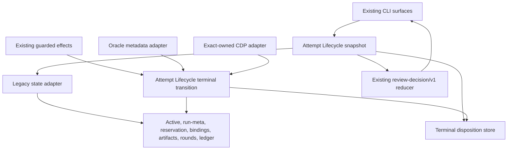
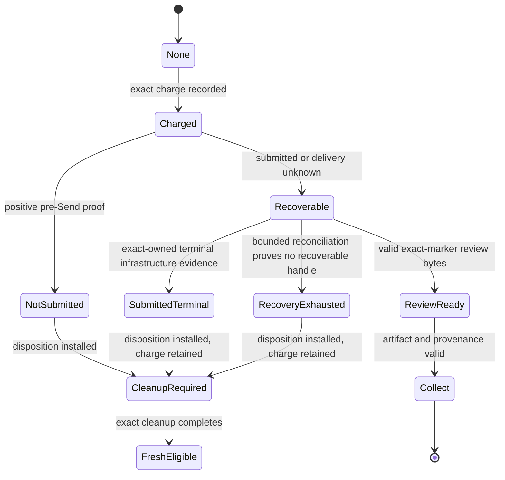

# Pro-Gate Lifecycle and Admission - Plan

## Goal Capsule

- **Objective:** One `/pro-gate` invocation takes the safest productive next action without manual state surgery, routine permission prompts, duplicate live work, or an artificial local quota leaving usable ChatGPT capacity idle.
- **Means:** Centralize attempt interpretation and terminal transitions in one deep Attempt Lifecycle module, persist only terminal proof that must survive, and make round history advisory unless an operator explicitly enables enforcement. (KTD1-KTD4)
- **Authority:** Valid review artifacts outrank terminal dispositions. A valid terminal disposition outranks stale mutable active, reservation, and run-meta sidecars and must finish cleanup before fresh charge. Without a disposition, exact live or recoverable attempt evidence blocks new spend. Structured transport evidence outranks log prose. Explicit operator enforcement outranks advisory round telemetry.
- **Execution profile:** Characterization-first changes inside the existing runtime, CLI, browser salvage helper, and tests. No new process, daemon, database, or user prompt.
- **Stop conditions:** Do not launch while exact work is active or recoverable. Do not refund without positive no-submit proof. Do not keep recovery ownership after terminal or recovery-exhausted evidence is durable.
- **Tail ownership:** Pro-gate still stops before merge. The surrounding workflow retains edit, CI, and merge authority.

---

## Product Contract

### Summary

Pro-gate will distinguish live work, recoverable work, completed review bytes, proven no-submit failures, submitted terminal failures, and exhausted recovery through one canonical attempt snapshot. The runtime will use that snapshot for status, typed decisions, recovery, and pre-dispatch freshness. Round trajectories remain useful diagnostics, but they stop pretending to be ChatGPT quota.

### Problem Frame

The current runtime has strong local safeguards but interprets the same sidecars in several places. This creates contradictory outcomes. A current `--status 2312 --json` reports `recoverable: false` while its `next_step` says to harvest an `in-progress` marker. PR 2248 has no reservation, no completed artifact, no scored review trajectory, and three charged infrastructure failures, yet its default round grant is exhausted.

The initial v0.22 hard cap prevented an old autonomous review loop from consuming 10-16 serialized reviews. Version 0.36 replaced that loop with one runtime-selected action per invocation and an identical-code-plus-evidence stop. The hard default cap now blocks explicit changed-evidence reviews without observing ChatGPT capacity, current queue contention, or whether charged attempts produced useful reviews.

The current runtime already refunds a subset of positively proven pre-submit failures through `pg_attempt_provably_unsubmitted` and `pg_fresh_dispatch_refund` (`bin/oracle-review.sh:1637-1654`, `bin/oracle-review.sh:3203-3221`, `bin/oracle-review.sh:3728-3743`). The missing capability is durable terminal classification that every caller consumes. Oracle 0.18.0 already records `promptSubmitted=false` before attachment completion and switches it to `true` only when Send is dispatched. Pro-gate does not consume that structured evidence today.

### Key Decisions

- **Round history is advisory by default** (session-settled: user-directed — chosen over default hard per-change caps: local attempts cannot measure ChatGPT subscription capacity, and v0.36 already bounds each invocation to one safe action). Governs R6-R8.
- **Recovery has a bounded end state** (session-settled: user-directed — chosen over indefinite unknown-fate recovery: unreachable historical work must not permanently block productive review). Governs R2-R5.
- **No manual repair workflow** (session-settled: user-directed — chosen over a new reset/quarantine command: the runtime must classify and settle its own proof-backed state). Governs R1, R5, R9.
- **Consolidate interpretation before replacing storage** (session-settled: user-directed — chosen over a new database or event ledger: the observed defect is duplicated policy, not inadequate storage technology). Governs R1, R9, R10.

### Requirements

**Canonical lifecycle**

- R1. Status, typed decision queries, effect freshness, recovery, harvest, and pre-dispatch checks must derive attempt state from one read-only Attempt Lifecycle snapshot.
- R2. Exact active, generating, or recoverable work must block new submission and retain its existing no-duplicate-spend protections.
- R3. A valid exact-marker completed or pending review artifact must remain collectable and must outrank terminal failure state.
- R4. The runtime must distinguish `not-submitted`, `submitted-terminal`, and `recovery-exhausted` terminal outcomes without treating a CLI exit code or missing tab alone as proof.
- R5. A terminal attempt must stop owning recovery and capacity. `not-submitted` refunds exactly once; `submitted-terminal` and `recovery-exhausted` remain charged. A new charge is eligible only after disposition-driven cleanup completes.

**Admission and automation**

- R6. Changed, proven review evidence may start a fresh review when no active or recoverable work exists, even when advisory round history has reached its computed grant.
- R7. `PRO_GATE_ROUND_GUARD=1`, explicit legacy round-limit settings, and explicit lockdown settings must retain hard enforcement; `PRO_GATE_ROUND_GUARD=0` must continue to disable it.
- R8. Round count, open-P0/P1 trajectory, churn streak, elapsed review time, and computed grant must remain visible as telemetry and warnings without becoming default admission authority.

**Agent experience and compatibility**

- R9. `/pro-gate` must take a safe replacement action after recovery terminalizes an attempt. It must not ask routine permission or require a second manual invocation.
- R10. Existing commands, review-decision/v1 envelope shape, provenance rules, concurrency controls, cooldowns, payload guards, and merge authority must remain compatible.
- R11. `--status --json` must explain the canonical attempt state, terminal kind, charge/refund consequence, retry safety, and round-policy mode without contradicting its next step.
- R12. Direct `--recover` must remain no-spend and must never launch a fresh review. When it settles terminal state, it must report that no review remains recoverable and that a fresh decision can proceed.

### Actors

- A1. **Coding agent:** invokes pro-gate and dispatches the runtime-selected action without inventing review policy.
- A2. **Pro-gate runtime:** owns attempt state, guarded transitions, admission, recovery, and typed decisions.
- A3. **Oracle/browser adapters:** provide structured submission and rendered-conversation evidence; they never decide refund or admission policy.
- A4. **Operator:** may explicitly enable hard round enforcement or lockdown, but is not asked to repair ordinary runtime state.

### Key Flows

- F1. **Normal review:** Proven changed evidence and no owned attempt produce `run-granted-review`; one charged attempt runs and publishes a canonical result.
- F2. **Proven no-submit:** Oracle exits before Send with validated `promptSubmitted=false`, no exact conversation evidence, and a stable browser; the attempt becomes `not-submitted`, refunds once, and the fresh decision may run again.
- F3. **Ambiguous post-click:** Send was attempted but no terminal evidence exists; the attempt remains recoverable and blocks new submission.
- F4. **Submitted terminal infrastructure failure:** Exact-owned browser evidence shows a terminal ChatGPT infrastructure error after the prompt; the attempt remains charged, releases recovery/capacity ownership, and a fresh decision may run later.
- F5. **Recovery exhausted:** The existing TTL and miss policy proves no active process, reservation, artifact, conversation handle, or exact marker remains; the attempt becomes charged `recovery-exhausted` and no longer blocks.
- F6. **Advisory churn:** A non-shrinking review trajectory emits a warning and status telemetry. It blocks only when explicit enforcement is active.

### Acceptance Examples

- AE1. **Shared truth:** Given one run-meta-only marker, when status, decision query, effect freshness, and recovery inspect it, then all report the same recoverable marker and no fresh Oracle call occurs. Covers R1-R3.
- AE2. **Attachment timeout before Send:** Given Oracle metadata with `promptSubmitted=false`, a complete verified attempt transcript, no exact conversation evidence, and stable browser state, when the attempt settles, then its round is refunded once and a replacement decision may run. Covers R4, R5, R9.
- AE3. **Post-click timeout:** Given `promptSubmitted=true` and no terminal conversation evidence, when settlement runs, then the attempt stays charged and recoverable. Covers R2, R4, R5.
- AE4. **Owned network error:** Given an exact-owned prompt followed by a terminal ChatGPT network-error render, when salvage observes it, then recovery ends, the round stays charged, and a later review is eligible. Covers R4, R5.
- AE5. **Exhausted recovery:** Given an expired reservation, required confirmed marker misses, no process or lock, no artifact, and no exact conversation handle, when reconciliation runs, then it records `recovery-exhausted`, keeps the charge, and permits fresh review. Covers R4, R5.
- AE6. **Late artifact wins:** Given a terminal disposition and later valid exact-marker review bytes, when the snapshot is assembled, then the artifact is collectable and outranks the disposition. Covers R1, R3.
- AE7. **Default exhausted rounds:** Given three charged attempts and an advisory grant of three, when changed evidence requests review with no owned attempt, then status warns and review proceeds. Covers R6, R8.
- AE8. **Explicit hard cap:** Given the same state with explicit enforcement enabled, when review is requested, then `round-governor-denied` remains the typed stop reason and `PRO_GATE_FORCE_ROUND=1` remains a one-invocation override. Covers R7, R10.
- AE9. **Identical evidence:** Given a prior applicable review with identical code and evidence, when review is requested, then it stops regardless of advisory round mode. Covers R10.
- AE10. **No state surgery:** Given any proof-backed terminal flow above, when `/pro-gate` is invoked once, then the runtime settles state, re-reduces, and takes the safe replacement action without asking for file deletion, quarantine, or a force flag. Covers R9, R12.

### Success Criteria

- All supported read and effect surfaces return the same canonical action for every lifecycle fixture.
- No proof-backed terminal attempt remains indefinitely recoverable.
- No ambiguous or live attempt is refunded or bypassed.
- Default local round history never blocks changed proven evidence.
- Explicit enforcement and lockdown remain behaviorally compatible.
- No new user-facing command, daemon, database, or routine prompt is introduced.

### Scope Boundaries

**In scope**

- Attempt-state assembly and guarded terminal transitions inside the current runtime.
- One minimal immutable terminal-disposition record per terminal marker.
- Structured Oracle 0.18.0 submission evidence and exact-owned CDP terminal infrastructure evidence.
- Advisory-by-default round policy with explicit enforcement compatibility.
- Status, skill, runtime, tests, distribution, and release documentation required for the behavior.

**Outside this product's identity**

- Measuring or predicting ChatGPT subscription quota.
- Scheduling fairness across unrelated PRs; the existing semaphore and callers own concurrency and work ordering.
- Automatically merging, editing code, or replacing surrounding workflow authority.
- A new repair command, admin dashboard, state database, append-only event system, generalized policy engine, or additional approval token.
- Generic classification of arbitrary ChatGPT prose as terminal failure.

---

## Planning Contract

### Product Contract preservation

This plan intentionally supersedes the default-governor assumption in `docs/plans/2026-08-26-2019-feat-pro-gate-one-clear-next-step-plan.md` R8 step 6, R11, F5, AE9, AE11, and KTD2's unchanged-authority assumption. It preserves that plan's one-action-per-invocation, exact-input proof, recovery-first precedence, identical-evidence stop, provenance, transport-only adapters, contract compatibility, and merge boundaries. Hard governor denial remains available only under explicit operator policy.

### Key Technical Decisions

- KTD1. **One deep Attempt Lifecycle module inside the existing runtime library.** Its small interface has one read-only canonical snapshot operation and one validated terminal-transition operation. Callers stop reading active, run-meta, reservation, artifact, ledger, and round stores independently. Governs R1-R5, R9-R12.
- KTD2. **Persist only terminal proof that currently evaporates.** A marker-addressed immutable `review-attempt-disposition/v1` record stores marker, round key, charged epoch, terminal kind, proof kind, and observation time. It is product runtime state because admission branches on it. It is not a third review binding and carries no review authority. The snapshot checks valid review bytes first, then disposition, then mutable live/recovery sidecars. Governs R3-R5.
- KTD3. **Use an evidence hierarchy, not error-string policy.** Valid review bytes rank first. Exact live/recoverable evidence ranks second. Validated Oracle `promptSubmitted` metadata and exact-owned CDP terminal state may settle an attempt. Missing tabs, elapsed time, CLI exit code, or free-form logs cannot refund by themselves. Governs R2-R5.
- KTD4. **Separate lifecycle safety from automation advice.** The lifecycle snapshot owns hard no-duplicate and proof gates. Round scoring remains telemetry. Hard round enforcement activates only through explicit operator configuration. Governs R6-R8.
- KTD5. **Keep review-decision/v1 shape stable.** `.governor.granted` continues to mean hard admission permission. It is `true` under default advisory mode and `false` only under explicit enforcement. `round-governor-denied` remains valid without a contract-v2 migration. Governs R7, R10.
- KTD6. **Read legacy stores through one internal adapter.** Existing active, run-meta, reservation, binding, artifact, ledger, round, and conversation-handle formats remain readable. Terminal dispositions supplement them. No bulk state migration or dual runtime is required. Governs R1, R10.
- KTD7. **Terminal transitions are atomic, idempotent, and marker/epoch-bound.** The disposition is installed before cleanup. Re-entry treats lingering mutable sidecars as cleanup work, completes refund or retirement safely, and refuses a new charge until cleanup succeeds. `not-submitted` unrecords only the exact newest charged epoch. Other terminal kinds never refund. Governs R4, R5.
- KTD8. **Recovery exhaustion uses existing bounded evidence.** The current reservation TTL, confirmed-miss threshold, lock/process checks, artifact lookup, and conversation-handle checks feed one terminal transition. TTL alone is insufficient. Governs R4, R5.
- KTD9. **Disposition retention reuses existing clocks.** After cleanup, retain the disposition for the greater of the effective round window and reservation TTL, then sweep it with existing housekeeping. Add no retention setting. Governs R5, R10, R11.

### High-Level Technical Design

#### Module and adapter topology

The two evidence adapters are real seams because Oracle metadata and rendered CDP state vary independently. Storage remains an implementation detail behind the Attempt Lifecycle module.

#### Attempt lifecycle

A late valid artifact outranks every terminal disposition and re-enters `ReviewReady`.

#### Admission policy split

| Concern | Default authority | Explicit override |
|---|---|---|
| Active or recoverable exact work | Hard block | None |
| Identical code and evidence | Hard stop | Changed code/evidence only |
| Invalid provenance or unsafe evidence | Hard stop | Correct proof only |
| ChatGPT throttle/cooldown, browser health, payload ceiling | Defer/refuse through existing guards | Existing documented controls |
| Round count and churn trajectory | Advisory warning | `PRO_GATE_ROUND_GUARD=1` or explicit limit/lockdown settings enforce |
| Recovery exhausted or submitted terminal failure | Fresh eligible, no refund | Valid late artifact still collects |

### Compatibility and Migration

1. Keep all current CLI entry points and the review-decision/v1 envelope.
2. Add the disposition reader and writer behind the Attempt Lifecycle module.
3. Assemble legacy markers from existing stores when no disposition exists.
4. Route one caller at a time through the canonical snapshot under parity tests; remove each replaced direct interpretation in the same unit.
5. Change default governor enforcement only after lifecycle parity and terminal transitions are complete.
6. Resolve round-policy precedence as follows:
   - Explicit `PRO_GATE_ROUND_GUARD=0` disables enforcement.
   - Explicit `PRO_GATE_ROUND_GUARD=1` enables enforcement.
   - When the guard is unset, explicit `PRO_GATE_MAX_ROUNDS_PER_PR`, `PRO_GATE_ROUNDS_BASE`, or `PRO_GATE_ROUNDS_CEILING` preserves enforcement for existing configured installations.
   - When no enforcement knob is set, round scoring is advisory.
   - `PRO_GATE_FORCE_ROUND=1` remains meaningful only when enforcement is active.
7. After cleanup, retain terminal dispositions for the greater of `PRO_GATE_ROUNDS_WINDOW` and `PRO_GATE_RESERVATION_TTL`, then sweep them through existing housekeeping. Add no retention setting.
8. Ship runtime, plugin, contract identity metadata, tests, release notes, and marketplace distribution together under the existing release train.

### Consolidation and Deletion

- Replace direct lifecycle assembly in `pg_review_decision_cli`, status rendering, `pg_fresh_dispatch_recheck`, `--recover`, and harvest reconciliation with the Attempt Lifecycle snapshot.
- Replace independent refund/retirement call sequences with the terminal-transition operation.
- Remove log-text-based no-submit decisions where structured Oracle metadata is available.
- Remove default `round-governor-denied` behavior from ordinary configuration while retaining the explicit enforcement branch.
- Delete test fixtures that encode contradictory status-versus-decision outcomes after parity coverage replaces them.
- Do not add a repair CLI, second decision contract, state migration daemon, event ledger, policy DSL, or dashboard.

### Alternatives Considered

1. **One consolidated mutable JSON record per attempt.** This would reduce store count but creates a risky state migration, rollback problem, and broad rewrite before the behavior is proven.
2. **Append-only lifecycle event ledger.** This would make history explicit but adds event ordering, replay, compaction, and schema migration for a local single-user shell runtime.
3. **Keep all callers and patch each contradiction.** This is smallest per patch but preserves the root defect: five surfaces can disagree again.
4. **Selected: derived canonical snapshot plus terminal dispositions.** This removes duplicated policy, preserves current storage, and adds only the durable fact the system currently loses.

### Risks and Mitigations

- **False no-submit proof could refund a real review.** Require validated `promptSubmitted=false`, complete Oracle metadata, exact negative conversation evidence, stable browser state, and marker/epoch-bound transition.
- **False terminal CDP classification could abandon a generating review.** Require exact marker ownership, the operator's prompt ordering, and a bounded known terminal infrastructure state. Unknown renders remain recoverable.
- **Recovery exhaustion could leave a hidden completed review unused.** Keep the charge, require the existing TTL plus confirmed misses and absence checks, and let any later valid artifact outrank the disposition.
- **Legacy state can be malformed or cross-bound.** Reuse canonical repository/PR/marker validation and fail ambiguous records closed.
- **Default governor change can surprise configured users.** Treat any explicit enforcement knob as opt-in compatibility and make doctor/status state the effective policy.
- **Partial transition failure can split disposition and cleanup.** Install disposition first and make cleanup idempotent under the existing per-change and marker locks.

### System-Wide Impact

- **Claude skill and relay:** continue dispatching one typed action; they gain automatic replacement after terminal recovery.
- **Daemon:** consumes the same decisions and no longer needs separate round/recovery inference.
- **Oracle bridge:** remains an evidence producer; pro-gate reads its existing structured metadata.
- **Browser salvage:** gains exact terminal infrastructure classification without broad prose matching.
- **Operations:** status and doctor expose effective admission mode and terminal consequences; manual quarantine/reset instructions disappear.
- **Distribution:** the behavior requires a runtime/plugin version bump and coordinated package identity update.

---

## Implementation Units

### U1. Characterize and centralize attempt snapshots

- **Goal:** Introduce the Attempt Lifecycle snapshot with no intended behavior change and prove parity across current consumers.
- **Requirements:** R1, R2, R3, R10, R11; KTD1, KTD6.
- **Dependencies:** None.
- **Files:** `lib/pro-gate-lib.sh`, `bin/oracle-review.sh`, `tests/engine.test.sh`.
- **Approach:**
  1. Define one normalized internal attempt snapshot that resolves canonical target identity, latest exact marker, valid artifacts, active state, reservation, run-meta, disposition, charge, and retry safety.
  2. Enforce precedence: valid artifact, valid terminal disposition with cleanup state, active/recoverable work, then no owned attempt.
  3. Route decision query, effect freshness, status, and recovery selection through the snapshot.
  4. Delete each replaced direct interpretation in the same change.
- **Execution note:** Add characterization fixtures before replacing each legacy read path.
- **Patterns to follow:** Canonical repository/PR normalization and exact-marker selection in `lib/pro-gate-lib.sh:503-637`; pure reducer fact assembly in `bin/oracle-review.sh:310-520`.
- **Test scenarios:**
  - Covers AE1. One run-meta-only marker yields the same marker and recover-only action in query, effect freshness, status, and recovery.
  - A valid completed artifact outranks matching run-meta and active history.
  - A completed marker does not hide a newer unresolved marker.
  - Malformed, symlinked, cross-repository, mismatched-key, and tied records fail closed without authorizing spend.
  - A legacy marker with no new disposition remains readable through the internal legacy adapter.
- **Verification:** Every existing lifecycle fixture retains its pre-unit result, and no consumer outside the module directly decides lifecycle precedence.

### U2. Persist terminal dispositions and guarded settlement

- **Goal:** Make proof-backed terminal outcomes durable, idempotent, and consistent after crashes.
- **Requirements:** R3, R4, R5, R9, R11, R12; KTD2, KTD7, KTD8, KTD9.
- **Dependencies:** U1.
- **Files:** `lib/pro-gate-lib.sh`, `bin/oracle-review.sh`, `tests/engine.test.sh`.
- **Approach:**
  1. Add the minimal immutable disposition record and strict validator.
  2. Add one marker/epoch-bound terminal-transition operation under existing locks.
  3. Install the disposition before refund, reservation release, active cleanup, or run-meta retirement.
  4. Re-enter safely after interruption and finish the exact remaining cleanup once.
  5. Let valid late review bytes outrank the disposition.
  6. Fold existing refund logic into the transition operation instead of creating a second mechanism.
- **Execution note:** Implement terminal transitions test-first because incorrect refund or retirement can double-spend or deadlock review.
- **Patterns to follow:** Exact refund checks in `bin/oracle-review.sh:1637-1654`; immutable no-clobber bindings in `lib/pro-gate-lib.sh`.
- **Test scenarios:**
  - Covers AE2. `not-submitted` installs once, refunds one exact latest epoch, and remains idempotent after replay.
  - Covers AE3. Submitted or unknown delivery cannot enter `not-submitted`.
  - Covers AE5. TTL plus confirmed misses and all absence checks produce charged `recovery-exhausted`; TTL alone does not.
  - A crash after disposition write but before cleanup makes the next guarded run effect finish cleanup before charging and never refunds twice.
  - Covers AE6. A late valid artifact remains collectable and supersedes terminal state.
  - Direct `--recover` never launches fresh work and reports terminalized no-review state truthfully.
- **Verification:** Every terminal kind has one durable record, one charge consequence, one retry-safety result, and an idempotent replay test.

### U3. Consume structured transport and browser terminal evidence

- **Goal:** Classify attachment no-submit and terminal ChatGPT infrastructure failures without guessing from logs.
- **Requirements:** R2, R3, R4, R5, R9; KTD3.
- **Dependencies:** U2.
- **Files:** `bin/oracle-review.sh`, `bin/cdp-salvage.mjs`, `tests/engine.test.sh`, `tests/cdp-salvage.test.mjs`.
- **Approach:**
  1. Add an Oracle metadata adapter that validates the current session record and extracts submission state.
  2. Permit positive no-submit settlement only when structured metadata, transcript integrity, marker scan, URL absence, and browser stability agree.
  3. Preserve post-click `promptSubmitted=true` timeouts as charged recoverable work.
  4. Add exact-owned CDP terminal infrastructure evidence after the operator prompt; classify only bounded known terminal states.
  5. Route both adapters into the terminal-transition operation.
- **Execution note:** Use planted negatives for every proof gate; a green test must show nearby ambiguous evidence remains recoverable.
- **Patterns to follow:** Verified Oracle transcript proof in `bin/oracle-review.sh:3203-3221`; ownership and prompt-order checks in `bin/cdp-salvage.mjs`.
- **Test scenarios:**
  - Covers AE2. Attachment completion timeout with validated `promptSubmitted=false` and no conversation evidence refunds once.
  - The same timeout with missing, malformed, or mismatched Oracle metadata stays charged.
  - Covers AE3. Prompt-commit timeout with `promptSubmitted=true` stays recoverable and suppresses duplicate retry.
  - Covers AE4. Exact-owned terminal network error after the prompt becomes charged `submitted-terminal` and releases reservation.
  - A quoted network-error phrase, foreign marker, stale verdict, error before the prompt, live Stop state without terminal evidence, and localization drift remain non-terminal.
  - Valid review bytes on the same page always win over a terminal-error marker.
- **Verification:** Structured evidence determines classification; no refund or terminal transition depends solely on a free-form log line.

### U4. Make round governance advisory by default

- **Goal:** Preserve useful trajectory diagnostics and explicit controls without rationing default review admission.
- **Requirements:** R6, R7, R8, R10, R11; KTD4, KTD5.
- **Dependencies:** U1, U2.
- **Files:** `lib/pro-gate-lib.sh`, `bin/oracle-review.sh`, `tests/engine.test.sh`, `tests/fixtures/review-decision/v1/contract.json`, `tests/fixtures/review-decision/v1/corpus.json`, `.env.example`, `README.md`, `skills/pro-gate/SKILL.md`, `agents/oracle-reviewer.md`.
- **Approach:**
  1. Separate effective enforcement mode from round scoring.
  2. Keep the current scorer, status trajectory, churn warning, round history, and force override.
  3. Compute `.governor.granted=true` in ordinary unset configuration.
  4. Preserve `round-governor-denied` when explicit enforcement or lockdown is active.
  5. Make status and doctor report `advisory`, `enforced`, or `lockdown` plus the configuration source.
  6. Update the v0.36 conformance corpus only if fixture metadata changes; do not introduce contract v2.
- **Execution note:** Characterize every existing environment-variable combination before changing the default.
- **Patterns to follow:** Single round scorer in `lib/pro-gate-lib.sh:1479-1540`; reducer precedence in `lib/pro-gate-lib.sh:2164-2175`.
- **Test scenarios:**
  - Covers AE7. Default exhausted grant and churn brake warn but permit changed proven evidence.
  - Covers AE8. Explicit guard, flat cap, trajectory cap, and lockdown still deny with the existing reason and exit behavior.
  - Explicit guard off overrides other limit values.
  - Unset guard plus explicit limit knobs preserves existing configured enforcement.
  - Covers AE9. Identical code/evidence still stops when round mode is advisory.
  - Active/recoverable work, throttle, health, concurrency, payload, unsafe evidence, and provenance gates remain unchanged.
- **Verification:** Default behavior uses all safe available review capacity; explicit installations retain their chosen enforcement semantics.

### U5. Complete integration, distribution, and operator truth

- **Goal:** Ship the behavior coherently and remove obsolete recovery/governor guidance.
- **Requirements:** R9, R10, R11, R12; KTD1, KTD2, KTD3, KTD4, KTD5, KTD6, KTD7, KTD8, KTD9.
- **Dependencies:** U1-U4.
- **Files:** `bin/oracle-review.sh`, `scripts/package-runtime.sh`, `install.sh`, `tests/review-decision-adapters.test.sh`, `tests/distribution.test.sh`, `tests/cdp-salvage.test.mjs`, `VERSION`, `.claude-plugin/plugin.json`, `docs/release-notes/v<version>.md`, `README.md`, `.env.example`, `skills/pro-gate/SKILL.md`, `agents/oracle-reviewer.md`.
- **Approach:**
  1. Make status, doctor, recovery output, and typed decisions describe one canonical attempt state and effective round mode.
  2. Remove manual quarantine/reset and routine force-round instructions from the normal path.
  3. Keep expert diagnostics and explicit enforcement documentation.
  4. Package runtime and plugin identity together through the existing release train.
  5. Verify an upgrade can read legacy state and settle a planted stale marker without manual file changes.
- **Execution note:** Prefer install/runtime smoke verification after behavior tests because distribution drift is the final risk.
- **Patterns to follow:** Runtime identity/package checks from v0.36 and the trusted release verification path.
- **Test scenarios:**
  - Covers AE10. One typed invocation terminalizes stale state, re-reduces, and takes the replacement action without a question.
  - Status cannot emit `recoverable=false` with an `in-progress` next step for the same canonical snapshot.
  - Doctor reports effective round policy and unresolved terminal-cleanup failures.
  - Fresh install and upgrade from v0.36.1 both read old run-meta, active, reservation, artifacts, bindings, and rounds.
  - Distribution tests prove the installed runtime, plugin, skill, relay, contract identity, and release card stay aligned.
- **Verification:** The packaged install reproduces source behavior, and customer-facing notes explain the default admission change and preserved explicit controls.

---

## Verification Contract

| Gate | Command or evidence | Required outcome |
|---|---|---|
| Shell correctness | `shellcheck --severity=error` over repository shell files and `bash -n` for changed scripts | No errors |
| Engine lifecycle | `bash tests/engine.test.sh` | All lifecycle, refund, recovery, governor, status, and upgrade fixtures pass |
| Browser salvage | `node --test tests/cdp-salvage.test.mjs` | Exact ownership and terminal/error planted negatives pass |
| Adapter contract | `bash tests/review-decision-adapters.test.sh` | Every adapter consumes the same decision and replacement action |
| Distribution | `bash tests/distribution.test.sh` | Packaged runtime/plugin/skill identity and files match source |
| Remaining repository suites | All CI-listed shell suites | All pass without weakened assertions |
| Live smoke | One controlled pre-submit failure, one current review, and one explicit enforced-cap status check | Correct refund, recovery, and enforcement behavior; no manual state edits |
| Release | Existing release train and marketplace verification | New version is installable and distributed before announcement |

No test may infer success from exit code alone. Every positive terminal/refund fixture must include a neighboring ambiguous negative that stays charged or recoverable.

---

## Definition of Done

### Global

- Every lifecycle consumer uses the Attempt Lifecycle module rather than interpreting state stores independently.
- Terminal dispositions are minimal, validated, marker/epoch-bound, atomic, idempotent, and swept after their retention obligation ends.
- Default round mode is advisory; explicit enforcement and lockdown remain compatible.
- Active/recoverable duplication, identical evidence, throttle, health, payload, provenance, and merge guards remain intact.
- No manual quarantine/reset step or new routine prompt remains in customer guidance.
- Source, packaged runtime, plugin, adapters, tests, release notes, and marketplace distribution agree.
- Abandoned experimental helpers, duplicate state readers, obsolete fixtures, and superseded documentation are removed from the final diff.

### Per unit

- U1 is done when parity tests prove one canonical snapshot across every current read/effect surface.
- U2 is done when all terminal transitions survive replay and apply the correct exactly-once charge consequence.
- U3 is done when structured transport and exact-owned browser evidence classify positives while all planted ambiguous negatives remain safe.
- U4 is done when default advisory behavior and every explicit compatibility mode are covered by tests and status output.
- U5 is done when upgrade, package, install, distribution, and controlled live smoke evidence match the Product Contract.

---

## Sources / Research

- `bin/oracle-review.sh:1637-1654` — exact marker/epoch refund implementation already exists.
- `bin/oracle-review.sh:3203-3221` — current positive no-submit predicate and its transcript/browser constraints.
- `bin/oracle-review.sh:3695-3769` — reservation, failed salvage, and current refund/unknown-fate outcomes.
- `lib/pro-gate-lib.sh:1479-1580` — trajectory scorer and hard-by-default round guard.
- `lib/pro-gate-lib.sh:2164-2175` — identical-evidence and round-governor typed decisions.
- `bin/cdp-salvage.mjs:1286-1446` — current ownership and still-generating classification.
- `tests/engine.test.sh:1401-1494` — post-click prompt-commit timeout is intentionally charged.
- `docs/plans/2026-08-26-2019-feat-pro-gate-one-clear-next-step-plan.md` — one-action architecture and the now-superseded default-governor assumption.
- Oracle 0.18.0 browser runtime — attachment completion precedes Send and `promptSubmitted` changes only at submission.
- Live state on 2026-08-31 — PR 2248 had three charged rounds, zero scored reviews, no reservation or artifact, and default admission exhausted; PR 2312 exposed contradictory recoverability and next-step status.
