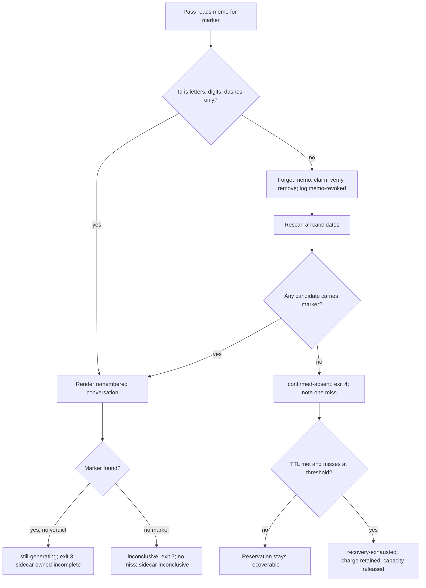

# Placeholder Conversation Memos Never Pin a Slot - Plan

## Goal Capsule

- **Objective:** A review run whose remembered conversation URL is not a real conversation can no longer hold a ChatGPT slot indefinitely, and an operator reading status can tell what kind of stall any unresolved run is in.
- **Means:** Check the conversation id when a URL is remembered and every time it is read, inside the salvage helper so the same pass rescans and reaches the confirmed-absent sweep (KTD1, KTD2); carry each pass's classification to status through a per-marker sidecar (KTD3).
- **Product authority:** The Product Contract below owns the memo validity rule, the rescan behavior after a revocation, and the status fields. It does not change when a review may be declared finished, refunded, or released; issue #109's evidence-gated rule for verdict-less real conversations stands.
- **Product Contract preservation:** unchanged in meaning. Two clarifications: the Problem Frame's memo count is corrected to four (two of them orphaned), and AE6 is added under R5 to pin the refund boundary planning found.
- **Open blockers:** None.
- **Stop conditions:** Stop and surface rather than guess if the id rule would reject any id in the live memo directory that later proves to be a real conversation, if reaching the confirmed-absent path after a revocation would require touching the still-generating or inconclusive branches, or if a revoked memo changes any refund decision in the engine suite.
- **Execution profile:** One release, v0.42.0, landing after v0.41.0 (PR #148). Units U1 through U5 in order, U6 last. Each unit lands with its tests green; the full engine suite runs before the version bump.
- **Tail ownership:** The implementer owns tests, release notes, and the CHANGELOG row. The surrounding workflow owns merge and the marketplace promotion; a `/pro-gate` round before merge is expected because U2 touches the memo lifecycle.

---

## Product Contract

### Summary

Make the harvest pass distrust a conversation memo whose id does not look like a real conversation id, at write time and at read time, and let the existing absence sweep finish the job once the memo is gone. Show the stall class and time remaining in status beside the age and miss fields it already has.

### Problem Frame

Since 2026-08-30 four reviews have pinned a ChatGPT slot for a day or more while reporting "Still working" (pushbot PRs 2284, 2333, 2307, 2368). Two of them remembered a synthetic placeholder URL, `https://chatgpt.com/c/WEB:<uuid>`, as the authoritative conversation for their marker. The page behind that URL is titled "ChatGPT" and is not a conversation, so every collection pass renders it, finds neither the run's marker nor a foreign one, classifies the result as inconclusive, and returns without advancing the miss counter, which is the engine's deliberate protection against transient rendering failures. The pass then exits still-in-progress and the reservation stays recoverable forever. The existing shape check on remembered URLs tests only the `https://chatgpt.com/c/` prefix, so the placeholder passes it. Nothing in status distinguishes this parked run from one whose model is genuinely still writing; the operator learns the difference by reading stderr and listing the state directory. On 2026-09-05 the memo directory held four placeholder memos (pushbot 2156, 2307, 2328, 2333), two of them for reservations that no longer exist, and eight in-progress markers, the oldest 80 hours.

### Key Decisions

- **Validate the conversation id, not the page's content.** The placeholder is distinguishable from a real id by syntax alone; "rendered without our marker" stays a transient that never counts as a miss, so the engine's fail-closed posture on blank renders is untouched. Governs R1, R2, R5.
- **Leave release logic and the still-generating branch alone.** (session-settled: user-approved — chosen over extending the still-generating branch with the TTL-plus-confirmed-miss sweep its sibling has: that branch is only entered for a page carrying the marker, so a sweep there could never reach the placeholder failure, and the change would have touched reservation release for no gain.) Governs R4, R5.
- **Stall detail lives in status only.** (session-settled: user-approved — chosen over adding detail to the recovery relay's state line: the relay's six fixed states are a contract other renderers already conform to.) Governs R6, R7.
- **A placeholder-only run gets no memo and rescans every pass.** (session-settled: user-approved — chosen over remembering the placeholder and revoking later: a bad memo remembered is the failure this plan removes.) Governs R1, R4.
- **Verdict-less real conversations stay held.** A real id whose page keeps rendering without the marker, or whose turn never ends, is not terminalized here; issue #109's re-scope requires positive evidence before any such run is released. Governs R5.

### Actors

- A1. The operator, who reads status, runs recovery by hand, and owns the ChatGPT account.
- A2. A caller of the runtime: the skill, relay, daemon, or the dotfiles loop script, which dispatch the typed decision and relay recovery states.
- A3. The engine's harvest and recovery pass, which reads and writes conversation memos and decides which lifecycle branch a pass takes.
- A4. The browser salvage helper, which renders candidate conversations, classifies what it sees, and remembers URLs for markers.

### Requirements

**Memo validity**

- R1. A conversation URL is remembered for a marker only when its conversation id has the shape of a real ChatGPT conversation id; a placeholder id such as `WEB:<uuid>` is never persisted.
- R2. Every read of a remembered URL re-applies the same shape check before the URL is trusted, and a memo that fails is revoked in that pass.
- R3. A rejected or revoked placeholder is named in the pass's diagnostics with the marker and the offending id, so the operator can see why the memo was dropped.

**Sweep and recovery**

- R4. After a revocation the same pass rescans candidates as if no memo existed; finding no conversation that carries the marker takes the existing confirmed-absent path, which advances the miss counter and releases the reservation only after the TTL and the configured number of confirmed misses.
- R5. The still-generating branch, the inconclusive branch's rule that a blank render never counts as a miss, and every charge and refund rule are unchanged.

**Status visibility**

- R6. Status output, human and JSON, reports for each unresolved attempt the salvage classification from its latest pass and the time remaining before the reservation TTL is satisfied, beside the age and miss fields it already carries.
- R7. The recovery relay's six state lines are unchanged; stall detail appears only in status output.

**Regression coverage**

- R8. Tests cover: a placeholder id is never remembered; a placeholder memo is revoked on read and the pass proceeds to rescan; a rescan with no candidate reaches the confirmed-absent path; a real-id memo whose page renders without the marker stays inconclusive and holds; a revoked placeholder on a charged attempt does not make it refundable; status shows the classification and time remaining.

### Key Flows

- F1. Remembering a URL
  - **Trigger:** The salvage helper identifies the conversation it just submitted or found for a marker.
  - **Actors:** A4
  - **Steps:** The helper checks the id shape; a real id is remembered as before; a placeholder is not written and the rejection is logged with the marker and id.
  - **Covered by:** R1, R3
- F2. A collection pass with a placeholder memo
  - **Trigger:** A harvest, recovery, or reconcile pass reads the memo for a marker whose remembered URL is a placeholder.
  - **Actors:** A3, A4
  - **Steps:** The shape check fails; the memo is revoked and logged; the pass rescans all candidates; with no conversation carrying the marker, the pass takes the confirmed-absent path and advances the miss counter; on later passes the same happens until the TTL and miss threshold are both met, when the reservation is recovery-exhausted with its charge retained.
  - **Covered by:** R2, R3, R4, R5
- F3. Reading status during a stall
  - **Trigger:** The operator runs status for a PR or marker with an unresolved attempt.
  - **Actors:** A1, A3
  - **Steps:** The entry shows the classification from the latest pass, the attempt's age, its miss count, and the time remaining before the TTL is satisfied; recovery through the skill still relays one of the six fixed states.
  - **Covered by:** R6, R7

### Acceptance Examples

- AE1. Placeholder never remembered
  - **Covers R1, R3.**
  - **Given** a run whose first captured URL is `https://chatgpt.com/c/WEB:57cc5403-ad61-4ccd-af90-ad28a539081e`
  - **When** the salvage helper would remember it
  - **Then** no memo is written for the marker and the log names the rejected id.
- AE2. Placeholder memo drains through the absence sweep
  - **Covers R2, R3, R4, R5.**
  - **Given** an existing memo `https://chatgpt.com/c/WEB:5789ac7a-755a-4385-82db-0c1eb37ccf88` for a marker whose reservation is 21 hours old with zero misses
  - **When** three collection passes run at least the reconcile interval apart
  - **Then** the first pass revokes the memo and rescans, each pass records one confirmed miss, and after the third pass the reservation is recovery-exhausted with its charged round retained and its capacity released.
- AE3. Real id, blank render, still held
  - **Covers R5.**
  - **Given** a memo `https://chatgpt.com/c/6a959c8f-c95c-83ea-81b8-85a3ea5d6cbc` whose page renders without the marker
  - **When** a collection pass reads it
  - **Then** the memo is kept, the pass is inconclusive, the miss counter does not advance, and the reservation stays recoverable.
- AE4. Status shows the stall
  - **Covers R6, R7.**
  - **Given** an unresolved attempt classified owned-incomplete on its latest pass, three hours old, with no misses and a six-hour TTL
  - **When** the operator runs status
  - **Then** the entry shows owned-incomplete, the age, zero misses, and three hours remaining; running recovery through the skill still relays "Still working".
- AE5. Real ids are unaffected
  - **Covers R1.**
  - **Given** a captured URL with a canonical conversation id
  - **When** the salvage helper remembers it
  - **Then** the memo is written exactly as before this change.
- AE6. Revocation never refunds
  - **Covers R5.**
  - **Given** a charged attempt whose only memo is a placeholder and whose submission evidence is missing
  - **When** a pass revokes the memo
  - **Then** the attempt stays charged and is not reported as provably unsubmitted.

### Success Criteria

- The conversation-memo directory on the operator's box holds zero memos with a non-conversation id after one upgrade cycle, with no manual deletion.
- Every reservation that held a placeholder memo at upgrade time reaches recovery-exhausted through the absence path within the TTL plus three confirmed misses.
- Charge and refund counts for runs without a placeholder memo are unchanged across the release.
- An operator can tell a parked run from a generating one from status alone.

### Scope Boundaries

- A completion predicate for a real conversation that never emits a verdict is out; it stays evidence-gated per issue #109.
- A real-id memo whose page keeps rendering without the marker stays held; distinguishing a dead page from a transient render is a harder problem this plan does not take on.
- The stall classification as a ledger field waits for the ledger row schema in the hygiene batch.
- The still-generating branch, the inconclusive branch's no-miss rule, and the reservation guard are not modified.
- Wait sizing shipped separately in v0.41.0 and is not revisited here.

#### Deferred to Follow-Up Work

- The `--harvest` case statement has no arm for the browser-infrastructure exit code, which falls to the runtime-trouble default; adjacent to U3 but not this fix.
- Project-scoped conversation URLs (`chatgpt.com/g/<project>/c/<id>`) already fail the prefix check today and are never remembered; unchanged here.
- Tightening the id rule to the strict hex-and-dash shape once test fixtures use realistic ids (KTD1).
- The two orphaned placeholder memos with no reservation clear through the existing 14-day memo sweep; nothing here accelerates that.

### Dependencies and Assumptions

- Every one of the 196 real ids in the live memo directory is a 36-character hex-and-dash identifier whose third group starts with `8`, so a version-anchored UUID pattern would reject real ids; the strict shape, if adopted later, must be shape-only.
- oracle 0.18.0 is the installed browser driver; its own incomplete-capture marking, recheck, and heartbeat liveness are not duplicated by the classification field, which reports only what the salvage helper concluded.
- The confirmed-absent path's TTL and miss threshold keep their current defaults; this plan relies on them rather than tuning them.
- v0.41.0 (PR #148) lands first; this work is v0.42.0.

### Outstanding Questions

**Deferred to Planning**

None remaining; the four questions the brainstorm deferred are resolved in KTD1 through KTD4.

### Sources

- Issue #109 and its comments of 2026-08-31 (root cause: a `WEB:<uuid>` placeholder persisted as the authoritative memo) and 2026-09-01 (re-scope: no terminalizer from age, TTL, missing verdict, or absent spinner alone).
- `bin/cdp-salvage.mjs`: the memo contract at 39-49; `recallUrl` at 166-173 and `rememberUrl` at 258-279, both guarded only by the `/c/` prefix; `forgetUrl` at 195-208 (claim-then-verify removal) and `discardForeignUrl` at 1233-1241; `classifyEvidence` at 1122-1128; `probeState` collapse at 1196-1199; the remembered-URL branch at 1440-1478 and the inconclusive fallback exit at 1519-1530; `MARKER_SAFE_RE` at 162 as the shape-gate precedent.
- `bin/oracle-review.sh`: the harvest invocation and `matched-url` capture at 2556-2561; the harvest case statement at 2658-2764 (still-generating, confirmed-absent, inconclusive arms); `pg_provenance_reject` call sites at 2616 and 4056; the status block at 1106-1277 with the per-reservation JSON at 1267-1273 and the hint chain at 1258-1266; the raw memo reads at 1243, 3613, and 4162; the reconcile call on fresh dispatch at 3204; the 14-day memo sweep at 3145.
- `lib/pro-gate-lib.sh`: reservation record shape at 517 and `pg_reservation_marker_ok` at 532-537; `pg_reservation_note_miss` at 1261-1320 (one confirmed-absent observation; release needs misses and TTL together); `pg_reservation_expire_if_stale` at 1546-1562; `pg_reservation_reconcile` at 1648-1687; `pg_provenance_reject` at 2298-2329.
- `tests/cdp-salvage.test.mjs`: `runSalvage` at 358 and `seedMemo` at 437-442; the still-generating regression at 1424-1447, which stays. `tests/engine.test.sh`: harvest cases at 220-309; status assertions by `grep -qF` at 243 and 256; reservation field assertions by `awk -F'\t'` at 275-290. `tests/mock-cdp.mjs`: scratch-tab support for remembered-URL re-renders.
- `CONCEPTS.md`, Conversation Memo.
- `docs/solutions/conventions/separate-review-lifecycle-applicability-capacity-and-input-trust.md` and `ship-the-legible-core-let-the-gate-decline-fragile-automation.md`.
- CHANGELOG §12 (v0.31.1 cross-bound memos): claim-and-verify revocation replaced plain deletion after gate rounds found the race with a concurrently republished genuine memo.
- `docs/ideation/2026-09-04-pro-gate-ideation-refresh.html`, idea 2.

---

## Planning Contract

### Key Technical Decisions

- KTD1. **The id rule is letters, digits, and dashes only, anchored on the whole `/c/<segment>`.** (session-settled: user-approved — chosen over the strict hex-and-dash shape: every live id matches the strict shape, but about forty salvage and engine fixtures use named ids such as `mock-conversation`; the loose rule rejects the colon-bearing placeholder, including one whose body is a well-formed UUID, and leaves fixtures untouched. The strict shape is deferred until fixtures migrate.) Governs R1, R2. The rule is one helper shared by the write and read sites, mirrors the marker shape gate, and states its boundary in a code comment next to the check.
- KTD2. **Revocation happens inside the salvage helper, in the same pass, through its claim-then-verify forget routine.** The shell's provenance rejection runs only after the helper has exited, so it cannot make the same pass rescan; the helper clears its known URL before the scan loop, rescans, and exits confirmed-absent when nothing carries the marker. Plain deletion is not used: the forget routine's rename-inspect-restore protocol is what closed the v0.31.1 race with a concurrently republished genuine memo. Governs R2, R3, R4. The check applies at every read: module init, the organize step, the churn guard inside remember, and the reconcile probe, which share the same read helper.
- KTD3. **The classification reaches status through a per-marker sidecar, not a reservation column.** (session-settled: user-approved — chosen over a new tab-separated field on the reservation record: the record's column count is fragile, as two in-code warnings and a gate round already record.) The helper prints one new stderr line naming the evidence kind in harvest and probe modes; the engine captures it the way it captures the matched URL and writes `salvage-class/<marker>` holding the kind and the epoch, mirroring the `crossbound/` sidecar; status reads it and derives time remaining from the reservation's creation time and the TTL. The existing 14-day sweep removes stale sidecars. Governs R6.
- KTD4. **Drain cadence is the reconcile probe's.** (session-settled: user-approved — chosen over defining the drain against the daemon's poll: the reconcile probe runs on every fresh dispatch, rate-limited per marker, and needs no caller action.) The engine suite proves the drain with that interval. Governs R4.
- KTD5. **Refund eligibility is unchanged and proved.** The refund predicate treats a memo's existence as one of its negatives; revoking a placeholder removes that negative but the predicate still requires positive no-submit evidence from oracle's session metadata. No code in the refund path changes; U3 adds the test that pins it. Governs R5.
- KTD6. **Status fields are additive.** `classification`, `classified_at`, and `ttl_remaining_secs` join the per-reservation JSON as siblings of `age_secs` and `miss_streak`; the human hint chain gains one branch below the higher-priority superseded and cross-bound hints. No existing field is renamed or restructured, matching every prior status addition. Governs R6, R7.

### High-Level Technical Design

The collection pass with the memo check inserted. Diamonds are decisions the helper already makes today except the first.

Status reads the sidecar written at G, H, or J and reports the kind, its epoch, and `max(0, created + TTL - now)`.

### Assumptions

- The mock CDP server can present a placeholder page with no marker and, in a second run, no candidate at all, using its existing scratch-tab and canonical-URL parameters.
- The engine suite can drive three harvest passes against one seeded reservation with the miss threshold and reconcile interval set through their existing environment knobs.

### Sequencing

U1 then U2 (salvage helper), U3 (engine drain and refund tests, no engine code expected), U4 then U5 (sidecar, then status), U6 (release). U4 depends on U2 only for the log line vocabulary; it can be developed in parallel and merged after.

---

## Implementation Units

### U1. Conversation id rule and write-time rejection

- **Goal:** A placeholder id is never remembered; a real id is remembered exactly as before.
- **Requirements:** R1, R3. Covers AE1, AE5.
- **Dependencies:** none.
- **Files:** `bin/cdp-salvage.mjs` (the memo contract comment at 39-49, a new id helper beside `MARKER_SAFE_RE` at 162, `rememberUrl` at 258-279); `tests/cdp-salvage.test.mjs`.
- **Approach:**
  1. Add one helper that extracts the exact segment after `https://chatgpt.com/c/` and accepts it only when it is non-empty and matches letters, digits, and dashes, anchored at both ends (KTD1).
  2. Make `rememberUrl` call the helper instead of the prefix regex; on rejection, write no file and print one stderr line naming the marker and the rejected id.
  3. Update the memo contract comment so the "authoritative for its marker" statement carries the new validity condition.
- **Patterns to follow:** `MARKER_SAFE_RE` and `pg_reservation_marker_ok` for an anchored shape gate; `rememberUrl`'s atomic temp-plus-rename write stays as is.
- **Test scenarios:**
  - Covers AE1. A capture whose URL is `https://chatgpt.com/c/WEB:57cc5403-ad61-4ccd-af90-ad28a539081e` leaves no memo file and the run's stderr names the marker and the id.
  - A URL whose segment is a well-formed UUID preceded by `WEB:` is rejected (anchoring, not substring matching).
  - Covers AE5. A URL with a canonical 36-character hex-and-dash id is remembered with byte-identical content to today.
  - A URL with a named fixture id such as `mock-conversation` is remembered (the loose rule keeps existing fixtures valid).
  - An empty segment after `/c/`, a segment containing a slash, and a segment containing a colon are all rejected.
- **Verification:** `node --test tests/cdp-salvage.test.mjs` passes with the new cases; every existing memo-related case is unchanged.

### U2. Read-time revocation and same-pass rescan

- **Goal:** A placeholder memo read by any pass is removed in that pass, logged, and the pass rescans and can exit confirmed-absent.
- **Requirements:** R2, R3, R4. Covers AE2 (the first pass), AE3.
- **Dependencies:** U1.
- **Files:** `bin/cdp-salvage.mjs` (`recallUrl` at 166-173 and its callers at 261, 491, 950; the seeded-render branch at 1440-1478; `forgetUrl` at 195-208); `tests/cdp-salvage.test.mjs`; `tests/mock-cdp.mjs` if a no-candidate scenario needs a parameter.
- **Approach:**
  1. In `recallUrl`, apply the U1 helper; on failure call `forgetUrl` with the offending URL, print one stderr line naming the marker and the id, and return no URL (KTD2).
  2. Keep the organize-step and churn-guard call sites on the same helper so every read revokes; the organize step does not hold capacity, so revocation there is safe.
  3. Confirm the main scan proceeds with no known URL after a revocation and reaches the existing confirmed-absent exit when no candidate carries the marker; no new exit code.
  4. Leave the seeded-render branch's inconclusive handling for a real-id memo exactly as it is.
- **Patterns to follow:** `discardForeignUrl` for how the helper already revokes a memo on foreign content; the still-generating regression at `tests/cdp-salvage.test.mjs:1424-1447` stays unchanged as the guard that real conversations are untouched.
- **Execution note:** Add the revocation test first with the memo seeded raw through `seedMemo`, since the write-time check would otherwise prevent the fixture from existing.
- **Test scenarios:**
  - Covers AE2. A raw-seeded placeholder memo is gone after the run, the run's stderr names the marker and id, and with no candidate carrying the marker the run exits confirmed-absent.
  - A raw-seeded placeholder memo with a genuine candidate elsewhere is revoked and the run then finds and binds the genuine conversation.
  - Covers AE3. A real-id memo whose page renders without the marker is kept and the run exits inconclusive.
  - The organize step revokes a raw-seeded placeholder memo and completes normally.
  - Revocation while a concurrent writer republishes a real-id memo leaves the real-id memo in place (the forget routine's restore path).
  - The existing still-generating regression still passes unchanged.
- **Verification:** `node --test tests/cdp-salvage.test.mjs` passes; the still-generating case is byte-identical.

### U3. Engine drain through the absence sweep and refund safety

- **Goal:** Prove, at the engine level, that a placeholder memo drains to recovery-exhausted through the existing confirmed-absent path and never changes refund eligibility.
- **Requirements:** R4, R5. Covers AE2, AE6.
- **Dependencies:** U2.
- **Files:** `tests/engine.test.sh` (new cases beside the harvest cases at 220-309, using the reservation assertions at 275-290); no engine code change expected.
- **Approach:**
  1. Seed a reservation older than the TTL with a raw placeholder memo and a mock CDP that presents no candidate.
  2. Run three harvest passes spaced by the reconcile interval knob with the miss threshold at its default of three; assert the miss streak increments once per pass and the third pass exhausts recovery with the charged round retained (KTD4).
  3. Assert the refund predicate still returns not-provably-unsubmitted for that attempt after revocation, because no oracle no-submit evidence exists (KTD5).
  4. Assert a real-id memo whose page renders blank leaves the miss streak unchanged across two passes.
- **Patterns to follow:** the harvest case shape at `tests/engine.test.sh:236-243`; reservation field checks by `awk -F'\t'`.
- **Test scenarios:**
  - Covers AE2. Three spaced passes: miss streak 1, 2, 3; final state recovery-exhausted; round history unchanged; capacity released.
  - Two passes inside the reconcile interval count one miss, not two.
  - Covers AE6. After revocation the attempt is not provably unsubmitted and no refund is recorded.
  - Covers AE3. A real-id blank-render memo: miss streak stays 0 and the memo file remains.
  - A fresh `--pr` dispatch for the same change runs the reconcile probe, which revokes the placeholder without a harvest being invoked.
- **Verification:** `bash tests/engine.test.sh` passes; the new cases fail against the pre-U2 helper (run once to confirm they exercise the change).

### U4. Classification sidecar

- **Goal:** Every harvest and probe pass records what the salvage helper concluded, per marker, where status can read it.
- **Requirements:** R6 (data source). Covers AE4 (data half).
- **Dependencies:** U2 (log-line vocabulary).
- **Files:** `bin/cdp-salvage.mjs` (evidence emission near 1191-1200 and the exit sites at 1507-1530); `bin/oracle-review.sh` (harvest capture at 2556-2561; the 14-day sweep at 3145); `lib/pro-gate-lib.sh` (`pg_reservation_reconcile` at 1648-1687 and a small sidecar write helper beside the reservation helpers); `tests/cdp-salvage.test.mjs`; `tests/engine.test.sh`.
- **Approach:**
  1. Have the helper print one stderr line `evidence-kind: <kind>` in harvest and probe modes, with a closed vocabulary drawn from its existing classifications: owned-incomplete, inconclusive, browser-down, memo-revoked, foreign, cross-bound, throttle, terminal, terminal-infrastructure, absent (KTD3).
  2. Capture the line in the harvest path the way `matched-url` is captured, and in the reconcile probe, and write `salvage-class/<marker>` as one line, kind and epoch, through an atomic temp-plus-rename.
  3. Extend the existing 14-day sweep to the new directory.
- **Patterns to follow:** the `matched-url` grep at `bin/oracle-review.sh:2561`; the `crossbound/` sidecar for a per-marker file the status block already reads; the `probe-state` line for how the helper already reports to the reconcile probe.
- **Test scenarios:**
  - A harvest pass that ends still-generating writes `owned-incomplete` and an epoch for the marker.
  - A probe pass that ends inconclusive writes `inconclusive`.
  - A pass that revoked a placeholder writes `memo-revoked` on that pass and `absent` on the next.
  - The sweep removes a sidecar older than 14 days and leaves a fresh one.
  - A malformed sidecar line is ignored by readers rather than crashing status.
- **Verification:** both suites pass; a manual `--harvest` against the mock CDP leaves the expected sidecar.

### U5. Status classification and time remaining

- **Goal:** Status shows, for each unresolved attempt, the latest classification, when it was recorded, and the time remaining before the TTL is satisfied, in JSON and in the human line.
- **Requirements:** R6, R7. Covers AE4.
- **Dependencies:** U4.
- **Files:** `bin/oracle-review.sh` (the status block at 1106-1277: the per-reservation JSON at 1267-1273 and the hint chain at 1258-1266); `README.md` (the status documentation under Engine commands); `tests/engine.test.sh`; `tests/review-decision-adapters.test.sh` (no change expected; it already pins the six relay states).
- **Approach:**
  1. Read `salvage-class/<marker>` beside the existing `age_secs` and `miss_streak` derivation; add `classification`, `classified_at`, and `ttl_remaining_secs` as sibling JSON fields, empty or null when no sidecar exists (KTD6).
  2. Add one hint branch below the superseded and cross-bound hints that names the classification, age, misses, and time remaining in plain words.
  3. Leave the skill and relay recovery text untouched; the conformance suite continues to assert the six states.
- **Patterns to follow:** the additive status changes of v0.33.0, v0.34.0, and v0.40.0; the `grep -qF` assertion idiom for status JSON.
- **Test scenarios:**
  - Covers AE4. An owned-incomplete sidecar three hours into a six-hour TTL yields `classification`, `classified_at`, and `ttl_remaining_secs` near 10800 in JSON, and the human line names the class and the remaining time.
  - No sidecar yields empty classification fields and no crash.
  - A superseded reservation keeps its superseded hint ahead of the classification hint.
  - `ttl_remaining_secs` is 0, not negative, for a reservation past its TTL.
  - The conformance suite still passes unchanged (six relay states).
- **Verification:** `bash tests/engine.test.sh` and `bash tests/review-decision-adapters.test.sh` pass; `--status --json` on a seeded fixture shows the three fields.

### U6. Release v0.42.0

- **Goal:** Ship the change as one release with customer-readable notes.
- **Requirements:** all.
- **Dependencies:** U1 through U5; v0.41.0 merged.
- **Files:** `VERSION`, `.claude-plugin/plugin.json`, `docs/release-notes/v0.42.0.md`, `CHANGELOG.md`.
- **Approach:** Bump both version files together; write the notes per the template with three Highlights bullets under 180 characters; add the timeline row.
- **Test expectation:** none — release metadata; verified by the notes check and the full suite run.
- **Verification:** `bash scripts/check-release-notes.sh docs/release-notes/v0.42.0.md` reports OK; `bash tests/distribution.test.sh` passes.

---

## Verification Contract

| Check | Command | Applies to |
|---|---|---|
| Salvage helper unit tests | `node --test tests/cdp-salvage.test.mjs` | U1, U2, U4 |
| Engine regression suite (about 30 minutes) | `bash tests/engine.test.sh` | U3, U4, U5 |
| Consumer conformance (six relay states, sized timeouts) | `bash tests/review-decision-adapters.test.sh` | U5 |
| Daemon lifecycle | `bash tests/daemon-reload.test.sh` | U4 |
| Packaging and manifest | `bash tests/distribution.test.sh` | U6 |
| Release notes | `bash scripts/check-release-notes.sh docs/release-notes/v0.42.0.md` | U6 |
| Live memo audit before merge | list the memo directory on the operator's box and confirm every real id passes the rule | U1 |

CI runs all eight suites on push; the engine suite's wall time is by design.

---

## Definition of Done

- All eight CI suites green on the branch; the new salvage and engine cases present and passing.
- The live memo directory audit shows the rule accepts every real id and rejects every placeholder.
- One `/pro-gate` round on the PR before merge, with any FIX-FIRST findings fixed or, if two rounds surface new findings on the revocation mechanism, the status half (U4, U5) shipped alone per the legible-core learning.
- v0.42.0 notes pass the check; VERSION and plugin.json agree; CHANGELOG row present.
- No abandoned-attempt code remains in the diff.
- Per unit: U1 and U2 leave the still-generating regression byte-identical; U3 proves the drain and the refund boundary; U4 leaves a sidecar the sweep can remove; U5 changes no existing status field.
