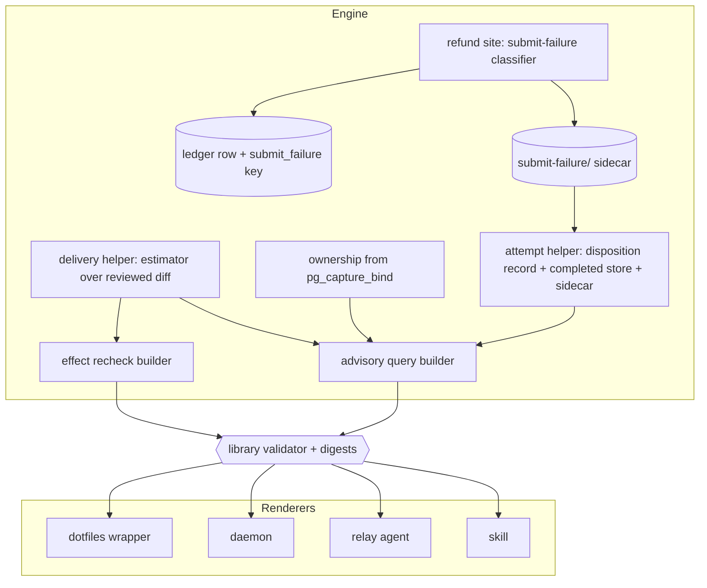

# Typed Delivery, Ownership and Disposition Facts - Plan

## Goal Capsule

- **Objective:** A caller that drives pro-gate reads how a review was delivered, whose verdict an artifact carries, and how the last attempt ended from the typed decision, so no caller has to re-derive those facts from log text, exit codes, or the artifact's bytes, and the dotfiles wrapper shrinks back to orchestration.
- **Means:** Three additive fact groups on `review-decision/v1`, each landing as one atomic commit with its validator, fixtures, digests and both builders (KTD1, KTD2), plus a new `--input auto` value the engine resolves inside Input Policy (KTD3); the wrapper deletes its copies in a companion PR after the release is installed (U7).
- **Product authority:** The Product Contract below owns which facts exist, their closed vocabularies, and where each is derived. It does not change what the gate decides: merge authority, the fail-closed connector-SHIP rule, and the acceptance predicate that binds an artifact to its run are untouched (R7, R17).
- **Product Contract preservation:** bootstrap from issue #175. One correction to the issue text, recorded as a Key Decision: the runtime never publishes "only the block bound to the run's own marker"; it accepts or refuses a whole artifact, and the typed fact says which.
- **Open blockers:** None.
- **Stop conditions:** Stop and surface rather than guess if a new field cannot be derived from a flag the engine already observes without reading model output; if the delivery estimator would need the composed prompt rather than the reviewed diff bytes to agree between query and effect; if adding a field would require reading anything but files on the early read-only query path; or if PR #159 lands first with a `completed_results` shape that conflicts with U3's fields.
- **Execution profile:** One runtime release, taking the next unclaimed minor at rebase (U6). Units U1 through U5 in order on one branch, each fact unit green on its own before the next starts; U7 in dotfiles only after the release is installed on the host that runs the wrapper.
- **Tail ownership:** The implementer owns tests, the release note, and the CHANGELOG row. The surrounding workflow owns merge and marketplace promotion; a `/pro-gate` round before merge is expected because U2 through U4 change the contract every renderer validates.

---

## Product Contract

### Summary

Publish three facts the engine already knows, or can know from evidence it already holds, as typed fields on `review-decision/v1`: the delivery the run will use and the measured payload behind that choice; whether an artifact's verdict is the run's own and which marker it named; and how the most recent attempt ended, including a submit-failure class the ledger cannot express today. Add `--input auto` so a caller can let the engine choose delivery within the deployment's Input Policy. Wire the conformance suite into CI so the new fields are gated where the other tests run. Then delete the wrapper's estimator, its verdict and marker parsers, and its log greps.

### Problem Frame

Between 2026-09-04 and 2026-09-07 the dotfiles wrapper `claude/scripts/pro-gate-loop.sh` grew from 627 to 1,685 lines across fourteen hardening PRs. An audit of those PRs found the growth is re-derivation: the wrapper reverse-engineers oracle 0.18.0's composer math to guess whether a diff fits the 60,000-character inline budget (three PRs); it re-implements the engine's verdict grammar in awk to decide which lines of a published artifact are its own (four PRs, including a case-fold bug the engine fixed separately in v0.46.0); and it greps effect logs for the words oracle prints when an upload stalls and the words the health gate prints when the account is cooling down. Each copy rots independently. The engine, meanwhile, has no character-budget check at all, only line counts; its facts object names the artifact but not the ownership of its verdict; and its ledger collapses an upload stall and a lost send into one `refunded-unsubmitted` row. v0.48.0 typed the cooldown half of the third fact, and the wrapper already prefers that field over its grep, which shows the shape of the fix.

### Key Decisions

- **Scope is exactly the three facts in issue #175, plus the wrapper deletion as acceptance.** (session-settled: user-approved — chosen over the broader "staged decision facts" direction from the 2026-09-04 ideation, which also proposed failure reason, round trajectory and policy mode on the contract: those fields have no caller today, while each of these three replaces code a caller runs now.) Governs R1 through R16.
- **Ownership is a whole-artifact fact, not a block cut.** The engine's acceptance predicate accepts an exact owned claim or refuses the artifact; it never cuts, rewrites or deletes input, and v0.42.0 refuses mixed cross-task answers before publication while preserving quoted references. Issue #175's wording "publishes only the block bound to the run's own marker" is superseded by this rule; the typed fact reports what the predicate concluded. Governs R5, R6, R7.
- **Every new value is derived from an engine-observed flag, never from model output.** Oracle's own error lines, the engine's salvage flags, the attempt-disposition record and the completed store are admissible sources; the answer text is not. Governs R2, R6, R9, R10.
- **`auto` chooses within Input Policy, never around it.** Under `bundle-only` the resolved delivery is always `bundle`; under `connector-enabled` the engine picks `both` or `connector` from the measurement. The policy stays the deployment-level authority. Governs R1, R3.
- **The wrapper's stricter stop on a quoted foreign verdict retires.** It was added for dotfiles#1027 before v0.42.0 refused authoritative foreign claims at the runtime; a quoted reference is not a claim, and one acceptance rule beats two. Governs R7, R16.

### Actors

- A1. Engine: `bin/oracle-review.sh` with `lib/pro-gate-lib.sh`; builds the facts at the advisory query and at the effect recheck, resolves delivery, classifies a failed submission.
- A2. Prose renderers: `skills/pro-gate/SKILL.md` and `agents/oracle-reviewer.md`; instruct a language-model caller from the same facts.
- A3. Bash renderers: `daemon/daemon.sh` and the dotfiles wrapper `claude/scripts/pro-gate-loop.sh`; validate and dispatch the decision unattended.
- A4. Conformance suite: `tests/review-decision-adapters.test.sh` with `tests/fixtures/review-decision/v1/`; proves every renderer accepts the frozen corpus.

### Requirements

**Delivery sizing**

- R1. `--input auto` is accepted on review queries and fresh reviews and resolves to `bundle` under `bundle-only`, and to `both` or `connector` under `connector-enabled`, according to the measurement in R2.
- R2. The engine estimates the rendered composer size of the reviewed diff with the wrapper's estimator (bytes plus lines times the line-number width plus three, plus twice the fence width, plus a reserve) against an inline budget and a byte ceiling, all three engine-owned constants with the wrapper's current defaults, and uses the same estimator over the same diff bytes at the query and at the effect.
- R3. When no reviewed-diff proof is present on a query, `auto` resolves to the delivery that always works for the policy, `connector` under `connector-enabled` and `bundle` under `bundle-only`, and the facts say the payload was not measured.
- R4. The facts carry a `delivery` object on every decision: the requested value, the resolved value, the policy, whether a measurement happened, the estimate, the budget, and whether the estimate exceeded the budget.

**Result ownership**

- R5. Each `completed_results` entry carries the ownership the acceptance predicate concluded, as a closed enum distinguishing an exact owned claim from a nonce-less legacy artifact, and the marker the accepted verdict line named.
- R6. The ownership fields are computed by the primitives the engine already uses to bind a capture, with the one normalization those primitives share; no second parser of the artifact is introduced.
- R7. An artifact that carries a foreign authoritative claim is refused before publication as today and never appears as an owned result; a quoted reference to another run does not change ownership.

**Attempt disposition**

- R8. The facts carry an `attempt` object describing the most recent attempt for the round key: its marker, its terminal disposition when one is recorded, whether a durable result exists for it, whether its charge was refunded, and its submit-failure class.
- R9. The submit-failure class is a closed enum, `upload-stalled`, `send-unconfirmed`, `cloudflare-challenge`, or `none`, classified once at the refund site from oracle's own transcript lines and the engine's salvage flags, and persisted per marker so the read-only query can report it.
- R10. Every failed ledger row gains the same submit-failure class as an additive key beside `reason`, so the two records never disagree.
- R11. The cooldown fact shipped in v0.48.0 is unchanged; `attempt` sits beside it and does not restate it.

**Contract and conformance**

- R12. Each new field is added to the contract fixture, the corpus, the library validator, both engine builders, the two digest pins and the plugin's mirror file in one commit, so no decision is ever produced that its own validator rejects.
- R13. The conformance suite runs in CI beside the other test files.
- R14. Removing any new top-level object from an otherwise valid envelope makes the validator reject it; this is the planted negative from issue #175.

**Renderers and the wrapper**

- R15. The skill and the relay tell a language-model caller to read delivery, verdict, ownership and attempt facts from the decision and never to parse a `VERDICT` line or choose delivery from the diff; the conformance suite greps for that language.
- R16. The dotfiles wrapper deletes its estimator, its verdict and marker parsers, its upload-stall grep and the grep tiers of its cooldown reader, keeping only orchestration and a counter over the typed submit-failure class, in a companion PR that lands after the release carrying these fields is installed.
- R17. Merge authority, the connector-mode SHIP refusal, the acceptance predicate and the reducer's action table are unchanged.

### Acceptance Examples

- AE1. Under-budget diff, connector-enabled.
  - **Covers:** R1, R2, R4
  - **Given:** `PRO_GATE_INPUT_POLICY=connector-enabled`, `--input auto`, a reviewed diff whose estimate plus reserve is at or below the budget and whose bytes are at or below the ceiling.
  - **When:** the advisory query runs.
  - **Then:** `delivery.resolved` is `both`, `delivery.measured` is true, `delivery.over_budget` is false, and the effect attaches the bundle file.
- AE2. Over-budget diff, connector-enabled.
  - **Covers:** R1, R2, R4
  - **Given:** the same policy and a diff whose estimate plus reserve exceeds the budget.
  - **When:** the advisory query runs.
  - **Then:** `delivery.resolved` is `connector`, `delivery.over_budget` is true, and the effect attaches no file.
- AE3. Over-budget diff, bundle-only.
  - **Covers:** R1, R3, R4
  - **Given:** `PRO_GATE_INPUT_POLICY=bundle-only`, `--input auto`, the over-budget diff from AE2.
  - **When:** the advisory query runs.
  - **Then:** `delivery.resolved` is `bundle` and `delivery.over_budget` is true, so a caller can see the upload risk the policy leaves it with.
- AE4. Query without a diff proof.
  - **Covers:** R3, R4
  - **Given:** `connector-enabled`, `--input auto`, no `--diff` on the query.
  - **When:** the advisory query runs.
  - **Then:** `delivery.measured` is false, `delivery.estimate_chars` is null and `delivery.resolved` is `connector`.
- AE5. Owned artifact with a quoted reference.
  - **Covers:** R5, R6, R7
  - **Given:** a completed artifact whose authoritative verdict line names this run's marker and whose body quotes another run's verdict line inside a fence.
  - **When:** the query lists completed results.
  - **Then:** the entry's `ownership` is `exact`, `verdict_marker` is this run's marker, and the artifact is published whole.
- AE6. Mixed answer.
  - **Covers:** R7
  - **Given:** a capture carrying two authoritative verdict lines naming two markers.
  - **When:** the engine tries to publish it.
  - **Then:** publication is refused as in v0.42.0 and no completed result for that marker reports any ownership.
- AE7. Upload stalled, then completed.
  - **Covers:** R8, R9, R10
  - **Given:** an effect whose oracle transcript ends with the attachment-upload timeout and whose salvage proves the prompt was never submitted, followed by a second effect on the same head that completes.
  - **When:** the query runs after each effect.
  - **Then:** after the first, `attempt.submit_failure` is `upload-stalled`, `attempt.refunded` is true, `attempt.result_produced` is false, and the ledger row carries `submit_failure: upload-stalled`; after the second, `attempt.submit_failure` is `none` and `attempt.result_produced` is true.
- AE8. Planted negative.
  - **Covers:** R12, R14
  - **Given:** a corpus envelope with the `delivery` object removed.
  - **When:** the library validator runs.
  - **Then:** the envelope is rejected, and the same holds for a removed `attempt` object and for a result entry missing `ownership`.

### Success Criteria

- The wrapper's companion PR removes the sizing, parsing and grep functions named in U7 and its test file still passes, with the wrapper reading only decision JSON for those three facts.
- No renderer instructs a caller to parse a `VERDICT` line or to pick delivery by measuring the diff, enforced by the conformance greps.

### Scope Boundaries

- The reducer's action table, reasons and merge-eligibility rules are unchanged. `delivery`, `ownership` and `attempt` are facts a caller reads, not inputs the reducer branches on in this plan.
- The attachment seam, the connector-SHIP typed stop and the classic-path binding gate belong to PR #159 and are not folded in here.
- No new admission, refund or release authority: `attempt.refunded` reports the disposition record that already exists.

#### Deferred to Follow-Up Work

- A count of quoted foreign markers per result, only if a fixer misfire on a quoted block is ever observed after v0.42.0.
- The daemon's legacy-migration check converging onto the typed ownership field instead of calling the capture primitives directly.
- A consecutive-submit-failure count in the runtime, if more than one caller ends up keeping that counter.
- The remaining ideation-refresh facts (failure reason, round trajectory, policy mode) and issue #174's finding kind and convergence, which have their own brainstorm.

### Dependencies and Assumptions

- The installed oracle is 0.18.0; the estimator mirrors its composer math and the constants are engine knobs so a later oracle changes one place.
- The advisory query may carry the reviewed-diff proof as documented in the skill; when it does not, R3 applies.
- Issue #177 and #163 fixes are in flight on separate branches and do not touch the facts builders.

### Outstanding Questions

- Deferred, non-blocking: confirm with the issue author that "publishes only the block" is superseded by whole-artifact ownership as recorded in Key Decisions; the plan proceeds on the shipped acceptance contract either way.

### Sources

- Issue #175, work-spec, 2026-09-07, including its acceptance criteria and sequencing.
- `bin/oracle-review.sh` input policy resolution near the `PRO_GATE_INPUT_POLICY` case, the two facts builders (advisory query and effect recheck), the ledger row writer's reason derivation, the refund site that calls `pg_attempt_provably_unsubmitted`, the recover artifact-first path, `FILE_ARGS`, and the read-only note above `pg_review_decision_repair_result_binding`.
- `lib/pro-gate-lib.sh`: `pg_capture_bind`, `pg_capture_foreign_echo`, `pg_extract_verdict`, `pg_strip_nonce`, the closed facts grammar under `pg_review_decision_reduce`, the digest pins, `pg_attempt_disposition_*` and `pg_attempt_snapshot`, `pg_cooldown_remaining_secs`, `pg_salvage_class_*`.
- `tests/review-decision-adapters.test.sh`, `tests/fixtures/review-decision/v1/contract.json` and `corpus.json`, `skills/pro-gate/review-decision-v1.json`, `.github/workflows/ci.yml`.
- dotfiles `claude/scripts/pro-gate-loop.sh` at origin/main: `size_input` and `pin_input`, `upload_failed`, `throttle_of`, `verdict_index` through `verdict_of`, the two-stalls stop rule, and `claude/tests/pro-gate-loop.test.sh`.
- `docs/solutions/conventions/`: ownership lives on the verdict line; extraction and comparison share one normalization; one identity check, two error biases; an appended prompt contract is cooperative; separate lifecycle, applicability, capacity and input trust; ship the legible core.
- Release notes v0.40.0 (ledger reason enum), v0.42.0 (mixed-task refusal), v0.46.0 (case fold on the conviction side), v0.48.0 (cooldown fact); PR #165 as the worked example of adding a fact.
- Draft PR #159, which adds `bindable` and `evidence_mode` to `completed_results` and the `--browser-attachments` seam.

---

## Planning Contract

### Key Technical Decisions

- KTD1. **One atomic commit per fact group, covering fixture, corpus, validator, both builders, digest pins and mirror.** The validator's top-level key set is exact and a miss rejects every decision as `undefined-state`, not just the ones touching the new field. PR #165 shipped the cooldown fact this way. Governs R12.
- KTD2. **Extract the new fact objects into small library builders both engine builders call, instead of editing two jq literals.** The advisory query and the effect recheck build near-identical facts objects with no shared function; adding three objects to both invites the drift this plan exists to remove. Each helper takes its inputs as arguments and returns compact JSON the builders splice in with `--argjson`. The existing literals are otherwise left alone.
- KTD3. **`auto` is a fourth `--input` value resolved after Input Policy, and the estimator lives in the library.** Port the wrapper's `size_input` arithmetic verbatim into a library function with three knobs, `PRO_GATE_INLINE_BUDGET_CHARS` (60000), `PRO_GATE_INLINE_RESERVE_CHARS` (10000) and `PRO_GATE_INLINE_MAX_BYTES` (50000); the wrapper's byte-class line count and fence rule are the measured fidelity, not an approximation to redo. The measurement input is the reviewed diff file the query and effect already share, so both resolve identically; the composed prompt is not measured because it exists only at the effect. Governs R1 through R4.
- KTD4. **Ownership fields come from the acceptance predicate's return, not a new scan.** `pg_capture_bind` already distinguishes an exact owned claim (rc 0), a nonce-less artifact (rc 1) and a foreign claim (rc 2), and `pg_capture_verdict_claims` yields the marker the verdict line named. The builder records `ownership: exact | legacy` and `verdict_marker` from those when a completed result is assembled; the field names avoid PR #159's `bindable` and `evidence_mode`. Governs R5, R6.
- KTD5. **Submit failure is classified once, at the refund site, from fixed strings in oracle's transcript plus the engine's own flags, and persisted as a per-marker sidecar.** The transcript lines are oracle infrastructure output, the same class of evidence the Cloudflare skip and the refund predicate already read. The sidecar follows the `salvage-class/<marker>` pattern (one token and an epoch, an allowlist shared by writer and reader) so the read-only query needs no ledger scan and the disposition record's exact-key validator stays at record version 1. The ledger row mirrors the token as an additive key from the same variable. Governs R8, R9, R10.
- KTD6. **`attempt` projects records that already exist.** Marker and state come from `pg_attempt_snapshot`; `disposition` is the record's `terminal_kind`; `refunded` is true exactly when that kind is `not-submitted`; `result_produced` is a completed-store artifact for the marker that passes `pg_is_review`; `submit_failure` is the sidecar. No new terminal authority and no new state machine. Governs R8, R11.
- KTD7. **Wire the conformance suite into CI as part of the first unit.** The suite that checks digests and every renderer is not in `ci.yml` today, so the acceptance criterion "with a test" would otherwise be unenforced. Governs R13.
- KTD8. **Sequence against PR #159 by merge order, not by waiting.** Both PRs move `completed_results` and the digests. Whichever lands second rebases its fixture and digest pair; the field names in KTD4 make that a fixture merge, not a semantic conflict. Governs R12.

### High-Level Technical Design

Where each fact is born and who reads it:



The wrapper's round after this plan, showing where the deleted code used to sit:

```mermaid
sequenceDiagram
  participant W as wrapper
  participant PG as engine
  W->>PG: --review-decision --input auto --diff reviewed.diff
  PG-->>W: decision with delivery.resolved (was: size_input)
  W->>PG: --review-decision-effect (same input args)
  PG-->>W: artifact or refund; sidecar written
  W->>PG: --review-decision (next step)
  PG-->>W: completed_results[].ownership + verdict (was: verdict_index, block_of)
  PG-->>W: attempt.submit_failure, cooldown (was: upload_failed, throttle_of greps)
```

### Assumptions

- The field names below are the implementer's to keep or rename inside the closed grammar; the plan fixes their meaning, not their spelling: `delivery.{requested,resolved,policy,measured,estimate_chars,budget_chars,over_budget}`, result `ownership` and `verdict_marker`, `attempt.{marker,disposition,result_produced,refunded,submit_failure}`.
- The advisory query is allowed to read the sidecar directory and the completed store; both are file reads on the path that already reads reservations and dispositions.
- The `auto` value is exposed through the skill as an optional caller choice; callers that omit `--input` keep today's policy default.
- One runtime release carries all three facts; the wrapper's companion PR follows once the host that runs the wrapper has installed it.

### Sequencing

- U1 first: plumbing, estimator, classifier and CI wiring, none of which changes the contract.
- U2, U3, U4 next, each an atomic contract change with its own corpus cases and digest bump; order among them is free, but U3 should check PR #159's state before it starts (KTD8).
- U5 after the fields exist, so the conformance greps have something to point at.
- U6 last in this repo; U7 in dotfiles after U6 is installed where the wrapper runs.

---

## Implementation Units

### U1. Shared plumbing: fact helpers, estimator, submit-failure classifier, CI wiring

- **Goal:** Put every new derivation in one library place and make the conformance suite a CI gate, without changing the contract yet.
- **Requirements:** R2, R9, R10, R13
- **Dependencies:** none
- **Files:** `lib/pro-gate-lib.sh`, `bin/oracle-review.sh` (refund site, ledger row writer), `.github/workflows/ci.yml`, `tests/engine.test.sh`, `tests/review-decision-adapters.test.sh`
- **Approach:**
  1. Add a library estimator that takes a diff path and returns bytes, content lines, fence width, estimate and an over-budget flag, porting the wrapper's `size_input` arithmetic and its `LC_ALL=C` whitespace byte classes; the three knobs from KTD3 default to the wrapper's values.
  2. Add a submit-failure classifier that reads the oracle transcripts the refund predicate already iterates and the `CLOUDFLARE` flag, returning one token from the closed enum in R9; call it at the refund site and write the sidecar with a `pg_submit_failure_*` family shaped like `pg_salvage_class_*` (allowlist shared by writer and reader).
  3. Emit the same token as an additive `submit_failure` key on the ledger row, empty on non-failure rows, matching how `reason` is present-but-empty.
  4. Add the conformance suite to the CI test list.
- **Patterns to follow:** `pg_salvage_class_write` and `pg_salvage_class_read` for the sidecar; the ledger row writer's `reason` block for present-but-empty keys; `pg_attempt_provably_unsubmitted` for how transcripts are iterated.
- **Test scenarios:**
  - Estimator on a diff with a long backtick run reports a fence wider than three and an estimate above bare bytes plus line tax.
  - Estimator on an empty file reports zero bytes, zero lines and not over budget.
  - Estimator with a whitespace-only trailing line counts lines the way the wrapper's byte-class rule does.
  - Classifier returns `upload-stalled` for a transcript containing oracle's attachment-upload timeout line, `send-unconfirmed` for the prompt-did-not-appear line, `cloudflare-challenge` when the Cloudflare flag is set, `none` otherwise.
  - Refund path in the engine suite writes the sidecar and a ledger row whose `submit_failure` matches it (Covers AE7, first half).
  - Sidecar reader rejects a token outside the allowlist.
  - CI workflow lists the conformance suite; the suite passes unchanged at this unit.
- **Verification:** the estimator and classifier have unit coverage in the engine suite, a refunded run leaves a readable sidecar, and CI runs the conformance suite.

### U2. Delivery fact and `--input auto`

- **Goal:** The engine resolves `auto` inside Input Policy and every decision carries a `delivery` object.
- **Requirements:** R1, R2, R3, R4, R12, R14
- **Dependencies:** U1
- **Files:** `bin/oracle-review.sh` (argument parsing, policy resolution, both facts builders, `FILE_ARGS`), `lib/pro-gate-lib.sh` (delivery helper, validator, digest pins), `tests/fixtures/review-decision/v1/contract.json`, `tests/fixtures/review-decision/v1/corpus.json`, `skills/pro-gate/review-decision-v1.json`, `tests/engine.test.sh`, `tests/review-decision-adapters.test.sh`
- **Approach:**
  1. Accept `auto` in `--input` parsing and in both policy branches; resolve it after the policy default using the estimator when a reviewed diff is present, else per R3.
  2. Build the `delivery` object in one helper (KTD2) and splice it into both builders; the effect's resolved value drives whether `FILE_ARGS` attaches the bundle.
  3. Extend the validator with the `delivery` key set and value types, add `delivery` to the corpus base facts with cases for AE1 through AE4, regenerate both digests and the mirror file, all in this one commit (KTD1).
- **Execution note:** Start from a failing conformance run that expects `delivery` in every corpus envelope, then make the engine and validator agree.
- **Patterns to follow:** the cooldown fact's path through both builders, the validator and the corpus; the policy `case` for where `auto` slots in.
- **Test scenarios:**
  - Covers AE1. Under-budget diff under connector-enabled resolves `both` and the effect attaches the file.
  - Covers AE2. Over-budget diff under connector-enabled resolves `connector` and the effect attaches no file.
  - Covers AE3. Over-budget diff under bundle-only resolves `bundle` with `over_budget` true.
  - Covers AE4. Query without a diff resolves `connector` with `measured` false and a null estimate.
  - Explicit `--input bundle|both|connector` still passes through unchanged and `delivery.requested` records it.
  - Covers AE8. Corpus envelope without `delivery` is rejected by the validator.
  - Digest check in the conformance suite matches the regenerated pins and the mirror file.
- **Verification:** the conformance suite and the engine suite are green with `delivery` present on every decision, and a daemon envelope validates through the shared library validator.

### U3. Result ownership fields

- **Goal:** Each completed result states whether its verdict is an exact owned claim and which marker it named.
- **Requirements:** R5, R6, R7, R12, R14
- **Dependencies:** U1
- **Files:** `bin/oracle-review.sh` (completed-results assembly in the advisory query, the effect recheck), `lib/pro-gate-lib.sh` (validator result schema, digest pins), the two fixtures and the mirror file, `tests/engine.test.sh`, `tests/review-decision-adapters.test.sh`
- **Approach:**
  1. Before starting, check PR #159's state; if it merged, rebase and add these fields beside `bindable` and `evidence_mode` (KTD8).
  2. When a completed result is assembled, derive `ownership` and `verdict_marker` from `pg_capture_bind`'s return and the accepted claim (KTD4); a nonce-less legacy artifact reports `legacy` and an empty marker.
  3. Extend the validator's result key set, update every corpus result entry, regenerate digests and the mirror, one commit.
- **Patterns to follow:** the existing result schema in the validator; the harvest and fresh paths where `pg_capture_bind` already runs before publication.
- **Test scenarios:**
  - Covers AE5. Owned artifact with a quoted foreign verdict reports `ownership: exact` and this run's marker.
  - Covers AE6. A mixed capture is refused before publication and no completed result exists for it.
  - A legacy nonce-less artifact reports `ownership: legacy` and an empty `verdict_marker`.
  - A case-only drift in the echoed marker still reports `exact` (v0.46.0 fold on the conviction side is unchanged).
  - Covers AE8. A result entry missing `ownership` fails validation.
- **Verification:** every completed result in the conformance corpus carries the two fields, the engine suite's publication tests are unchanged in outcome, and no code path cuts an artifact.

### U4. Attempt fact

- **Goal:** Every decision carries an `attempt` object for the most recent attempt of the round key.
- **Requirements:** R8, R9, R11, R12, R14
- **Dependencies:** U1
- **Files:** `bin/oracle-review.sh` (both facts builders), `lib/pro-gate-lib.sh` (attempt helper, validator, digest pins), the two fixtures and the mirror file, `tests/engine.test.sh`, `tests/review-decision-adapters.test.sh`
- **Approach:**
  1. Build `attempt` in one helper from `pg_attempt_snapshot`, the disposition record, the completed store and the submit-failure sidecar (KTD6); when no attempt exists every field is its empty value, present not absent.
  2. Splice into both builders; extend the validator; add corpus cases for a refunded upload stall, a completed attempt, and no attempt; regenerate digests and the mirror, one commit.
- **Patterns to follow:** `pg_attempt_snapshot` for locating the attempt; the cooldown object for a small typed sibling.
- **Test scenarios:**
  - Covers AE7. After a refunded upload stall, `submit_failure` is `upload-stalled`, `refunded` true, `result_produced` false; after the next completed effect on the same head, `submit_failure` is `none` and `result_produced` true.
  - A round key with no attempt yields an `attempt` object with empty marker and `submit_failure: none`.
  - A recovery-exhausted disposition reports `disposition: recovery-exhausted` and `refunded` false.
  - `cooldown` is byte-identical before and after this unit for the same state.
  - Covers AE8. Envelope without `attempt` is rejected.
- **Verification:** the conformance suite and engine suite are green, and the read-only query still performs no writes (the existing read-only assertions in the engine suite pass).

### U5. Renderer prose and conformance greps

- **Goal:** The skill and the relay tell a language-model caller to read the new facts and never to re-derive them.
- **Requirements:** R15
- **Dependencies:** U2, U3, U4
- **Files:** `skills/pro-gate/SKILL.md`, `agents/oracle-reviewer.md`, `tests/review-decision-adapters.test.sh`, `README.md`
- **Approach:**
  1. In the skill's "Resolve one action" section, document `--input auto` beside the pass-through of explicit values, and state that `delivery` in the decision is the record of what the engine chose.
  2. In the relay's boundary section, keep verbatim relay of the owned artifact and add that verdict and ownership are read from the decision's completed result, never parsed from the text.
  3. Add conformance checks: both prose renderers mention the three fact names; neither instructs parsing a `VERDICT` line or measuring the diff to pick delivery.
  4. Document the three knobs and the `submit_failure` ledger key in the README's configuration table.
- **Test scenarios:**
  - Conformance grep fails when the skill loses the `delivery` mention or gains an instruction to parse `VERDICT`.
  - Conformance grep passes on the updated relay.
- **Verification:** the conformance suite covers the new language and the existing stale-timeout greps still pass.

### U6. Release

- **Goal:** Ship the three facts as one runtime release.
- **Requirements:** R12
- **Dependencies:** U1 through U5
- **Files:** `VERSION`, `.claude-plugin/plugin.json`, `docs/release-notes/v<next>.md`, `CHANGELOG.md`
- **Approach:** Take the next unclaimed minor at rebase, keep the two version files equal, write the release note in the repo's template naming the three facts, `--input auto`, the knobs and the CI wiring, and add the CHANGELOG row. Run one `/pro-gate` round before merge.
- **Test expectation:** none -- packaging is covered by the distribution and release-train suites in the Verification Contract.
- **Verification:** the release chain publishes the tag whose built runtime contains the digest pins from U4.

### U7. Dotfiles companion: delete the wrapper's copies

**Target repo:** dotfiles (`StartupBros-com/dotfiles`)

- **Goal:** The wrapper keeps orchestration only.
- **Requirements:** R16
- **Dependencies:** U6 installed on the host that runs the wrapper
- **Files:** `claude/scripts/pro-gate-loop.sh`, `claude/tests/pro-gate-loop.test.sh`
- **Approach:**
  1. Replace `size_input` and `pin_input` with passing `--input auto` (or the operator's explicit `PRO_GATE_LOOP_INPUT`) and log `delivery.resolved` from the decision.
  2. Delete `verdict_index`, `markers_in`, `foreign_in`, `foreign_markers`, `foreign_list`, `own_line`, `count_review`, `block_of` and `verdict_of`; read `verdict`, `ownership` and `marker` from the selected completed result, keeping `selected_marker` and `status_marker`.
  3. Delete `upload_failed` and the grep tiers of `throttle_of`; read `attempt.submit_failure` and `cooldown` from the next query; keep the two-consecutive-stalls counter over the typed value.
  4. Remove the three `PRO_GATE_LOOP_INLINE_*` knobs and update the test file's assertions to the typed reads.
- **Execution note:** Confirm the installed runtime's contract digest equals the release's before deleting; the wrapper must not carry a fallback for an older runtime.
- **Test scenarios:**
  - Wrapper test asserts `--input auto` is passed when no explicit input is configured.
  - Wrapper test asserts a stop after two consecutive `upload-stalled` attempts read from the decision.
  - Wrapper test asserts the fixer receives the whole owned artifact and the ledger names the marker from the decision.
  - A cross-repo grep confirms none of the deleted function names remain.
- **Verification:** the wrapper's test file passes, and a live round on a real PR completes with the wrapper logging the typed fields.

---

## Verification Contract

| Check | Command | Applies to |
|---|---|---|
| Consumer conformance (digests, corpus envelopes, renderer greps) | `bash tests/review-decision-adapters.test.sh` | U1, U2, U3, U4, U5 |
| Engine regression suite (about 30 minutes) | `bash tests/engine.test.sh` | U1, U2, U3, U4 |
| Daemon lifecycle | `bash tests/daemon-reload.test.sh` | U2, U4 |
| Packaging and manifest | `bash tests/distribution.test.sh` | U6 |
| Release notes | `bash scripts/check-release-notes.sh docs/release-notes/v<next>.md` | U6 |
| Wrapper suite (dotfiles) | `bash claude/tests/pro-gate-loop.test.sh` | U7 |
| Live round before merge | `/pro-gate` on the PR | U6 |

CI runs the engine, daemon, distribution and release suites on push and, after U1, the conformance suite too. The engine suite's wall time is by design; run it detached on a busy host.

---

## Definition of Done

- Every decision the engine emits carries `delivery`, `attempt` and per-result `ownership` and `verdict_marker`, and the library validator rejects an envelope missing any of them.
- `--input auto` resolves per Input Policy with the estimator, and the effect attaches or omits the bundle accordingly.
- A refunded upload stall is distinguishable from a lost send in the sidecar, the ledger and the decision.
- The conformance suite runs in CI and covers the new fields and the renderer language.
- The release is published with matching version files and a release note; the wrapper's companion PR is merged with the named functions gone and its tests green.
- No experimental or abandoned code from the work remains in either diff.
